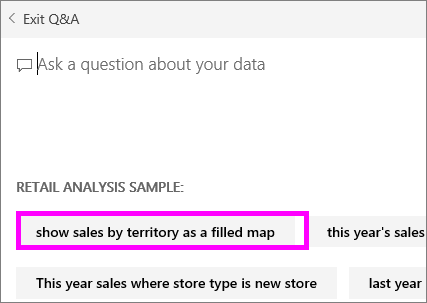

<properties
   pageTitle="Crear las preguntas destacadas para Power BI Q & A"
   description="Documentación sobre cómo crear las preguntas destacadas para Power BI Q & A"
   services="powerbi"
   documentationCenter=""
   authors="mihart"
   manager="mblythe"
   backup=""
   editor=""
   tags=""
   featuredVideoId="E1mIAyEXuF4"
   qualityFocus="no"
   qualityDate=""/>

<tags
   ms.service="powerbi"
   ms.devlang="NA"
   ms.topic="article"
   ms.tgt_pltfrm="NA"
   ms.workload="powerbi"
   ms.date="08/23/2016"
   ms.author="mihart"/>

# Crear las preguntas destacadas para Power BI Q & A  

Si dispone de un conjunto de datos, puede agregar sus propias preguntas destacadas a ese conjunto de datos.  Y Power BI Q & A mostrará esas preguntas a los colegas que utilizan el conjunto de datos.  Las preguntas destacadas dar a sus colegas ideas acerca de los tipos de preguntas que pueden hacer sobre el conjunto de datos. Son las preguntas destacadas que agrega hasta agregue las preguntas más frecuentes, preguntas que muestran los resultados interesantes o preguntas que pueden ser difíciles de frase;

Inspección agregará algunas preguntas destacadas a Power BI Q & A y, a continuación, usar esas preguntas destacadas para explorar su conjunto de datos. A continuación, siga las instrucciones detalladas a continuación el vídeo para probarlo usted mismo.
<iframe width="560" height="315" src="https://www.youtube.com/embed/E1mIAyEXuF4" frameborder="0" allowfullscreen></iframe>

Este artículo se usa el [ejemplo de análisis de venta minorista](powerbi-sample-datasets.md).

1.  Seleccione las preguntas y un cuadro de pregunta.   Observe que preguntas y respuestas está siendo útil mostrando una lista de términos que aparecen en el conjunto de datos.

2.  Para agregar a esta lista, seleccione el icono de engranaje en la esquina superior derecha de Power BI.  
    

3.  Seleccione **configuración** &gt; **conjuntos de datos** &gt; **ejemplo de análisis de venta** &gt; **destacados de preguntas y respuestas A preguntas**.  

4.  Seleccione **Agregar una pregunta**.

    

5.  Escriba su pregunta en el cuadro de texto y seleccione **aplicar**.   Opcionalmente, agregue otra pregunta seleccionando **Agregar una pregunta**.  
    

6.  Vaya al panel de Power BI de ejemplo de análisis de venta directa y coloque el cursor en las preguntas y un cuadro de pregunta.   
    

7.  El nuevo destacados de pregunta, **ventas por territorio como un mapa**, es el primero de la lista. Seleccione esta opción.  

8.  La respuesta se muestra como una visualización de mapa de relleno.  
    

## Véase también
[Preguntas y respuestas en Power BI](powerbi-service-q-and-a.md)  
[Tutorial: Introducción a Power BI Q & A](powerbi-service-tutorial-introduction-to-q-and-a.md)  
[Power BI: conceptos básicos](powerbi-service-basic-concepts.md)  
¿Preguntas más frecuentes? [Pruebe la Comunidad de Power BI](http://community.powerbi.com/)
