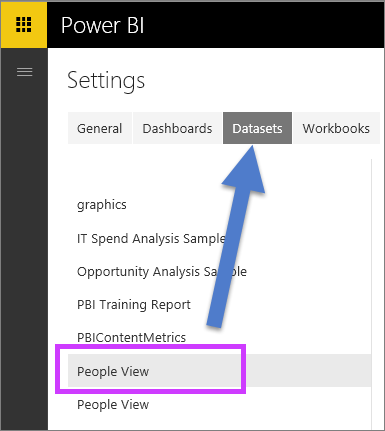

<properties
   pageTitle="Using Q&amp;A with Power BI Gateway - Enterprise data (Preview)"
   description="Documentation for using Power BI Q&amp;A natural language queries with Direct Query data and Enterprise Gateway data."
   services="powerbi"
   documentationCenter=""
   authors="mihart"
   manager="mblythe"
   backup="fetiye"
   editor=""
   tags=""
   qualityFocus="no"
   qualityDate=""/>

<tags
   ms.service="powerbi"
   ms.devlang="NA"
   ms.topic="article"
   ms.tgt_pltfrm="NA"
   ms.workload="powerbi"
   ms.date="07/07/2016"
   ms.author="mihart"/>

# Enable Q&amp;A for Direct Query (Preview)

##  What is On-premises Data Gateway?  What is DirectQuery?

Datasets in Power BI can be imported into Power BI or you can create a live connection to them. Live connection datasets are often referred to as "on-premises". The live connections are managed using a <bpt id="p1">[</bpt>gateway<ept id="p1">](powerbi-gateway-onprem.md)</ept> and data and inquiries are sent back and forth using DirectQuery.

##  Q&amp;A for On-premises Data Gateway datasets

If you'd like to use Q&amp;A with datasets you access through a gateway, you'll need to enable them first.

Once enabled, Power BI creates an index of your data source and uploads a subset of that data to Power BI to enable asking questions. It may take several minutes to create the initial index and Power BI maintains and updates the index automatically as your data changes. Using Q&amp;A with these datasets behaves the same as with data published to Power BI. The full set of features available in the Q&amp;A experience is supported in both cases, including using the data source with Cortana.

As you ask questions in Power BI, Q&amp;A determines the best visual to construct or report sheet to use to answer your question using an index of your dataset. After determining the best potential answer, Q&amp;A uses DirectQuery to fetch live data from the data source via the Enterprise Gateway to populate charts and graphs. This ensures Power BI Q&amp;A results always show the most up-to-date data directly from the underlying data source.

Since Power BI Q&amp;A uses the text and schema values from your data source to determine how to query the underlying model for answers, searches for specific new or deleted text values (such as asking for a customer name related to a newly added text record) rely on the index being up-to-date with the latest values. Power BI automatically keeps the text and schema index up to date within a 60 minute window of changes.

Para obtener más información, vea:

- What is the <bpt id="p1">[</bpt>On-premises Data Gateway<ept id="p1">](powerbi-gateway-onprem.md)</ept>?

- [Introduction to Power BI Q&amp;A](powerbi-service-q-and-a.md)

##  Enable Q&amp;A
Once you have the enterprise gateway set up, connect to your data from Power BI.  Either create a dashboard using your on-premises data, or upload a .pbix file that uses on-premises data.  You may also already have on-premises data in dashboards, reports, and datasets that have been shared with you.

1.  In the upper-right corner of Power BI, select the cog icon <ph id="ph1"></ph> and choose <bpt id="p1">**</bpt>Settings<ept id="p1">**</ept>.

    

2.  Select <bpt id="p1">**</bpt>datasets<ept id="p1">**</ept> and choose the dataset to enable for Q&amp;A.

    

3. Expand <bpt id="p1">**</bpt>Q&amp;A and Cortana<ept id="p1">**</ept>, select the checkbox for <bpt id="p2">**</bpt>Turn on Q&amp;A for this dataset<ept id="p2">**</ept> and choose <bpt id="p3">**</bpt>Apply<ept id="p3">**</ept>.

    

##  What data is cached and how is privacy protected?

When you enable Q&amp;A for your on-premises data, a subset of your data is cached in the service. This is done to ensure that Q&amp;A works with a reasonable performance. We exclude values longer than 24 characters from caching. The cache is deleted within a few hours when you disable Q&amp;A by unchecking <bpt id="p1">**</bpt>Turn on Q&amp;A for this dataset<ept id="p1">**</ept>, or when you delete your dataset.

##  Limitations during Public Preview
During the Preview phase of this feature, there are several limitations:

- Initially the feature is only available for SQL Server 2016 Analysis Services data sources. The feature is optimized to work with tabular data. Some functionality is available for multi-dimensional data sources, but the full Q&amp;A experience is not yet supported for this dataset type. Additional data sources supported by the enterprise gateway will be rolled out during the public preview.

- Full support for row level security defined in the SQL Server Analysis Services is not available initially in the public preview. While asking questions in Q&amp;A, the “auto-complete” of questions while typing can show string values a user does not have access to. However, RLS defined in the model is respected for report and chart visuals so no underlying numerical data can be exposed. Options to control this behavior will be released in coming updates.

- Q&amp;A does not work with Power BI Gateway-Personal data sources.

## Consulte también

[Power BI Quick Insights](powerbi-service-auto-insights.md)

[Optimize your data for Power BI Quick Insights](powerbi-service-auto-insights-optimize.md)

[Power BI - Basic Concepts](powerbi-service-basic-concepts.md)

[Dashboards in Power BI](powerbi-service-dashboards.md)

More questions? [Try the Power BI Community](http://community.powerbi.com/)
