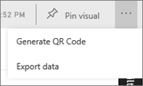
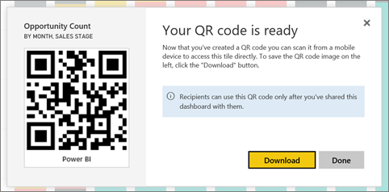

<properties
   pageTitle="Crear un código QR para un mosaico"
   description="Códigos QR en Power BI pueden conectarse a cualquier cosa en el mundo real directamente a la información relacionada de BI en la aplicación móvil de Power BI, ninguna búsqueda necesitada."
   services="powerbi"
   documentationCenter=""
   authors="maggiesMSFT"
   manager="mblythe"
   backup=""
   editor=""
   tags=""
   qualityFocus="no"
   qualityDate=""/>

<tags
   ms.service="powerbi"
   ms.devlang="NA"
   ms.topic="article"
   ms.tgt_pltfrm="NA"
   ms.workload="powerbi"
   ms.date="09/29/2016"
   ms.author="maggies"/>

# Crear un código QR para un icono en el servicio de Power BI

Códigos QR en Power BI pueden conectarse directamente a la información relacionada de BI & #151; nada en el mundo real ninguna exploración o la búsqueda necesitado.

Puede crear un código QR en el servicio de Power BI para iconos en cualquier panel que puede editar. A continuación, coloque el código QR en una ubicación de la clave. Por ejemplo, podría pegar en un correo electrónico, o imprimirlo y péguelo en una ubicación específica. 

Compañeros que ha compartido el panel puede [digitalizar el código QR para el acceso en el mosaico, directamente desde su teléfono](powerbi-mobile-qr-code-for-tile.md). Puede utilizar el analizador de código QR ubicado en la aplicación Power BI o cualquier otro escáner QR instalados en su teléfono. Obtenga más información sobre [cómo compartir paneles](powerbi-service-how-should-i-share-my-dashboard.md).

## Agregar un código QR a un mosaico en el servicio Power BI

1. Abrir un panel en el servicio Power BI.

2. Seleccione el botón de puntos suspensivos (...) en la esquina superior derecha del icono y seleccione **modo de enfoque** .

2. Seleccione el botón de puntos suspensivos (...) en la esquina superior derecha y seleccione **código QR generar**. 

    

3. Aparece un cuadro de diálogo con el código QR. 

    

4. Desde aquí puede examinar el código QR o descargar y guardarla para que pueda: 

     - Agregar a un correo electrónico u otro documento, o 
     - Imprimir y colóquelo en una ubicación específica. 

## Imprimir el código QR

Power BI genera el código QR como un archivo JPG, está listo para imprimirlo. 

1. Seleccione **descargar**, a continuación, abra el archivo JPG en un equipo conectado a una impresora.  

    >
            **Sugerencia:** el archivo JPG tiene el mismo nombre que el mosaico. Por ejemplo, "Recuento de oportunidad - por mes, Stage.jpg de ventas".

2. Imprimir el archivo al 100% o "tamaño real".  

3. Recortar el código QR a lo largo de su borde y péguela en un lugar relevante para el mosaico. 

### Consulte también

-  
            [Conectarse a los datos de Power BI del mundo real](powerbi-mobile-data-in-real-world-context.md) con las aplicaciones móviles
-  [Examinar un código QR de BI de energía desde el teléfono](powerbi-mobile-qr-code-for-tile.md)
-  [Iconos de panel en Power BI](powerbi-service-dashboard-tiles.md)
-  [Power BI: conceptos básicos](powerbi-service-basic-concepts.md)
- ¿Tiene preguntas? [Pruebe a formular a la Comunidad de Power BI](http://community.powerbi.com/)
