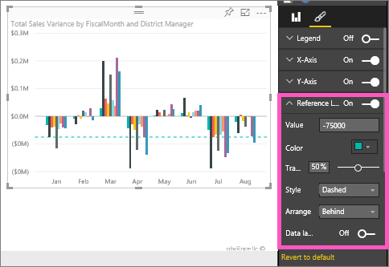

<properties
   pageTitle="Líneas de referencia en el informe"
   description="Líneas de referencia en el informe"
   services="powerbi"
   documentationCenter=""
   authors="mihart"
   manager="mblythe"
   backup=""
   editor=""
   tags=""
   featuredVideoId="zcAFP9U3d30"
   qualityFocus="no"
   qualityDate=""/>

<tags
   ms.service="powerbi"
   ms.devlang="NA"
   ms.topic="article"
   ms.tgt_pltfrm="NA"
   ms.workload="powerbi"
   ms.date="08/23/2016"
   ms.author="mihart"/>

# Líneas de referencia en el informe
##  Dos métodos para crear líneas de referencia

Muchos de los gráficos seguimiento del rendimiento en algunos objetivo o de destino, no sólo una comparación entre las distintas categorías. En estos casos, es útil trazar una o más líneas que representa los destinos o sus objetivos. Estos son *referencia líneas*.

Líneas de referencia se pueden agregar a línea, columna, gráficos de barras, área, cascada y dispersión.

Existen 2 formas para crear líneas de referencias; una es mediante la adición de líneas de referencia como necesite y la otra es mediante el uso de Power BI Desktop para crear un campo reutilizable en el conjunto de datos.

Desplácese hasta el final para ver creará una línea de referencia de servicio Power BI.
<iframe width="560" height="315" src="https://www.youtube.com/embed/zcAFP9U3d30?#t-2m30s" frameborder="0" allowfullscreen></iframe>

## Hacer referencia a las líneas según sea necesario

Este ejemplo utiliza el ejemplo de análisis de venta directa.

 1. Con el gráfico seleccionado, seleccione el icono de pincel para abrir el panel de formato.

    

 2. Expanda el **referencia líneas** área y mueva el control deslizante para **en**.

 3. Agregar una línea de referencia en - 75K escribiendo  **-75000** en la **valor** campo.

      

## Líneas de referencia reutilizables en un conjunto de datos

Usar Power BI Desktop para crear un nuevo campo (columna) en el conjunto de datos. A continuación, usar ese campo una y otra vez en objetos visuales basada en ese conjunto de datos.

 En este ejemplo se agregará un nuevo campo a la [ejemplo financiera](powerbi-sample-download-the-financial-sample-workbook.md).

1. Abra la **financials** tabla.  Esto es donde se creará el nuevo campo (columna).

2.  Seleccione la columna para usarla como base de la línea de referencia.  En este ejemplo vamos a usar la línea de referencia para mostrar **unidades vendidas** anteriormente 200.000.

2. En la cinta de opciones, seleccione **modelado** > **nueva columna**.

    

3. En la barra de fórmulas, escriba lo siguiente:

    **Objetivo de ventas de unidad = 2000**

    

    Esto calcula la columna devolverá el valor 2000 independientemente de donde se utiliza.  
            **Objetivo de ventas de la unidad** se mostrarán en la lista de campos, junto con todos los campos de este conjunto de datos y se pueden agregar en cualquier elemento visual que admite las líneas de referencia. 

4. Agregar el destino de ventas de unidad a un gráfico de líneas para mostrar cómo se relaciona cualquier serie a una línea de referencia específica.    

    

    >[AZURE.NOTE] Asegúrese de que **objetivo de ventas de unidad** no agregada, por ejemplo, sumar o contar. En el **visualizaciones** panel, haga clic en **objetivo de ventas de unidad** y seleccione **Media**, **mínimo**, **máximo**, o **mediana**.

    

##  Solucionar problemas

Si está utilizando un valor de campo como una línea de referencia y no se muestra correctamente, asegúrese de que no se agreguen.  Power BI agrega automáticamente valores, que hace la mejor estimación de cómo desea utilizar el valor. Por ejemplo, si Power BI suma el valor, obtendrá una línea pendiente.  Consulte el paso 4 anterior para obtener instrucciones sobre la configuración de la agregación adecuada para la línea de referencia.

##  Consulte también
[Obtener más información acerca de las columnas calculadas](powerbi-desktop-calculated-columns.md)

¿Preguntas más frecuentes? [Pruebe la Comunidad de Power BI](http://community.powerbi.com/)
