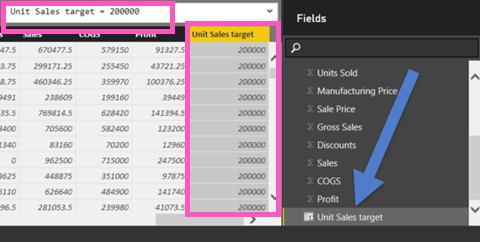

<properties
   pageTitle="Reference lines in your report"
   description="Reference lines in your report"
   services="powerbi"
   documentationCenter=""
   authors="mihart"
   manager="mblythe"
   backup=""
   editor=""
   tags=""
   featuredVideoId="zcAFP9U3d30"
   qualityFocus="no"
   qualityDate=""/>

<tags
   ms.service="powerbi"
   ms.devlang="NA"
   ms.topic="article"
   ms.tgt_pltfrm="NA"
   ms.workload="powerbi"
   ms.date="08/23/2016"
   ms.author="mihart"/>

# Reference lines in your report
##  Two methods to create reference lines

Many charts are tracking performance against some goal or target, not just a comparison across categories. In these cases, plotting one or more lines that represents targets or goals is useful. These are <bpt id="p1">*</bpt>reference lines<ept id="p1">*</ept>.

Reference lines can be added to Line, Column, Bar, Area, Waterfall, and Scatter charts.

There are 2 ways to create references lines; one is by adding reference lines as you need them and the other is by using Power BI Desktop to create a reusable field in your dataset.

Scroll to the end to see Will create a reference line in Power BI service.
<iframe width="560" height="315" src="https://www.youtube.com/embed/zcAFP9U3d30?#t-2m30s" frameborder="0" allowfullscreen></iframe>

## Reference lines as you need them

This example uses the Retail Analysis Sample.

 1. With your chart selected, select the paintbrush icon to open the Formatting pane.

    

 2. Expand the <bpt id="p1">**</bpt>Reference lines<ept id="p1">**</ept> area and move the slider to <bpt id="p2">**</bpt>On<ept id="p2">**</ept>.

 3. Add a reference line at -$75K by entering  <bpt id="p1">**</bpt>-75000<ept id="p1">**</ept> in the <bpt id="p2">**</bpt>Value<ept id="p2">**</ept> field.

      

## Reusable reference lines in a dataset

Use Power BI Desktop to create a new field (column) in your dataset. Then use that field over and over again in visuals based on that dataset.

 In this example you'll add a new field to the <bpt id="p1">[</bpt>Financial Sample<ept id="p1">](powerbi-sample-download-the-financial-sample-workbook.md)</ept>.

1. Open the <bpt id="p1">**</bpt>financials<ept id="p1">**</ept> table.  This is where you'll create the new field (column).

2.  Select which column to use as the basis for the reference line.  In this example we'll use the reference line to show <bpt id="p1">**</bpt>Units Sold<ept id="p1">**</ept> above 200,000.

2. From the ribbon, select <bpt id="p1">**</bpt>Modeling<ept id="p1">**</ept><ph id="ph1"> &gt; </ph><bpt id="p2">**</bpt>New Column<ept id="p2">**</ept>.

    

3. In the formula bar, type the following:

    **Unit Sales target = 2000**

    

    This calculated column will return the value 2000 regardless of where it is used.  <bpt id="p1">**</bpt>Unit Sales target<ept id="p1">**</ept> will show up in your Field list along with all the other fields from this dataset, and can be added to any visual that supports reference lines. 

4. Add the Unit Sales target to a line chart to show how any series relates to that specific reference line.    

    

    >[AZURE.NOTE] Make sure <bpt id="p1">**</bpt>Unit Sales target<ept id="p1">**</ept> isn't being aggregated, for example, summed or counted. In the <bpt id="p1">**</bpt>Visualizations<ept id="p1">**</ept> pane, right-click <bpt id="p2">**</bpt>Unit Sales target<ept id="p2">**</ept> and select <bpt id="p3">**</bpt>Average<ept id="p3">**</ept>, <bpt id="p4">**</bpt>Minimum<ept id="p4">**</ept>, <bpt id="p5">**</bpt>Maximum<ept id="p5">**</ept>, or <bpt id="p6">**</bpt>Median<ept id="p6">**</ept>.

    

##  Solucionar problemas

If you're using a field value as a reference line, and it's not displaying correctly, make sure it isn't being aggregated.  Power BI automatically aggregates values, making its best guess of how you want to use the value. For example, if Power BI sums the value, you'll get a sloping line.  See step 4 above for instructions for setting the proper aggregation for your reference line.

##  Consulte también
[Learn more about calculated columns](powerbi-desktop-calculated-columns.md)

More questions? [Try the Power BI Community](http://community.powerbi.com/)
