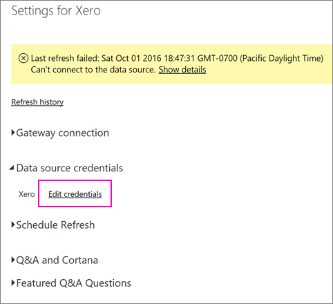
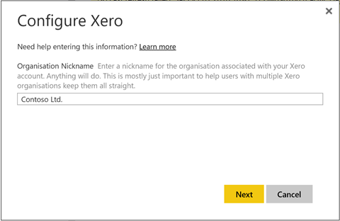

<properties 
   pageTitle="Cómo actualizar las credenciales de su paquete de contenido Xero"
   description="Si utiliza el paquete de contenido de Xero Power BI, puede han experimentado un problema con la actualización diaria del paquete de contenido debido a un incidente de servicio reciente de Power BI."
   services="powerbi" 
   documentationCenter="" 
   authors="joeshoukry" 
   manager="erikre" 
   backup="maggiesMSFT"
   editor=""
   tags=""
   qualityFocus="no"
   qualityDate=""/>
 
<tags
   ms.service="powerbi"
   ms.devlang="NA"
   ms.topic="article"
   ms.tgt_pltfrm="NA"
   ms.workload="powerbi"
   ms.date="10/07/2016"
   ms.author="yshoukry"/>

# Cómo actualizar las credenciales de su paquete de contenido Xero si no se pudo actualizar

Si utiliza el paquete de contenido de Xero Power BI, puede han experimentado algunos problemas relacionados con la actualización diaria del paquete de contenido debido a un incidente de servicio reciente de Power BI.

Puede ver si el paquete de contenido se actualiza correctamente comprobando el último estado de actualización para el conjunto de datos Xero como se muestra en la captura de pantalla siguiente.

Si ve ese error como se mostró anteriormente en la actualización, siga estos pasos para renovar sus credenciales de paquete de contenido.

1. Haga clic en los puntos suspensivos (...) junto a su conjunto de datos Xero, a continuación, haga clic en **programar la actualización**. Se abrirá la página de configuración para el paquete de contenido de Xero.

    
 
2. En el **configuración de Xero** página, seleccione **credenciales del origen de datos** > **Editar credenciales**.

    

3. Escriba el nombre de su organización > **siguiente**.

    

4. Inicie sesión con su cuenta de Xero.

    

4. Ahora que se actualizan las credenciales, asegurémonos de que la programación de actualización se establece para ejecutarse a diario. Compruebe que al hacer clic en los puntos suspensivos (...) junto a su conjunto de datos Xero, a continuación, haga clic en **programar la actualización** nuevo.

    

5. También puede actualizar el conjunto de datos inmediatamente. Haga clic en los puntos suspensivos (...) junto a su conjunto de datos Xero, a continuación, haga clic en **Actualizar ahora**.

    

Si sigue teniendo problemas de actualización, no dude en contacto con nosotros en [http://support.powerbi.com](http://support.powerbi.com) 

Para obtener más información sobre el paquete de contenido de Xero para Power BI, visite la [página de Ayuda del paquete de contenido de Xero](powerbi-content-pack-xero.md).

### Consulte también  

-  ¿Preguntas más frecuentes? [Pruebe la Comunidad de Power BI](http://community.powerbi.com/)
