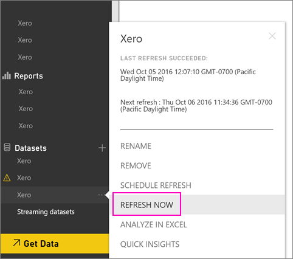

<properties 
   pageTitle="How to refresh your Xero content pack credentials"
   description="If you use the Xero Power BI content pack, you may have experienced a problem with the content pack’s daily refresh due to a recent Power BI service incident."
   services="powerbi" 
   documentationCenter="" 
   authors="joeshoukry" 
   manager="erikre" 
   backup="maggiesMSFT"
   editor=""
   tags=""
   qualityFocus="no"
   qualityDate=""/>
 
<tags
   ms.service="powerbi"
   ms.devlang="NA"
   ms.topic="article"
   ms.tgt_pltfrm="NA"
   ms.workload="powerbi"
   ms.date="10/07/2016"
   ms.author="yshoukry"/>

# How to refresh your Xero content pack credentials if refresh failed

If you use the Xero Power BI content pack, you may have experienced some problems with the content pack’s daily refresh due to a recent Power BI service incident.

You can see if your content pack refreshed successfully by checking the last refresh status for your Xero dataset as shown in the screenshot below.

If you do see that refresh failed as shown above, please follow these steps to renew your content pack credentials.

1. Click the ellipsis (...) next to your Xero dataset, then click <bpt id="p1">**</bpt>Schedule refresh<ept id="p1">**</ept>. This opens the settings page for the Xero content pack.

    
 
2. In the <bpt id="p1">**</bpt>Settings for Xero<ept id="p1">**</ept> page, select <bpt id="p2">**</bpt>Data source credentials<ept id="p2">**</ept><ph id="ph1"> &gt; </ph><bpt id="p3">**</bpt>Edit credentials<ept id="p3">**</ept>.

    

3. Enter your organization’s name &gt; <bpt id="p1">**</bpt>Next<ept id="p1">**</ept>.

    

4. Sign in with your Xero account.

    

4. Now that your credentials are updated, let’s make sure the refresh schedule is set to run daily. Check that by clicking the ellipsis (...) next to your Xero dataset, then clicking <bpt id="p1">**</bpt>Schedule refresh<ept id="p1">**</ept> again.

    

5. You can also choose to refresh the dataset immediately. Click the ellipsis (...) next to your Xero dataset, then click <bpt id="p1">**</bpt>Refresh now<ept id="p1">**</ept>.

    

If you are still having refresh issues, please don’t hesitate to reach out to us at <bpt id="p1">[</bpt>http://support.powerbi.com<ept id="p1">](http://support.powerbi.com)</ept> 

To learn more about the Xero content pack for Power BI, please visit the <bpt id="p1">[</bpt>Xero content pack help page<ept id="p1">](powerbi-content-pack-xero.md)</ept>.

### Consulte también  

-  More questions? [Try the Power BI Community](http://community.powerbi.com/)
