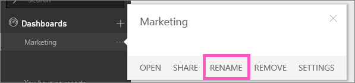

<properties
   pageTitle="Cambiar el nombre de un panel de Power BI"
   description="Cambiar el nombre de un panel de Power BI."
   services="powerbi"
   documentationCenter=""
   authors="mihart"
   manager="mblythe"
   backup=""
   editor=""
   tags=""
   qualityFocus="no"
   qualityDate=""/>

<tags
   ms.service="powerbi"
   ms.devlang="NA"
   ms.topic="article"
   ms.tgt_pltfrm="NA"
   ms.workload="powerbi"
   ms.date="10/07/2016"
   ms.author="mihart"/>
# Cambiar el nombre de un panel de Power BI

## Cambie el nombre del panel

Haga clic en el nombre del panel y seleccione **cambiar el nombre de**.

## ¿Tiene problemas para cambiar el nombre de un panel?

-   Si el panel tiene este icono 

    Un icono para compartir indica que el panel se está [compartido](powerbi-service-share-unshare-dashboard.md) con usted o forma parte de un paquete de contenido de organización.  

-   Paneles compartidos son de solo lectura y no se puede cambiar. 

-   Si el panel forma parte de un paquete de contenido, puede personalizarla y cambiar el nombre de este modo.

    

Leer más [sugerencias para diseñar su panel](powerbi-service-tips-for-designing-a-great-dashboard.md).

## Consulte también

[Paneles de Power BI](powerbi-service-dashboards.md)

[Power BI: conceptos básicos](powerbi-service-basic-concepts.md)

¿Preguntas más frecuentes? [Pruebe la Comunidad de Power BI](http://community.powerbi.com/)
