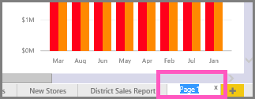

<properties
   pageTitle="Cambiar el nombre de una página del informe en Power BI"
   description="Documentación sobre cómo cambiar el nombre de una página del informe en el servicio de Microsoft Power BI."
   services="powerbi"
   documentationCenter=""
   authors="mihart"
   manager="mblythe"
   backup=""
   editor=""
   tags=""
   featuredVideoId="UOKbxTXZrWw"
   qualityFocus="no"
   qualityDate=""/>

<tags
   ms.service="powerbi"
   ms.devlang="NA"
   ms.topic="article"
   ms.tgt_pltfrm="NA"
   ms.workload="powerbi"
   ms.date="08/25/2016"
   ms.author="mihart"/>
# Cambiar el nombre de una página del informe en Power BI

##  ¿Qué ocurre al cambiar el nombre de una página de informe?

¿No le gusta el nombre de una página en el informe de Power BI?  Un nuevo nombre es sólo un clic de distancia. 

<iframe width="560" height="315" src="https://www.youtube.com/embed/UOKbxTXZrWw?list=PL1N57mwBHtN0JFoKSR0n-tBkUJHeMP2cP" frameborder="0" allowfullscreen></iframe>

1.  Abra el informe en [vista de edición de](powerbi-service-go-from-reading-view-to-editing-view.md).

2. Busque las fichas de página de informe en la parte inferior de la ventana de Power BI.

    

2.  Abra la página de informe que desea cambiar el nombre, seleccione la ficha.

4. Haga doble clic en el nombre de la ficha para resaltarla.  

    

5. Escriba un nuevo nombre de página del informe y presione ENTRAR.

    

##  Consulte también

[Cambiar el nombre de un informe](powerbi-service-rename-a-report.md)

Obtenga más información sobre [informes de Power BI](powerbi-service-reports.md)

[Power BI: conceptos básicos](powerbi-service-basic-concepts.md)*

¿Preguntas más frecuentes? [Pruebe la Comunidad de Power BI](http://community.powerbi.com/)
