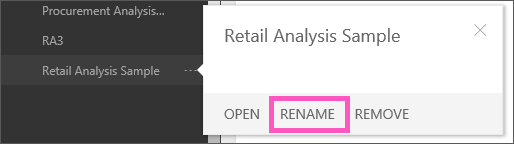

<properties
   pageTitle="Cambiar el nombre de un informe en Power BI"
   description="Cambiar el nombre de un informe en Power BI"
   services="powerbi"
   documentationCenter=""
   authors="mihart"
   manager="mblythe"
   backup=""
   editor=""
   tags=""
   qualityFocus="no"
   qualityDate=""/>

<tags
   ms.service="powerbi"
   ms.devlang="NA"
   ms.topic="article"
   ms.tgt_pltfrm="NA"
   ms.workload="powerbi"
   ms.date="10/07/2016"
   ms.author="mihart"/>
# Cambiar el nombre de un informe en Power BI

##  ¿Qué ocurre al cambiar el nombre de un informe?

¿No le gusta el nombre predeterminado de un informe en Power BI?  Un nuevo nombre es sólo un clic de distancia.  Y cambiar el nombre de un informe de no cambiar el nombre de conjunto de datos asociado o [cambiar el nombre del panel asociado](powerbi-service-rename-a-dashboard.md).

## Cambiar el nombre de un informe

1.  En el panel de navegación izquierdo, busque el informe, haga clic en él y seleccione **cambiar el nombre de**.

    

2.  Escriba el nuevo nombre.

##  Consulte también

Obtenga más información sobre [informes de Power BI](powerbi-service-reports.md)

[Power BI: conceptos básicos](powerbi-service-basic-concepts.md)*

¿Preguntas más frecuentes? [Pruebe la Comunidad de Power BI](http://community.powerbi.com/)
