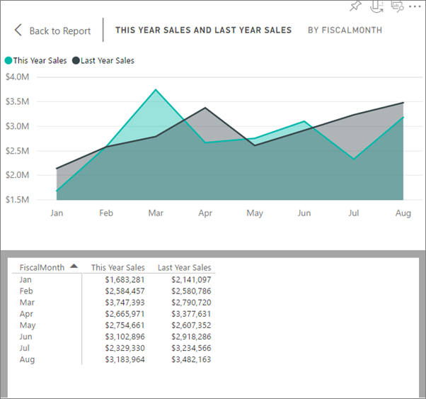

<properties
   pageTitle="Vea los datos utilizados para crear el objeto visual"
   description="Este documento muestra cómo ver los datos que se utiliza para crear un objeto visual en Power BI."
   services="powerbi"
   documentationCenter=""
   authors="mihart"
   manager="mblythe"
   backup=""
   editor=""
   tags=""
   qualityFocus="no"
   qualityDate=""/>

<tags
   ms.service="powerbi"
   ms.devlang="NA"
   ms.topic="article"
   ms.tgt_pltfrm="NA"
   ms.workload="powerbi"
   ms.date="09/12/2016"
   ms.author="mihart"/>

# Mostrar los datos subyacentes del objeto visual

Visual de Power BI se construye utilizando los datos de los conjuntos de datos. Si está interesado en ver entre bastidores, Power BI permite mostrar los datos que se utiliza para crear el objeto visual.

1.  En el servicio de Power BI, abra un informe en [vista lectura](powerbi-service-open-a-report-in-reading-view.md) o [vista de edición de](powerbi-service-go-from-reading-view-to-editing-view.md), y seleccione un objeto visual.  En Power BI Desktop, abra la vista de informe.

2.  Para ver los datos subyacentes del objeto visual, seleccione **Explorar** > **Ver datos**.

3.  De forma predeterminada, los datos se muestran debajo del objeto visual.  Para cambiar esto, en la esquina superior derecha del objeto visual, seleccione el **cambiar a diseño vertical** icono .

    

4.  Para exportar los datos a un archivo .csv, seleccione **Exportar datos**.

    

5. Para ocultar los datos, ya sea anular la selección **Explorar** > **Ver datos** o seleccione el **ocultar datos** icono  desde la esquina superior derecha del objeto visual.

### Consulte también

[Visualizaciones en informes de Power BI](powerbi-service-visualizations-for-reports.md)

[Informes de Power BI](powerbi-service-reports.md)

[Power BI: conceptos básicos](powerbi-service-basic-concepts.md)

¿Preguntas más frecuentes? [Pruebe la Comunidad de Power BI](http://community.powerbi.com/)
