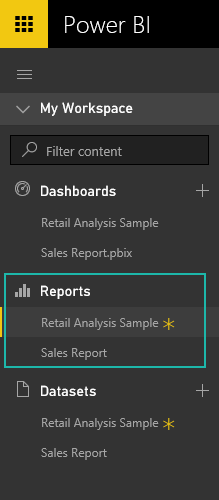

<properties
   pageTitle="Informes de Power BI"
   description="Informes de Power BI"
   services="powerbi"
   documentationCenter=""
   authors="mihart"
   manager="mblythe"
   backup=""
   editor=""
   tags=""
   qualityFocus="no"
   qualityDate=""/>

<tags
   ms.service="powerbi"
   ms.devlang="NA"
   ms.topic="article"
   ms.tgt_pltfrm="NA"
   ms.workload="powerbi"
   ms.date="10/05/2016"
   ms.author="mihart"/>
# Informes de Power BI

Los paneles, informes y conjuntos de datos están en el centro de Power BI. Un **informe** es una vista de varias perspectiva en los datos con visualizaciones que representan diferentes resultados e información de esos datos.  Un informe puede tener una sola visualización o páginas enteras de visualizaciones.

¿Necesita ayuda para comprender los bloques de creación que conforman Power BI?  Consulte [BI: conceptos básicos de energía](powerbi-service-basic-concepts.md).

Puede [crear un informe desde cero](powerbi-service-create-a-new-report.md) o [haberlo compartido con usted](powerbi-service-share-unshare-dashboard.md). Y para algunos tipos de datos, Power BI [crear un informe para el agrega el conjunto de datos](powerbi-service-get-data.md).  

## Ver informes en el panel de navegación

Power BI puede tener más de un informe, como agregar informes, sus títulos se agregan a la lista bajo la **informes** título (consulte la siguiente captura de pantalla). Se resalta el informe que está viendo actualmente. Nuevos informes tienen un asterisco amarillo. Solo se puede abrir un informe en un momento.

## Para obtener más información acerca de los informes:

En la tabla de contenido (en el lado izquierdo de esta página del explorador), expanda **informes** para ver todos los temas relacionados con los informes de Power BI.

### Sugerencias y solución de problemas

- No olvide que [crear un informe](powerbi-service-create-a-new-report.md)  requiere un [conjunto de datos](powerbi-service-get-data.md).  

- Asegúrese de entender la diferencia entre [vista lectura](powerbi-service-interact-with-a-report-in-reading-view.md) y [vista de edición de](powerbi-service-interact-with-a-report-in-editing-view.md). 

- Familiarizarse con el editor de informe [un paseo](powerbi-service-the-report-editor-take-a-tour.md).

- Modificar cómo los informes muestran utilizando [página Configuración de pantalla](powerbi-service-change-report-display-settings.md).

- ¿Conoce la diferencia entre el filtro, resaltar, filtro cruzado y resaltan? Si no es así, consulte [filtrar y resaltar datos en informes](powerbi-service-about-filters-and-highlighting-in-reports.md).

- 
            [Modo de enfoque](powerbi-service-move-and-resize-a-visualization.md) y [el modo de pantalla completa TV](powerbi-service-dash-and-reports-fullscreen.md) : hay una diferencia.

## Véase también

[Introducción a Power BI](powerbi-service-get-started.md) 

[Power BI: conceptos básicos](powerbi-service-basic-concepts.md)

¿Preguntas más frecuentes? [Pruebe la Comunidad de Power BI](http://community.powerbi.com/)
