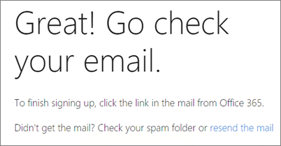
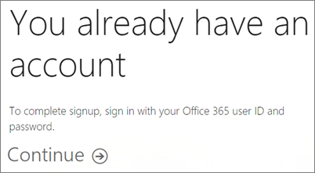
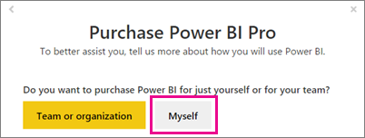

<properties
   pageTitle="Suscripción de autoservicio para Power BI"
   description="Suscripción de autoservicio para Power BI. Mira cómo una persona puede registrarse para Power BI (gratuito), una evaluación o adquirir Power BI Pro."
   services="powerbi"
   documentationCenter=""
   authors="guyinacube"
   manager="erikre"
   backup=""
   editor=""
   tags=""
   qualityFocus="no"
   qualityDate=""/>

<tags
   ms.service="powerbi"
   ms.devlang="NA"
   ms.topic="get-started-article"
   ms.tgt_pltfrm="NA"
   ms.workload="powerbi"
   ms.date="10/10/2016"
   ms.author="asaxton"/>
# Suscripción de autoservicio para Power BI

Registrarse para Power BI, como usuario individual, es fácil! Puede usar una cuenta gratuita, una cuenta de prueba Pro o compra Power BI Pro, incluso si está en una organización existente. Una vez que haya determinado que desea utilizar, este artículo le guiará a través de los pasos necesarios para poner en funcionamiento.

> [AZURE.NOTE] Si trabaja en una organización, inicio de sesión individual de puede deshabilitarse. Consulte [se ha desactivado el registro Individual](#individual-sign-up-has-been-turned-off) para obtener más información si se produce un error que indica que se ha desactivado.

## ¿Qué dirección de correo electrónico se puede usar con Power BI?

Power BI requiere el uso de un trabajo o escuela, dirección de correo electrónico para registrarse. Power BI no admite las direcciones de correo electrónico proporcionadas por servicios de correo electrónico del consumidor o proveedores de telecomunicaciones. Esto incluye outlook.com, hotmail.com, gmail.com y otros.

Si intenta iniciar sesión con una dirección de correo electrónico personal, obtendrá un mensaje que indica que para utilizar un trabajo o académica de dirección de correo electrónico.

> [AZURE.NOTE] Power BI no admite suscripción de autoservicio para direcciones .gov o. mil en este momento. Póngase en contacto con el Administrador de Office 365.

## Registrarse para Power BI (gratuito) como usuario individual

Es la forma más rápida para suscribirse a Power BI para suscribirse a una cuenta de Power BI (gratis). No hay ningún costo para esta cuenta y permite utilizar muchas de las características disponibles en el servicio. [Obtener más información](https://powerbi.microsoft.com/pricing/)

> [AZURE.NOTE] Si recibe un mensaje que ya sabemos, intente navegar a https://app.powerbi.com y la firma.

Para suscribirse a Power BI, puede hacer lo siguiente.

1.  Vaya a powerbi.com.

2.  Seleccione **Introducción gratuita**.

    

    O puede ir a **productos** > **precios** y seleccione **registrarse**.
    
    

3.  En el cuadro de diálogo para elegir cómo empezar a trabajar, seleccione **registrarse** en Power BI.

    

4.  Escriba la dirección de correo electrónico que va a registrarse con y, a continuación, seleccione **registrarse**. Asegúrese de que se permite su dirección de correo electrónico para registrarse. [Obtener más información](#what-email-address-can-be-used-with-power-bi)

    

5.  Si la cuenta no existe dentro de una organización, obtendrá un mensaje que indica que para comprobar el correo electrónico.

    

    Si la cuenta forma parte de una organización existente, obtendrá un mensaje que le pide que inicie sesión con esa cuenta. Seleccione **continuar** e inicie sesión con su inicio de sesión de Office 365.

    

6.  Si recibe un correo electrónico, seleccione el vínculo en el correo electrónico para comprobar su dirección de correo electrónico. Esto le llevará atrás en el flujo de suscripción. Debe proporcionar información adicional sobre sí mismo.
7.  Si tiene una cuenta de Office 365 existente, verá un mensaje que le pide que seleccione **iniciar**.

    
    
8.  A continuación, se le llevará a https://app.powerbi.com y puede empezar a usar Power BI como un usuario libre.

### Aspecto dentro del servicio

Cuando esté en el servicio, puede comprobar que tiene una cuenta gratuita, vaya a la **engranaje** icono y seleccione **Administrar almacenamiento personal**.

 
## Versión de prueba de Power BI Pro 60 días

Después de registrarse para su cuenta gratuita, puede optar por probar Pro de forma gratuita. Tendrá acceso a todas las funciones de Pro para la duración de la versión de prueba. Power BI Pro incluye todas las características de la versión gratuita de Power BI y características de actualización de datos y la colaboración adicional. También tiene mayor capacidad de datos y límites de transmisión de datos. Para obtener más información, consulte [precios de Power BI](https://powerbi.microsoft.com/pricing). Para probar una versión de prueba gratuita de 60 días de Power BI Pro, inicie sesión en Power BI y pruebe una de estas características de Power BI Pro:

-   Creación y publicación personalizada [paquetes de contenido](powerbi-service-organizational-content-packs-introduction.md)
-   Recurso compartido [actualizables](powerbi-refresh-data.md) paneles e informes de uso del equipo [grupos](powerbi-service-create-a-group-in-power-bi.md)
-   Conectarse a datos de local mediante [Personal Gateway](powerbi-personal-gateway.md)
-   Habilitar la conectividad interactivo directo a los orígenes siguientes:
    -   [SQL Server Analysis Services](powerbi-sql-server-analysis-services-tabular-data.md)
    -   [Spark en HDInsight de Azure](powerbi-spark-on-hdinsight-with-direct-connect.md)
    -   [Almacenamiento de datos SQL Azure](powerbi-azure-sql-data-warehouse-with-direct-connect.md)
    -   [Azure SQL Database](powerbi-azure-sql-database-with-direct-connect.md)

Cuando realice una de estas características, se le pedirá para iniciar la prueba gratuita. También puede hacer uso de ella en el icono de engranaje y seleccione **Administrar almacenamiento personal**. A continuación, seleccione **prueba gratuita de Pro para** a la derecha.

 
Puede seleccionar **Inicio prueba**.

> **Notas**
>
>-   Si necesita más tiempo para evaluar Power BI, puede solicitar para ampliar el período de prueba de 60 días más.
>-   Aprovechándose de esta versión de evaluación del producto Power BI Pro no aparece en el portal de administración de Office 365 como usuarios de Power BI Pro prueba (aparecen como usuarios gratuitos de Power BI). Sin embargo, aparecerán como usuarios de la versión de prueba de Power BI Pro en el **Administrar almacenamiento** página en Power BI.
>-   Si es un administrador de TI que deseen adquirir e implementar licencias de prueba de Power BI a varios usuarios de su organización sin necesidad de aceptar los términos de prueba individualmente usuarios individuales, puede registrarse para una [Power BI Pro suscripción de prueba](https://portal.office.com/Signup/MainSignup15.aspx?OfferId=d59682f3-3e3b-4686-9c00-7c7c1c736085&dl=POWER_BI_PRO).  Debe ser un administrador de facturación o Office 365 Global o crear un nuevo inquilino para suscribirse a un administrador de prueba. [Obtener más información](powerbi-admin-purchasing-power-bi-pro.md)
 
### Aspecto dentro del servicio

Cuando esté en el servicio, puede comprobar que tiene una cuenta de prueba Pro yendo a la **engranaje* icono y seleccione **Administrar almacenamiento personal**.

## Poder adquisitivo BI Pro como usuario individual

Puede adquirir Power BI Pro desde el principio, o puede elegir actualizar a Pro después de finaliza la prueba gratuita. Si la cuenta forma parte de una organización, puede comprar Power BI Pro como usuario individual si su organización ha deshabilitado compras individuales.

Para adquirir Power BI Pro como usuario individual, puede hacer lo siguiente.

1.  Vaya a [powerbi.com](https://www.powerbi.com).

2.  Seleccione **productos** > **precios**.

3.  Seleccione **compra**.

    

4.  Responda las preguntas que se presentan para guiar la compra. Como usuario individual, habrá una opción para seleccionar **yo mismo**. 

    

    > 
            **Nota**: si está interesado en la opción de comprar para su equipo u organización, puede leer sobre la adquisición de Power BI Pro para su organización. [Obtener más información](powerbi-admin-purchasing-power-bi-pro.md)

5.  Si aún no ha iniciado en Power BI, debe iniciar sesión con su cuenta de Power BI (gratis).

6.  Debe proporcionar información para realizar la compra.

### Aspecto dentro del servicio

Cuando esté en el servicio, puede comprobar que tiene una cuenta de Pro, vaya a la **engranaje** icono y seleccione **Administrar almacenamiento personal**.

## Se ha desactivado el registro individual

Al intentar iniciar sesión en Power BI, puede encontrar el siguiente mensaje de error.

    Your IT department has turned off signup for Microsoft Power BI.
 

Esto podría deberse a que su organización ha deshabilitado ups de inicio de sesión individuales. También podría deberse a que ha adquirido Office 365 a través de un socio. 
            [Obtenga más información](powerbi-admin-syndication-partner.md).

Si su organización ha deshabilitado el inicio de sesión individuales SAI (UPS), debe trabajar con su grupo de TI para obtener una licencia de Power BI asignada a su cuenta para poder continuar.

## Solucionar problemas

En muchos casos, puede lograr registrarse para Power BI siguiendo el proceso de suscripción de autoservicio simple mencionado anteriormente. Sin embargo, hay varios motivos de por qué no pueda completar la suscripción de autoservicio.  La tabla siguiente resume algunas de las razones más comunes que no pueda completar la suscripción y cómo que puede solucionar estos problemas.

| **Síntoma o mensaje de Error** | **Causa y solución** |
|---|---|
| 
            **Direcciones de correo electrónico personal (por ejemplo, nancy@gmail.com)** recibe un mensaje similar al siguiente durante la suscripción:    *Escribió una dirección de correo electrónico personal: escriba su dirección de correo electrónico por lo que podemos almacenar con seguridad los datos de su compañía.*    o    *Que parece una dirección de correo electrónico personal. Escriba su dirección de manera que podemos conectarnos con otras personas de su empresa. Y no se preocupe. No compartimos su dirección con nadie.* | Power BI no admite las direcciones de correo electrónico proporcionadas por los proveedores de telecomunicaciones o de servicios de correo electrónico de consumidor.    Para completar la suscripción, inténtelo de nuevo usando una dirección de correo electrónico asignada por su trabajo o escuela.    Si todavía no puede registrarse y está dispuesto a completar un proceso de configuración más avanzado, puede [registrar una nueva suscripción de prueba de Office 365 y utilizar esta dirección para iniciar sesión de correo electrónico](powerbi-admin-signing-up-for-power-bi-with-a-new-office-365-trial.md). |
| 
            **direcciones de correo electrónico .gov o. mil** recibe un mensaje similar al siguiente durante la suscripción:    *Power BI disponible: Power BI no está disponible para los usuarios con direcciones de correo electrónico .gov o. mil en este momento. Use otra dirección de correo electrónico de trabajo o vuelva a comprobarlo más tarde.*    o    *No podemos terminamos registrarse. Parece que Microsoft Power BI no está actualmente disponible para su trabajo o escuela.* | Power BI no admite suscripción de autoservicio para direcciones .gov o. mil en este momento. Póngase en contacto con el Administrador de Office 365. |
| 
            **Suscripción de autoservicio deshabilitado** recibe un mensaje similar al siguiente durante la suscripción:    *No podemos terminamos registrarse. El departamento de TI ha desactivado de suscripción para Microsoft Power BI. Póngase en contacto con ellos para una suscripción completa.*    o    *Que parece una dirección de correo electrónico personal. Escriba su dirección de manera que podemos conectarnos con otras personas de su empresa. Y no se preocupe. No compartimos su dirección con nadie.* | Su organización se detallan suscripción de autoservicio para Power BI.    Para completar la suscripción, póngase en contacto con el Administrador de TI y pídale que siga las instrucciones en la página siguiente para permitir que los usuarios existentes para suscribirse a Power BI y permitir a los usuarios nuevos unir a inquilino existente.    También puede experimentar este problema si se registró para Office 365 a través de un socio. [Obtener más información](powerbi-admin-syndication-partner.md)    [Power BI en su organización](https://support.office.com/en-ca/article/Power-BI-in-your-Organization-d7941332-8aec-4e5e-87e8-92073ce73dc5#BKMK_HowCanIAllowO365Tenant) |
| 
            **Dirección de correo electrónico no es un identificador de Office 365** recibe un mensaje similar al siguiente durante la suscripción:    *Se encuentra en contoso.com.  ¿Utiliza un ID de trabajo o escuela?    Intente iniciar sesión con la y, si no funciona, póngase en contacto con el departamento de TI.* | Su organización utiliza identificadores para iniciar sesión Office 365 y otros servicios de Microsoft que sea diferentes a la dirección de correo electrónico.  Por ejemplo, su dirección de correo electrónico podría ser Nancy.Smith@contoso.com, pero el identificador es nancys@contoso.com.    Para completar la suscripción, utilice el identificador de su organización ha asignado a para iniciar sesión en Office 365 u otros servicios de Microsoft.  Si no sabe qué se trata, póngase en contacto con el Administrador de TI.    Si todavía no puede registrarse y puede completar un proceso de instalación más avanzado, puede [registrar una nueva suscripción de prueba de Office 365 y utilizar esta dirección para iniciar sesión de correo electrónico](powerbi-admin-signing-up-for-power-bi-with-a-new-office-365-trial.md). |

## Consulte también

[Poder adquisitivo BI Pro](powerbi-admin-purchasing-power-bi-pro.md)  
[No se puede agregar suscripción a Office 365 socio Power BI](powerbi-admin-syndication-partner.md)  
[Power BI (gratuito) de su organización](powerbi-admin-powerbi-free-in-your-organization.md)  
¿Preguntas más frecuentes? [Pruebe la Comunidad de Power BI](http://community.powerbi.com/)