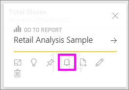
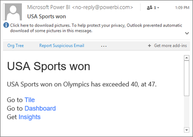
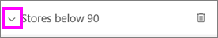

<properties
   pageTitle="Establecer alertas de datos en el servicio Power BI"
   description="Aprenda a establecer alertas para notificar cuando cambian los datos de los paneles más allá de los límites establezca en el servicio de Microsoft Power BI."
   services="powerbi"
   documentationCenter=""
   authors="mihart"
   manager="mblythe"
   backup=""
   editor=""
   tags=""
   featuredVideoId="JbL2-HJ8clE"
   qualityFocus="no"
   qualityDate=""/>

<tags
   ms.service="powerbi"
   ms.devlang="NA"
   ms.topic="article"
   ms.tgt_pltfrm="NA"
   ms.workload="powerbi"
   ms.date="10/04/2016"
   ms.author="mihart"/>

# Alertas de datos en el servicio Power BI

Establecer alertas para recibir una notificación cuando cambian los datos de los paneles más allá de los límites establezca.  Alertas de trabajo mosaicos numérico con tarjetas y medidores. Sólo puede ver las alertas que establezca, incluso si comparte el escritorio. Alertas de datos están completamente sincronizadas entre plataformas; establecer y ver las alertas de datos [en la aplicación móvil de Power BI para iPhone](powerbi-mobile-set-data-alerts-in-the-iphone-app.md), [aplicaciones móviles de Power BI para Windows](powerbi-mobile-set-data-alerts-in-the-windows-10-mobile-app.md) y en el servicio Power BI. No están disponibles para Power BI Desktop.

> [AZURE.WARNING] Notificaciones de alerta controlada por datos proporcionan información acerca de los datos. Si ve los datos de Power BI en un dispositivo móvil y roben ese dispositivo, se recomienda usar el servicio Power BI para desactivar todas las reglas de alertas controlada por datos.

## Establecer alertas de datos en el servicio Power BI
Vea Amanda agregar algunas alertas a mosaicos en su panel. A continuación, siga las instrucciones detalladas a continuación el vídeo para probarlo usted mismo.

<iframe width="560" height="315" src="https://www.youtube.com/embed/JbL2-HJ8clE" frameborder="0" allowfullscreen></iframe>

Este ejemplo utiliza un icono de la tarjeta en el panel de ejemplo de análisis de venta directa.

1.  Inicie en un panel. En un icono de panel, seleccione el botón de puntos suspensivos.

    

2.  Seleccione el icono de campana  para agregar una o varias alertas para **Total almacenes**.

    

3.  Para empezar, asegúrese de que el control deslizante se establece en **en**, y asigne un título de la alerta. Títulos de ayudarle a reconocer fácilmente sus alertas.

    

4.  Desplácese hacia abajo y escriba los detalles de alerta.  En este ejemplo, vamos a crear una alerta que nos notifica una vez al día si el número de tiendas total supera los 100. Las alertas aparecen en nuestro centro de notificaciones. Y haremos que Power BI envíenos un correo electrónico también.

    

5. Seleccione **Guardar**.

## Recepción de alertas
Cuando los datos de seguimiento llegan a uno de los umbrales que ha establecido, se realizará varias acciones. En primer lugar, Power BI comprueba ver si han pasado más de una hora o más de 24 horas (según la opción seleccionada) desde la última alerta se envió. Siempre que los datos están más allá del umbral, obtendrá una alerta.

A continuación, Power BI envía una alerta a su centro de notificaciones y, opcionalmente, en el correo electrónico. Cada alerta contiene un vínculo directo a los datos. Seleccione el vínculo para ver el icono correspondiente donde puede explorar, compartir y obtener más información.  

1.  Si ha establecido la alerta para enviar un correo electrónico, encontrará algo parecido a esto en su Bandeja de entrada.

    

2.  Power BI agrega un mensaje a su **Centro de notificaciones** y agrega un nuevo icono de alerta en el icono correspondiente.

    

4. Abra el centro de notificaciones para ver los detalles de alerta.

    

>[AZURE.NOTE] Las alertas sólo funcionan en los datos que se actualizan. Cuando los datos se actualicen, Power BI busca para ver si se ha configurado una alerta para los datos. Si los datos ha alcanzado un umbral de alerta, se activará una alerta.

## Administrar alertas
Hay tres maneras de administrar las alertas: desde el panel en mosaico, en el menú de opciones de Power BI y en un mosaico individual en el [Power BI aplicación móvil en el iPhone](powerbi-mobile-set-data-alerts-in-the-iphone-app.md) o en la [aplicación móvil de Power BI para Windows 10](powerbi-mobile-set-data-alerts-in-the-windows-10-mobile-app.md).

###   Desde el mosaico

1. Si necesita cambiar o quitar una alerta para un mosaico, vuelva a abrir el **Administrar alertas** seleccionando el icono de campana . Se muestran todas las alertas que ha establecido para ese mosaico.

    .

2. Para modificar una alerta, seleccione la flecha situada a la izquierda del nombre de la alerta.

    .

3. Para eliminar una alerta, seleccione el cubo de basura a la derecha del nombre de la alerta.

      

###   En el menú de configuración de Power BI
1. Seleccione el icono de engranaje de la barra de menús de Power BI.

    .

2. Bajo **configuración** seleccione **alertas**.

    

3. Desde aquí puede activar alertas y desactivado, abra la **Administrar alertas** ventana para realizar cambios o eliminar la alerta.

## Sugerencias y solución de problemas

-  Las alertas no se admiten para los mosaicos de Bing o iconos de tarjeta con medidas de fecha y hora.

-  Las alertas sólo funcionan con tipos de datos numéricos.

-  Las alertas sólo funcionan en los datos que se actualizan. No funcionan en los datos estáticos.

### Consulte también
- [Establecer alertas de datos en su iphone](powerbi-mobile-set-data-alerts-in-the-iphone-app.md)
- 
            [¿Introducción a Power BI](powerbi-service-get-started.md) más preguntas? [Pruebe la Comunidad de Power BI](http://community.powerbi.com/)
