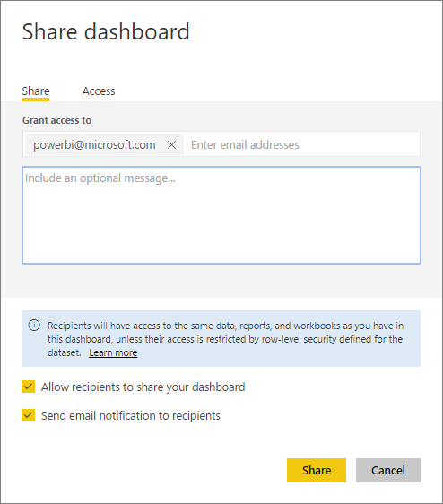
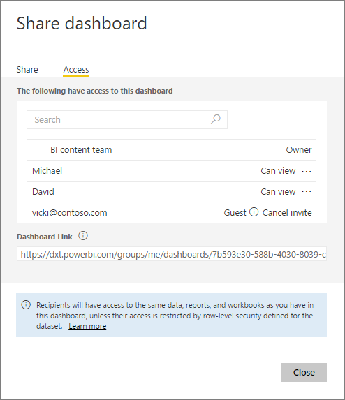
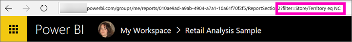

<properties
   pageTitle="Compartir paneles e informes con colegas etc."
   description="Cómo compartir informes y paneles de Power BI con colegas dentro y fuera de su organización, y lo que necesita saber acerca del uso compartido."
   services="powerbi"
   documentationCenter=""
   authors="ajayan"
   manager="mblythe"
   backup=""
   editor=""
   tags=""
   featuredVideoId="0tUwn8DHo3s"
   qualityFocus="identified"
   qualityDate="06/22/2016"/>

<tags
   ms.service="powerbi"
   ms.devlang="NA"
   ms.topic="article"
   ms.tgt_pltfrm="NA"
   ms.workload="powerbi"
   ms.date="10/13/2016"
   ms.author="maggies"/>

# Compartir un panel y los informes con sus colegas y otros

Puede compartir sus paneles e informes con colegas dentro y fuera de su organización. Si no han iniciado sesión en [Power BI](http://powerbi.com), deberá hacerlo para ver el panel.

¿Qué se puede compartir y que puede compartir con depende sus y sus licencias de Power BI. Consulte [requisitos de licencias para uso compartido](powerbi-service-share-unshare-dashboard.md#licensing-requirements-for-sharing) a continuación para obtener más información.

Paneles e informes que se comparten con los son de sólo lectura.  No se puede guardar-en cuanto a personalizarlos. Por otro lado, puede realizar su propia copia de paneles e informes en [paquetes de contenido organizativo](powerbi-service-organizational-content-packs-introduction.md).  Consulte [¿Cómo debo compartir mi panel](powerbi-service-how-should-i-share-my-dashboard.md)? para decidir cuál es mejor para su situación.

>
            **Nota**: compartir paneles e informes desde el servicio Power BI o las aplicaciones móviles de Power BI, pero no desde Power BI Desktop.

Vea Amanda compartir su escritorio con colegas dentro y fuera de su empresa. A continuación, siga las instrucciones detalladas a continuación el vídeo para probarlo usted mismo.

<iframe width="560" height="315" src="https://www.youtube.com/embed/0tUwn8DHo3s?list=PL1N57mwBHtN0JFoKSR0n-tBkUJHeMP2cP" frameborder="0" allowfullscreen></iframe>

## Compartir un panel

1.   Abrir el panel y seleccione **Share** .

2.  Seleccione **en vite** y escriba las direcciones de correo electrónico en el cuadro superior y, opcionalmente, modifique el mensaje.

      

    Puede compartir con personas cuyas direcciones están fuera de su organización, pero verá una advertencia.

      

3.  Para permitir que sus colegas para compartir su escritorio con otras personas, active **Permitir que los destinatarios compartan su panel**.

    Sólo los compañeros de su organización pueden volver a compartir el panel. Personas fuera de su organización pueden ver el panel pero no compartirlo.

4.  Seleccione **recurso compartido.**

    Power BI envía una invitación de correo electrónico con un vínculo al panel compartido. Al hacer clic en el vínculo, se agrega el panel servicio de Power BI de su colega. Verán este icono  junto al panel compartido, que indica el panel se comparte con ellos.

    Si no lo ha hecho todavía registrado en Power BI, pueden crear una cuenta después de hacer clic en el vínculo.

    >
            **Nota**: la experiencia de uso compartida es diferente para las personas fuera de su organización. Consulte [cuando se comparte con personas fuera de su organización](powerbi-service-share-unshare-dashboard.md#when-you-share-your-dashboard-with-people-outside-your-organization) a continuación para obtener más información.

5.  Para ver que ya ha compartido el panel con, seleccione **acceso**.

    

    Personas fuera de la organización se muestran como **invitado**.

## Notas acerca de cómo compartir un panel

Al compartir un panel:

-   Todos los usuarios comparten con pueden ver el panel e interactuar con los informes en [vista lectura](powerbi-service-open-a-report-in-reading-view.md). Que no pueden crear nuevos informes o guardar los cambios en los informes existentes.

-   Incluso todos pueden ver los cambios que realice.

-   Nadie puede ver o descargar el conjunto de datos.

-   Todo el mundo puede manualmente [actualizar los datos del panel](powerbi-refresh-data.md).

### Cuando comparta su panel con sus colegas

-   Si utiliza Office 365 para correo electrónico, puede compartir con los miembros de un grupo de distribución escribiendo la dirección de correo electrónico asociada con el grupo de distribución.

-   Colegas que tengan el mismo dominio de correo electrónico como y colegas cuyo dominio es diferente pero registrados en el inquilino, pueden volver a compartir el panel. Por ejemplo, supongamos que los dominios contoso.com y contoso2.com están registrados en el inquilino. Si su dirección de correo electrónico es konrads@contoso.com, a continuación, ambos ravali@contoso.com y gustav@contoso2.com puede compartirlo.

    
            **Sugerencia:** si sus compañeros ya tienen acceso a un panel específico, puede enviar un vínculo directo a ese panel copiando la dirección URL cuando se encuentra en el panel. Por ejemplo:   

    https://powerbi.com/Dashboards/g12466b5-a452-4e55-8634-xxxxxxxxxxxx

## Al compartir el escritorio con personas fuera de su organización

Cuando se comparte con personas fuera de su organización, recibe un correo electrónico con un vínculo al panel compartido. Tienen que iniciar sesión en Power BI para ver el panel. Si no tienen una cuenta de Power BI, puede crear uno al hacer clic en el vínculo.

Una vez que inicien sesión, podrán ver el panel compartido en su propia ventana del explorador sin el panel de navegación izquierdo, no en el portal de Power BI habitual. Tienen que marcar el vínculo para obtener acceso a este panel en el futuro.

No pueden editar contenido en este panel o informe. Pueden interactuar con los gráficos en el informe (resaltan) y cambiar los filtros o segmentaciones de datos disponibles en los informes conectados al panel.

Sólo los destinatarios directos pueden ver el panel compartido. En el ejemplo anterior, solo Vicki@contoso.com puede ver el panel. Nadie más puede ver el panel de control, incluso si tienen el vínculo y Vicki tiene que utilizar la misma dirección de correo electrónico para tener acceso a ese panel. Si se suscribe a cualquier otra dirección de correo electrónico, o bien, no tendrá acceso al panel.

Personas fuera de su organización no pueden ver los datos si se implementa la seguridad de nivel de fila o de rol en los modelos tabulares de Analysis Services en local.

## Compartir sólo un informe
Hemos visto que al compartir un panel que dispone de iconos que se vinculan a los informes, los informes también están compartidos al mismo tiempo. Pero, ¿qué sucede si desea compartir solamente un informe? Simplemente envía la dirección URL de página de informe a sus compañeros. Mientras que son miembros del mismo grupo de distribución, en el mismo dominio de correo electrónico que usted, o tienen al menos un panel que se vincula a ese mismo informe (el panel muestra iconos que se han fijado de ese informe), podrá abrir el informe.

Consulte [al compartir con compañeros, anteriormente](powerbi-service-share-unshare-dashboard.md#when-you-share-your-dashboard-with-colleagues).

### Compartir una versión filtrada de un informe
¿Qué sucede si desea compartir una versión filtrada de un informe? Quizás un informe que muestra solamente los datos de una determinada ciudad o vendedor o año. Esto puede hacerse mediante la creación de una dirección URL personalizada.

1.   Abra el informe en [vista de edición](powerbi-service-go-from-reading-view-to-editing-view.md) y aplicar el filtro. En este ejemplo que estamos filtrando el [ejemplo de análisis de venta](powerbi-sample-tutorial-connect-to-the-samples.md) para mostrar solo distrito FD-01.

    

2.  Agregue lo siguiente al final de la URL de la página de informe:

    ? Filtro = valor tablename/fieldname eq

    En nuestro ejemplo, el nombre de la tabla es **almacén**, el nombre del campo es **territorio**, y es el valor que desea filtrar en **NC**.

    

    El explorador agrega algunos caracteres especiales para representar espacios y barras diagonales para acabar con:

    App.powerbi.com/Groups/me/Reports/010ae9ad-a9ab-4904-a7a1-10a61f70f2f5/ReportSection2?Filter=Store%252FTerritory%20eq%20NC

    >[AZURE.NOTE]El campo debe ser de tipo **cadena** y ni el tablename ni el nombre de campo puede contener espacios.

3.  Enviar esta dirección URL a sus compañeros. Cuando hacen clic en el vínculo, Power BI se abrirá una versión de solo lectura del informe filtrado.

## Requisitos de licencias para uso compartido

Uso compartido de contenido dentro y fuera de su organización tienen los mismos requisitos de licencias.

Si crea el panel con sólo las características de Power BI libres, los destinatarios sólo necesitan una licencia gratuita de Power BI para ver el contenido. Si usa características de Power BI Pro como grupos o conectividad local, los destinatarios necesitan una licencia de Power BI Pro para ver el contenido.

Consulte [contenido de Power BI Pro - ¿qué es?](powerbi-power-bi-pro-content-what-is-it.md) para obtener una lista completa.

Esta página, precios de Power BI [Use Power BI para liberar o comprar Power BI Pro](https://powerbi.microsoft.com/pricing), es también una útil comparación de las dos opciones.

## Volver a compartir

Volver a compartir permite que sus colegas reenviar la invitación de correo electrónico a otras personas de su organización (la invitación expira transcurrido un mes). También pueden compartir colegas a través del servicio Power BI y aplicaciones móviles. Como propietario del panel, puede desactivar volver a compartir y también se pueden revocar usos compartidos de forma individual (ver abajo).

No se pueden volver a compartir personas fuera de su organización.

## Dejar de compartir un panel

1.  Abrir el panel y seleccione **Share** .

2.  Seleccione **acceso** para ver la lista completa de las personas.

    

3.  Seleccione los puntos suspensivos (**...**) junto a **puede ver** y seleccione:

    

    -   
            **Dejar de compartir** con esa persona o

    -   
            **Deshabilitar volver a compartir** para impedir que esa persona comparta con nadie más.

    -   O si la persona todavía no ha aceptado la invitación de uso compartido, **Cancelar invitación**.

## Desactivar volver a compartir

Sólo el propietario del panel puede activar y desactivar volver a compartir.

-   Si todavía no ha enviado la invitación para compartir, desactive la **Permitir que los destinatarios compartan su panel** casilla de verificación en la parte inferior de la invitación.

-   Si compañeros no han aceptado el uso compartido de invitación aún, cancelar la invitación e invitarlos nuevamente sin seleccionar **Permitir que los destinatarios compartan su panel**.

-   Si ha aceptado su invitación para compartir, seleccione **acceso**, seleccione los puntos suspensivos (**...**) junto a **puede ver** y haga clic en **dejar de compartir**.

    

### Consulte también

- 
            [¿Cómo debo compartir mi panel?](powerbi-service-how-should-i-share-my-dashboard.md)
- 
            [Compartir un panel que se vincula a un archivo de Excel](powerbi-service-share-dashboard-that-links-to-excel.md)
- 
            [Contenido de BI Pro Power - ¿qué es?](powerbi-power-bi-pro-content-what-is-it.md)
- 
            [Uso de Power BI gratuitamente o comprar Power BI Pro](https://powerbi.microsoft.com/pricing)
- 
            [Introducción a Power BI](powerbi-service-get-started.md)
- ¿Preguntas más frecuentes? 
            [Pruebe la Comunidad de Power BI](http://community.powerbi.com/).
