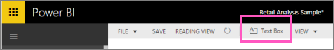
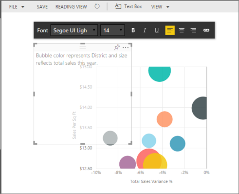
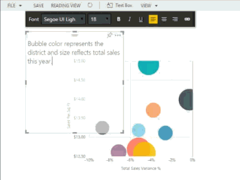

<properties
   pageTitle="Cuadros de texto en los informes de Power BI"
   description="Documentación sobre cómo agregar y crear cuadros de texto en un informe de Microsoft Power BI."
   services="powerbi"
   documentationCenter=""
   authors="mihart"
   manager="mblythe"
   backup=""
   editor=""
   tags=""
   qualityFocus="no"
   qualityDate=""/>

<tags
   ms.service="powerbi"
   ms.devlang="NA"
   ms.topic="article"
   ms.tgt_pltfrm="NA"
   ms.workload="powerbi"
   ms.date="10/07/2016"
   ms.author="mihart"/>
# Cuadros de texto en los informes de Power BI

En la vista de edición, agregue un cuadro de texto a un informe y, a continuación, se ancla a un panel. 

##  Agregar un cuadro de texto a un informe
1.  Coloque el cursor en cualquier lugar del lienzo del informe y seleccione **cuadro de texto**.

    

2.  Escriba el texto en el cuadro de texto y, opcionalmente, alineación de texto, color y fuente de formato. 

    

3.  Para colocar el cuadro de texto, seleccione el área gris de la parte superior y arrastre. Y para cambiar el tamaño del cuadro de texto, seleccione y arrastre cualquiera de los identificadores de esquema. 

    

4.  Para cerrar el cuadro de texto, seleccione cualquier espacio en blanco en el lienzo de informe.

5.  Seleccione el icono de pin   para anclar el cuadro de texto a un panel. 

### Consulte también

[Agregar un hipervínculo a un cuadro de texto](powerbi-service-add-a-hyperlink-to-a-text-box.md)

[Informes de Power BI](powerbi-service-reports.md)

[Visualizaciones en informes de Power BI](powerbi-service-visualizations-for-reports.md)

[Power BI: conceptos básicos](powerbi-service-basic-concepts.md)

¿Preguntas más frecuentes? [Pruebe la Comunidad de Power BI](http://community.powerbi.com/)
