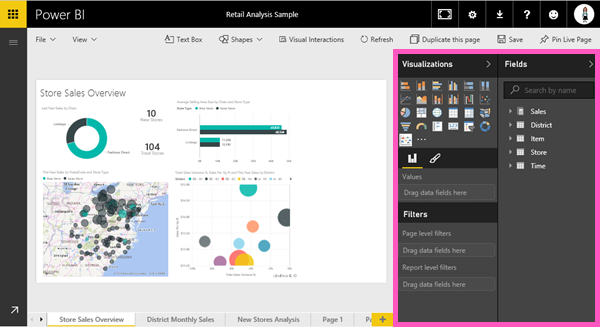
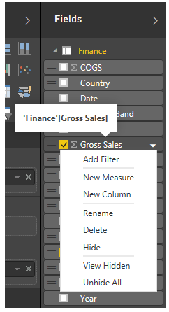
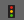

<properties
   pageTitle="El editor de informe... Dé un paseo"
   description="El editor de informe... Dé un paseo."
   services="powerbi"
   documentationCenter=""
   authors="mihart"
   manager="mblythe"
   backup=""
   editor=""
   tags=""
   qualityFocus="no"
   qualityDate=""/>

<tags
   ms.service="powerbi"
   ms.devlang="NA"
   ms.topic="article"
   ms.tgt_pltfrm="NA"
   ms.workload="powerbi"
   ms.date="09/21/2016"
   ms.author="mihart"/>
# El editor de informe... Dé un paseo

            [Abra un informe de Power BI en la vista de edición de](powerbi-service-go-from-reading-view-to-editing-view.md).

El editor de informes de Power BI se compone de 3 paneles:  **campos**, **visualizaciones**, y **filtros**, además de la barra de navegación superior y el lienzo de informes.  

## Los paneles del editor de informes

Los paneles en el lado izquierdo, visualizaciones y los filtros, controlan las visualizaciones apariencia--escriba colores, filtrado.  Y el panel del lado derecho, campos, controlar los datos subyacentes que se utilizan en las visualizaciones. 

El contenido mostrado en el editor de informe varía según las selecciones que realice en el lienzo de informes.  Por ejemplo, al seleccionar un objeto visual individual, 

-   la parte superior del panel de visualización identifica el tipo de visual en uso, 
-   la parte inferior del panel de visualización muestra los campos que se utiliza en el objeto visual,
-   el panel filtros muestra los filtros que se han aplicado, y
-   la lista de campos identifica tablas (campos y si la tabla ya está expandida) en uso.

## El panel de visualizaciones (de arriba a abajo)

Seleccionar tipo de visual, compile su visual agregando y administrar campos y personalizar la apariencia y funcionamiento de su visual.

### Cambiar entre los diferentes tipos visuales seleccionando el icono.

### Controlar los campos utilizados en el objeto visual.

Los cubos que se muestra en este panel varían según el tipo de visualización que ha seleccionado.  Por ejemplo, si ha seleccionado un gráfico de barras, verá depósitos para: valores, el eje y la leyenda. Cuando seleccione un campo o arrástrelo al lienzo, Power BI agrega ese campo a uno de los cubos.  También puede arrastrar campos desde la lista de campos directamente en los depósitos de visualizaciones.  Algunos de los depósitos están limitados a determinados tipos de datos.  Por ejemplo, **valores** no aceptará los campos no numéricos. Por tanto, si arrastra una **employeename** campo en el **valores** depósitos, Power BI cambia a **recuento de employeename**.

### Quitar un campo

Para quitar un campo de la visualización, seleccione el campo y haga clic en el **X**.

Para obtener más información, consulte [Agregar visualizaciones a un informe de Power BI](powerbi-service-add-visualizations-to-a-report-i.md)

### Dar formato a los objetos visuales

Seleccione el icono de pincel para mostrar las opciones de personalización. 

-   [Personalizar el título de visualización, el fondo y la leyenda](powerbi-service-tutorial-customize-visualization-title-background-and-legend.md)
-   [Formato de color](powerbi-service-getting-started-with-color-formatting-and-axis-properties.md)
-   [Personalizar las propiedades de los ejes x y y](powerbi-service-tutorial-customize-x-axis-and-y-axis-properties.md)

    

## El panel de filtros

Ver, establecer y modificar la página, informes y filtros de nivel visual.

Para obtener más información, consulte [Agregar un filtro a un informe](powerbi-service-add-a-filter-to-a-report.md).

## El panel de campos 

El panel de campos muestra las tablas y campos que existen en los datos.  Utilice estos campos para crear visualizaciones.

-   Arrastre un campo a la página para iniciar una visualización nueva.  También puede arrastrar un campo en una visualización existente para agregar el campo.

-   O bien, seleccione la casilla de verificación junto a un campo.  Si está seleccionada una visualización en el lienzo, el nuevo campo se agrega a esa visualización.

-   En cualquier caso, cada campo seleccionado se agrega al panel de visualizaciones en el editor de informes.

            **NOTA**: si usa Power BI Desktop, puede llegar a opciones para mostrar u ocultar campos, agregar cálculos etc., desde aquí:

### ¿Qué significan los iconos de campo?

- 
              **∑ Agregados** un agregado es un valor numérico que se suma o promedio, por ejemplo. Agregados se importan con los datos (definidos en el informe se basa en el modelo de datos).
  Para obtener más información, consulte [agregados en los informes de Power BI](powerbi-service-aggregates.md).

-   **Campos calculados o medidas**  
    Cada calculado campo tiene su propia fórmula codificado de forma rígida. No se puede cambiar el cálculo, por ejemplo, si es una suma, sólo puede ser una suma. Para obtener más información, [leer la descripción de las medidas](powerbi-desktop-measures.md)

-  **Campos únicos**  
    Los campos con este icono se importaron desde Excel y se van a mostrar todos los valores, incluso si tienen duplicados. Por ejemplo, los datos podrían tener dos registros para las personas con el nombre "John Smith" y cada uno se trata como único: no sumar.  

-  ** Campos de geografía**  
    Campos de ubicación se pueden usar para crear visualizaciones de mapas. 

-  ** Jerarquía**  
    Seleccione la flecha para mostrar los campos que componen la jerarquía. 

## La barra de navegación superior.
Las acciones disponibles en la barra de navegación superior son numerosas; con las nuevas acciones que se agrega todo el tiempo. Para obtener información sobre una acción concreta, utilice el cuadro de búsqueda o la tabla de contenido de Power BI documentación.

## Pasos siguientes:

[Editar un informe](powerbi-service-interact-with-a-report-in-editing-view.md)

[crear un informe](powerbi-service-create-a-new-report.md)

## Consulte también

Obtenga más información sobre [informes de Power BI](powerbi-service-reports.md)

[Introducción a Power BI](powerbi-service-get-started.md)

[Power BI: conceptos básicos](powerbi-service-basic-concepts.md)

¿Preguntas más frecuentes? [Pruebe la Comunidad de Power BI](http://community.powerbi.com/)
