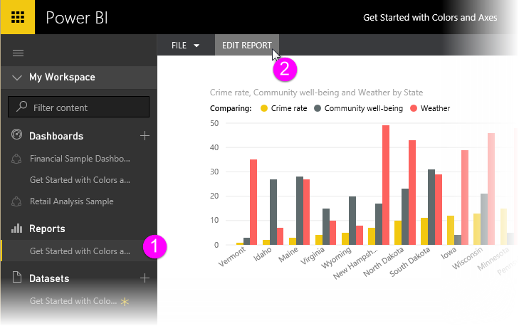
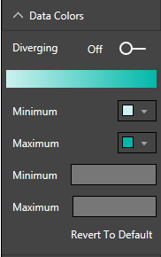
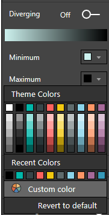
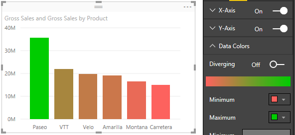
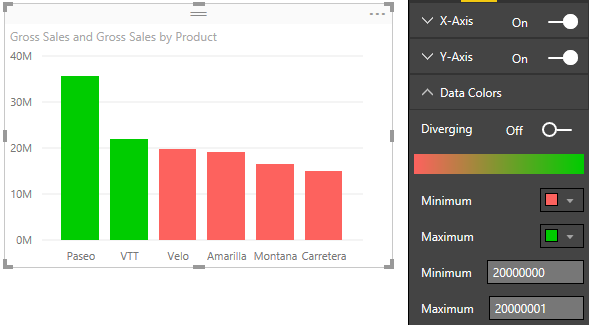

<properties
   pageTitle="Sugerencias y trucos para Power BI de formato de color"
   description="Sugerencias y trucos para Power BI de formato de color"
   services="powerbi"
   documentationCenter=""
   authors="davidiseminger"
   manager="mblythe"
   backup=""
   editor=""
   tags=""
   qualityFocus="no"
   qualityDate=""/>

<tags
   ms.service="powerbi"
   ms.devlang="NA"
   ms.topic="article"
   ms.tgt_pltfrm="NA"
   ms.workload="powerbi"
   ms.date="10/12/2016"
   ms.author="davidi"/>

# Sugerencias y trucos para Power BI de formato de color

Power BI proporciona muchas maneras diferentes de personalizar los informes y paneles. Este artículo se detalla un conjunto de sugerencias que puede hacer que las visualizaciones de Power BI más atractiva, interesantes y personalizadas para sus necesidades.

Se proporcionan las siguientes sugerencias. ¿Tiene otra buena sugerencia? Estupendo. Enviar nuestra manera y veremos acerca de cómo agregar a esta lista.

-   Cambiar el color de un único punto de datos

-   Basar los colores de un gráfico en un valor numérico

-   Basar el color de los puntos de datos en un valor de campo

-   Personalizar los colores utilizados en la escala de colores

-   Use divergentes escalas de colores

-   Cómo deshacer en Power BI

Para realizar cambios, debe modificar un informe: seleccionar su **informe** desde el **Mi área de trabajo** panel, a continuación, seleccione **Editar informe** desde el área de menú superior, como se muestra en la siguiente imagen.

Cuando el **visualizaciones** panel aparece al lado derecho de la **informe** lienzo, está listo para empezar a personalizar.

## Cambiar el color de un único punto de datos

A veces desea resaltar un punto de datos determinado. Quizás es cifras de ventas para el lanzamiento de un producto nuevo o aumentar las puntuaciones de calidad después de iniciar un programa nuevo. Con Power BI, puede resaltar un punto de datos determinado cambiándole el color.

La visualización siguiente clasifica los Estados en términos de coste de la vida. 

Ahora suponga que desea mostrar rápidamente en Washington aterriza en esa lista clasificada, utilizando el color. Estos son los pasos:

Expanda el **colores datos** sección. Aparece el siguiente.

Establecer **Mostrar todo** a **en**. Esto muestra los colores de cada elemento de datos en la visualización. Desplazamiento está habilitado cuando se coloca sobre los puntos de datos, por lo que puede modificar cualquiera de los puntos de datos.

En este caso, vamos a cambiar **Washington** a verde. Nos desplazamos hacia abajo hasta **Washington** y seleccione la flecha desplegable dentro de su cuadro de color y aparece la ventana de selección de color.

Una vez seleccionado, el **Washington** punto de datos es una buena tonalidad de verde y ciertamente destaque.

Aunque cambiar tipos de visualización, a continuación devuelve, Power BI recuerda la selección y mantiene **Washington** verde.

Puede cambiar el color de un punto de datos de más de un elemento de datos, también. En la siguiente imagen, **Arizona** es rojo, y **Washington** continúa en color verde.

Hay todo tipo de cosas que puede hacer con colores. En la siguiente sección, echamos un vistazo a degradados.

## Basar los colores de un gráfico en un valor numérico

Los gráficos que se suelen beneficiarán de establecer de forma dinámica basándose en el valor numérico de un campo de color. Haciendo esto, podría mostrar un valor diferente al que se utilizó para el tamaño de una barra y se muestran dos valores en un único gráfico. O bien puede usar para resaltar los datos puntos sobre (o en) un valor determinado: quizás resaltar áreas de la falta de rentabilidad.

Las siguientes secciones muestran distintas formas de color se base en un valor numérico.

## El color de los puntos de datos en un valor de base

Para cambiar el color según un valor, arrastre el campo que desea basar el color en la **saturación del Color** área en el **campo** panel. En la siguiente imagen, **beneficios antes de impuestos** se ha arrastrado a **saturación del Color**. Como puede ver que, aunque **Velo** tiene mayor **ventas brutas** (la columna es mayor), **Amarilla** tiene una mayor **beneficios antes de impuestos** (su columna tiene más de saturación de color).

## Personalizar los colores utilizados en la escala de colores

Puede personalizar los colores utilizados en la escala de colores demasiado. Expanda **datos colores** y verá un degradado de colores que se usan para visualizar los datos. De forma predeterminada, el valor más bajo de los datos se asigna a los colores menos saturados y el valor más alto para el color de la saturación máxima.

La gama de colores se muestra en la barra de degradado que muestre el espectro entre **mínimo** y **máximo** los valores de color con el **mínimo** valor de color a la izquierda, y **máximo** valor de color a la derecha.

Para cambiar la escala para usar otro intervalo de colores, seleccione la lista desplegable situada junto a color **mínimo** o **máximo**, y seleccione un color. La siguiente imagen muestra la **máxima** Cambiar color a negro y la barra de degradado muestra el espectro de color nuevo entre **mínimo** y **má Max**.

También puede cambiar la manera en que los valores se asignan a estos colores. En la siguiente imagen, los colores de **mínimo** y **máximo** se establecen en naranja y verde, respectivamente.

En esta primera imagen, observe cómo las barras del gráfico reflejan el degradado que se muestra en la barra; el valor máximo es verde, la más baja es naranja y cada barra entre está coloreado con un tono del espectro entre verde y naranja.

Ahora, veamos qué sucede si se proporcionan valores numéricos en el **mínimo** y **máximo** valor cuadros, que están por debajo de la **mínimo** y **máximo** color selectores (que se muestra en la siguiente imagen). Vamos a configurar **mínimo** en 20,000,000 y **máximo** a 20,000,000.

Estableciendo los valores de degradado ya no se aplica a los valores del gráfico que se encuentran debajo de **mínimo** o superior **máximo**; cualquier barra con un valor sobre **máximo** valor es de color verde y cualquier barra con un valor bajo **mínimo** valor es de color rojo.

## Usar escalas de colores Diverging

A veces los datos pueden tener una escala de forma natural divergente. Por ejemplo, un intervalo templado tiene un centro natural en el punto de congelación y una puntuación de rentabilidad tiene un punto medio natural (cero).

Para utilizar divergentes escalas de colores, deslice el **Diverging** control deslizante para **en**. Cuando **Diverging** está activado, un selector de color adicionales y cuadro de valor, ambos llama **Center**, aparecen como se muestra en la siguiente imagen.

Cuando el **Diverging** control deslizante está activada, puede establecer los colores de **mínimo**, **máximo** y **Center** por separado. En la siguiente imagen, **Center** se establece en uno, por lo que barras con valores por encima de uno son un tono de degradado de color verde, y por debajo de las barras de tonos de rojo.

## Cómo deshacer en Power BI

Al igual que muchos otros servicios de Microsoft y software, Power BI proporciona una manera fácil de deshacer el último comando. Por ejemplo, digamos cambiemos el color de un punto de datos o una serie de puntos de datos y no le gusta el color cuando aparece en la visualización. No recuerda exactamente el color que tenía antes, pero sabe que desea volver ese color!

Para **Deshacer** la última acción o las acciones de pocos última, todo lo que tiene que hacer es:

1.  Tipo CTRL + Z

## Comentarios

¿Tiene una sugerencia que le gustaría compartir? Envíe nuestra manera y veremos sobre incluirlo aquí.

            **Nota:** estos colores, eje y personalizaciones relacionadas, está disponible cuando el **formato** icono está seleccionada, también están disponible en Power BI Desktop.

Para obtener más información, vea los siguientes artículos:

-   [Introducción a las propiedades de eje y el formato de color](powerbi-service-getting-started-with-color-formatting-and-axis-properties.md)
