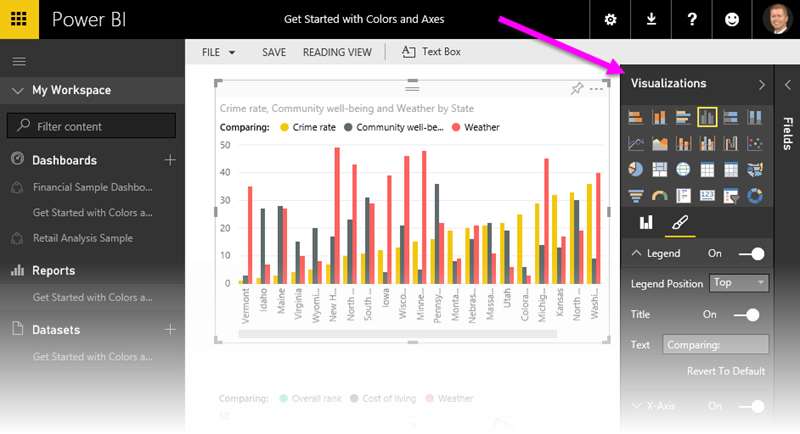
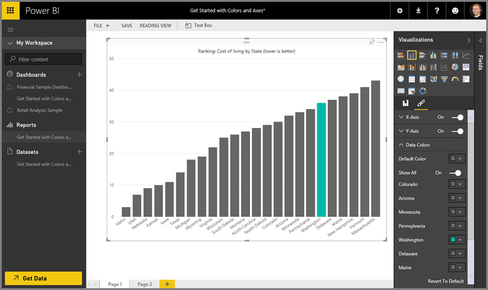

<properties
   pageTitle="Tips and tricks for color formatting in Power BI"
   description="Tips and tricks for color formatting in Power BI"
   services="powerbi"
   documentationCenter=""
   authors="davidiseminger"
   manager="mblythe"
   backup=""
   editor=""
   tags=""
   qualityFocus="no"
   qualityDate=""/>

<tags
   ms.service="powerbi"
   ms.devlang="NA"
   ms.topic="article"
   ms.tgt_pltfrm="NA"
   ms.workload="powerbi"
   ms.date="10/12/2016"
   ms.author="davidi"/>

# Tips and tricks for color formatting in Power BI

Power BI provides many different ways to customize your dashboards and reports. This article details a collection of tips that can make your Power BI visualizations more compelling, interesting, and customized to your needs.

The following tips are provided. Have another great tip? Estupendo. Send it our way and we’ll see about adding it to this list.

-   Change the color of a single data point

-   Base the colors of a chart on a numeric value

-   Base the color of data points on a field value

-   Customize colors used in the color scale

-   Use diverging color scales

-   How to undo in Power BI

To make any changes, you must be editing a report: select your <bpt id="p1">**</bpt>Report<ept id="p1">**</ept> from the <bpt id="p2">**</bpt>My Workspace<ept id="p2">**</ept> pane, then select <bpt id="p3">**</bpt>Edit Report<ept id="p3">**</ept> from the top menu area, as shown in the following image.

When the <bpt id="p1">**</bpt>Visualizations<ept id="p1">**</ept> pane appears along the right side of the <bpt id="p2">**</bpt>Report<ept id="p2">**</ept> canvas, you’re ready to start customizing.

## Change the color of a single data point

Sometimes you want to highlight one particular data point. Perhaps it’s sales figures for the launch of a new product, or increased quality scores after launching a new program. With Power BI, you can highlight a particular data point by changing its color.

The following visualization ranks states in terms of cost of living. 

Now imagine you want to quickly show where Washington lands in that ranked list, by using color. Here are the steps:

Expand the <bpt id="p1">**</bpt>Data Colors<ept id="p1">**</ept> section. The following appears.

Set <bpt id="p1">**</bpt>Show All<ept id="p1">**</ept> to <bpt id="p2">**</bpt>On<ept id="p2">**</ept>. This displays the colors for each data element in the visualization. When you hover over the data points, scrolling is enabled so you can modify any of the data points.

In this case, let’s change <bpt id="p1">**</bpt>Washington<ept id="p1">**</ept> to green. We scroll down to <bpt id="p1">**</bpt>Washington<ept id="p1">**</ept> and select the down arrow inside its color box, and the color selection window appears.

Once selected, the <bpt id="p1">**</bpt>Washington<ept id="p1">**</ept> data point is a nice shade of green, and certainly stands out.

Even if you change visualization types, then return, Power BI remembers your selection and keeps <bpt id="p1">**</bpt>Washington<ept id="p1">**</ept> green.

You can change the color of a data point for more than one data element, too. In the following image, <bpt id="p1">**</bpt>Arizona<ept id="p1">**</ept> is red, and <bpt id="p2">**</bpt>Washington<ept id="p2">**</ept> is still green.

There are all sorts of things you can do with colors. In the next section, we take a look at gradients.

## Base the colors of a chart on a numeric value

Charts often benefit from dynamically setting color based on the numeric value of a field. By doing this, you could show a different value than what’s used to for the size of a bar, and show two values on a single graph. Or you can use this to highlight data points over (or under) a certain value – perhaps highlighting areas of low profitability.

The following sections demonstrate different ways to base color on a numeric value.

## Base the color of data points on a value

To change color based on a value, drag the field you want to base color on into the <bpt id="p1">**</bpt>Color Saturation<ept id="p1">**</ept> area in the <bpt id="p2">**</bpt>Field<ept id="p2">**</ept> pane. In the following image, <bpt id="p1">**</bpt>Profit before tax<ept id="p1">**</ept> has been dragged into <bpt id="p2">**</bpt>Color Saturation<ept id="p2">**</ept>. As can see that, although <bpt id="p1">**</bpt>Velo<ept id="p1">**</ept> has higher <bpt id="p2">**</bpt>Gross Sales<ept id="p2">**</ept> (its column is higher), <bpt id="p3">**</bpt>Amarilla<ept id="p3">**</ept> has a larger <bpt id="p4">**</bpt>Profit before tax<ept id="p4">**</ept> (its column has more color saturation).

## Customize the colors used in the color scale

You can customize colors used in the color scale, too. Expand <bpt id="p1">**</bpt>Data Colors<ept id="p1">**</ept> and you see a gradient of colors used for visualizing your data. By default, the lowest value in your data is mapped to the least saturated color, and the highest value to the most saturated color.

The color range is shown in a gradient bar that displays the spectrum between <bpt id="p1">**</bpt>Minimum<ept id="p1">**</ept> and <bpt id="p2">**</bpt>Maximum<ept id="p2">**</ept> color values, with the <bpt id="p3">**</bpt>Minimum<ept id="p3">**</ept> value color on the left, and <bpt id="p4">**</bpt>Maximum<ept id="p4">**</ept> value color to the right.

To change the scale to use a different range of colors, select the color drop-down beside <bpt id="p1">**</bpt>Minimum<ept id="p1">**</ept> or <bpt id="p2">**</bpt>Maximum<ept id="p2">**</ept>, and select a color. The following image shows the <bpt id="p1">**</bpt>Maximum<ept id="p1">**</ept> color changed to black, and the gradient bar shows the new color spectrum between <bpt id="p2">**</bpt>Minimum<ept id="p2">**</ept> and <bpt id="p3">**</bpt>Maximum<ept id="p3">**</ept>.

You can also change the way the values map to these colors. In the following image, the colors for <bpt id="p1">**</bpt>Minimum<ept id="p1">**</ept> and <bpt id="p2">**</bpt>Maximum<ept id="p2">**</ept> are set to orange and green, respectively.

In this first image, notice how the bars in the chart reflect the gradient shown in the bar; the highest value is green, the lowest is orange, and each bar between is colored with a shade of the spectrum between green and orange.

Now, let’s see what happens if we provide numeric values in the <bpt id="p1">**</bpt>Minimum<ept id="p1">**</ept> and <bpt id="p2">**</bpt>Maximum<ept id="p2">**</ept> value boxes, which are below the <bpt id="p3">**</bpt>Minimum<ept id="p3">**</ept> and <bpt id="p4">**</bpt>Maximum<ept id="p4">**</ept> color selectors (shown in the following image). Let’s set <bpt id="p1">**</bpt>Minimum<ept id="p1">**</ept> to 20,000,000, and set <bpt id="p2">**</bpt>Maximum<ept id="p2">**</ept> to 20,000,000.

By setting those values, gradient is no longer applied to values on the chart that are below <bpt id="p1">**</bpt>Minimum<ept id="p1">**</ept> or above <bpt id="p2">**</bpt>Maximum<ept id="p2">**</ept>; any bar with a value over <bpt id="p3">**</bpt>Maximum<ept id="p3">**</ept> value is colored green, and any bar with a value under <bpt id="p4">**</bpt>Minimum<ept id="p4">**</ept> value is colored red.

## Use Diverging color scales

Sometimes your data may have a naturally diverging scale. For example, a temperate range has a natural center at freezing point, and a profitability score has a natural mid-point (zero).

To use diverging color scales, slide the <bpt id="p1">**</bpt>Diverging<ept id="p1">**</ept> slider to <bpt id="p2">**</bpt>On<ept id="p2">**</ept>. When <bpt id="p1">**</bpt>Diverging<ept id="p1">**</ept> is turned on, an additional color selector and value box, both called <bpt id="p2">**</bpt>Center<ept id="p2">**</ept>, appear, as shown in the following image.

When the <bpt id="p1">**</bpt>Diverging<ept id="p1">**</ept> slider is on, you can set the colors for <bpt id="p2">**</bpt>Minimum<ept id="p2">**</ept>, <bpt id="p3">**</bpt>Maximum<ept id="p3">**</ept> and <bpt id="p4">**</bpt>Center<ept id="p4">**</ept> separately. In the following image, <bpt id="p1">**</bpt>Center<ept id="p1">**</ept> is set to one, so bars with values above one are a gradient shade of green, and bars below one are shades of red.

## How to undo in Power BI

Like many other Microsoft services and software, Power BI provides an easy way to undo your last command. For example, let’s say you change the color of a data point, or a series of data points, and you don’t like the color when it appears in the visualization. You don’t recall exactly which color it was before, but you know you want that color back!

To <bpt id="p1">**</bpt>undo<ept id="p1">**</ept> your last action, or the last few actions, all you have to do is:

1.  Type CTRL+Z

## Comentarios

Do you have a tip you’d like to share? Please send it our way, and we’ll see about including it here.

<bpt id="p1">**</bpt>Note:<ept id="p1">**</ept> These color, axis, and related customizations, available when the <bpt id="p2">**</bpt>Format<ept id="p2">**</ept> icon is selected, are also available in Power BI Desktop.

Para obtener más información, vea los siguientes artículos:

-   [Getting started with color formatting and axis properties](powerbi-service-getting-started-with-color-formatting-and-axis-properties.md)
