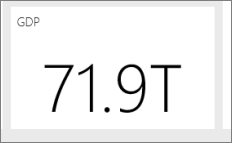

<properties
   pageTitle="Sugerencias para diseñar un excelente panel de Power BI"
   description="Sugerencias para diseñar un excelente panel de Power BI"
   services="powerbi"
   documentationCenter=""
   authors="mihart"
   manager="mblythe"
   backup=""
   editor=""
   tags=""
   qualityFocus="no"
   qualityDate=""/>

<tags
   ms.service="powerbi"
   ms.devlang="NA"
   ms.topic="article"
   ms.tgt_pltfrm="NA"
   ms.workload="powerbi"
   ms.date="08/11/2016"
   ms.author="mihart"/>

# Sugerencias para diseñar un excelente panel de Power BI  

Ahora que ha creado un panel y agrega algunos iconos, piense en cómo hacer que el panel no sólo bastante pero funcional. En general, esto significa comprobar el soporte de la información más importante out y facilitando limpio y ordenado.

Estas son algunas sugerencias.

### Tenga en cuenta la audiencia  
¿Cuáles son las métricas clave que le ayudarán a tomar decisiones? ¿Cómo se utilizará el panel? ¿Lo aprendido o suposiciones culturales pueden afectar a las opciones de diseño? ¿Qué información necesita el público tenga éxito?

Tenga en cuenta que el panel de información general, un único lugar para supervisar el estado actual de los datos. El panel se basa en conjuntos de datos e informes subyacentes y los pueden contener cargas de detalles. Los lectores pueden profundizar en los informes desde el panel. Por lo que no incluya los detalles en el panel a menos que sea lo que necesitan supervisar los lectores.

¿En el panel va a mostrarse? Si va a ser en un monitor de gran tamaño, pueden incluir más contenido en ella. Si los lectores se lo puede ver en tabletas, mosaicos menos será más legibles.

### Contar una historia y mantener en una pantalla  
Debido a los paneles están diseñados para mostrar información importante de un vistazo, con todos los mosaicos en una pantalla es mejor. ¿Puede evitar las barras de desplazamiento en el panel?

¿El panel demasiado desordenado?  Quitar información prácticamente esencial que se puede leer e interpretar fácilmente.

### Asegúrese de usar de modo de pantalla completa
Mostrar el panel en [pantalla completa](powerbi-service-dash-and-reports-fullscreen.md) sin distracciones.

### Hacer que la información más importante mayores  
Si el texto y visualizaciones en el panel son del mismo tamaño, los lectores tendrá un disco duro centrarse en lo que es más importante. Por ejemplo, visualizaciones de tarjeta son una buena forma de mostrar un número importante de forma destacada:  

Pero asegúrese de proporcionar un contexto.  

Lea acerca de [crear un mosaico con tan sólo un número](powerbi-service-create-a-big-number-tile-for-a-dashboard.md).

### Coloque la información más importante en la esquina superior
Mayoría de las personas que se lea de arriba a abajo, por lo que coloca el mayor nivel de detalle en la parte superior y mostrar más detalle a medida que se mueve en la dirección de la audiencia se utiliza para leer (de izquierda a derecha, de derecha a izquierda).

### Utilice la visualización correcta de los datos y formato para facilitar la lectura  
Evite la variedad de visualización en aras de la serie.  Visualizaciones deben pintar una imagen y ser fáciles de "lectura" e interpretar.  Para algunos datos y visualizaciones, una visualización gráfica simple es suficiente. Pero pueden llamar otros datos para una visualización más complejo: asegúrese de hacer uso de títulos y etiquetas y otra personalización para ayuda al lector.  

- 
            [Elija las visualizaciones de datos adecuado](http://blogs.msdn.com/b/microsoft_business_intelligence1/archive/2012/10/08/best-practices-in-data-visualization.aspx). Tenga cuidado al utilizar gráficos que se distorsionen gráficos 3D, es decir, de verdad. Tenga en cuenta que es difícil para el cerebro humano interpretar formas circulares. Los gráficos circulares, gráficos de anillos, medidores y otros tipos de gráfico circular pueden parecer bastante pero no son una práctica recomendada de visualización de datos.

- Ser coherente con la escala de gráfico en los ejes, orden de dimensión de gráfico y también los colores utilizados para los valores de gráficos.

- Asegúrese de codificar datos cuantitativos perfectamente. No superar los tres o cuatro números para mostrar números. Mostrar medidas a uno o dos números izquierdos del separador decimal y escala de miles o millones, es decir, 3.4 millones no 3,400,000.

- No mezcle los niveles de precisión y tiempo. Asegúrese de que comprende perfectamente plazos de tiempo.  No tiene un gráfico que tiene el mes pasado situado junto a gráficos filtrados de un mes específico del año.

- No mezcle medidas grandes y pequeñas en la misma escala, como en una línea o un gráfico de barras.  Por ejemplo, una medida puede estar en los millones y la otra medida miles.  Con una escala grande, sería difícil ver las diferencias de la medida que se encuentra en miles.  Si tiene que mezclar, elija una visualización que permite el uso de un segundo eje.

- No se alteran los gráficos con etiquetas de datos que no son necesarios. Los valores de los gráficos de barras se entienden bien normalmente sin mostrar el número real.

- Preste atención a cómo [gráficos se ordenan](powerbi-service-change-how-a-chart-is-sorted.md).  Si desea llamar la atención sobre el número mayor o menor, ordene por la medida.  Si desea que los usuarios puedan encontrar rápidamente una categoría determinada en muchas otras categorías, ordenar por el eje.  

- Los gráficos circulares son mejores si tienen menos de ocho categorías. Dado que no se pueden comparar valores en paralelo, es más difícil comparar valores en un gráfico circular que en gráficos de barras y columnas. Gráficos circulares puede ser útil para ver las relaciones de la parte a todo en lugar de comparar los elementos. Y gráficos de medidor son ideales para mostrar el estado actual en el contexto de un objetivo.

Para obtener ayuda específica de visualización, consulte [tipos de visualización en Power BI](powerbi-service-visualization-types-for-reports-and-q-and-a.md).  

## Obtener más información sobre el diseño del panel de prácticas recomendado  
Para dominar el arte del diseño de panel excelente, considere la posibilidad de aprender los principios básicos de Gestalt de percepción visual y cómo comunicar claramente información procesable en contexto. Por suerte, hay una gran cantidad de recursos ya esparcido dentro de nuestro blogs y ampliamente disponibles. Algunos de nuestros libros favoritos incluyen:

- 
            *Diseño del panel de información* por Stephen algunos  
- 
            *Mostrar los números* por Stephen algunos  
- 
            *Ahora verá* por Stephen algunos  
- 
            *Visualización de la información* por Edward Tufte  
- 
            *Advanced presentaciones* por diseño por Andrew Abela   

## Consulte también  
[Paneles de Power BI](powerbi-service-dashboards.md)  
[Power BI: conceptos básicos](powerbi-service-basic-concepts.md)  
¿Preguntas más frecuentes? [Pruebe la Comunidad de Power BI](http://community.powerbi.com/)
