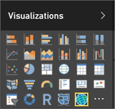
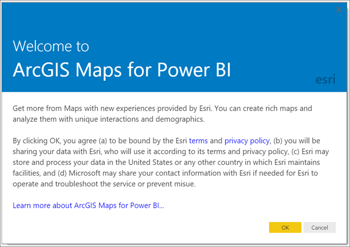
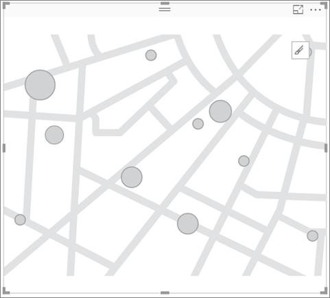
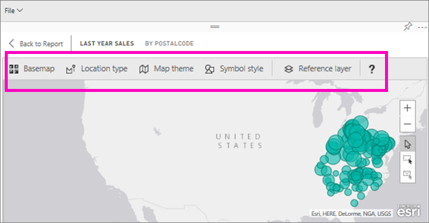
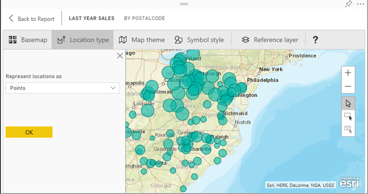

<properties
   pageTitle="Tutorial: ArcGIS en Power BI"
   description="Tutorial: ArcGIS en Power BI"
   services="powerbi"
   documentationCenter=""
   authors="mihart"
   manager="mblythe"
   backup=""
   editor=""
   tags=""
   featuredVideoId=""
   qualityFocus="no"
   qualityDate=""/>

<tags
   ms.service="powerbi"
   ms.devlang="NA"
   ms.topic="article"
   ms.tgt_pltfrm="NA"
   ms.workload="powerbi"
   ms.date="09/26/2016"
   ms.author="mihart"/>

# Tutorial: ArcGIS asigna en Power BI (vista previa)

Mapas de ArcGIS para Power BI (vista previa) por [Esri](https://www.Esri.com/powerbi) geográfica habilita Power BI. Mapas de ArcGIS ofrecen aún más atractiva visualizaciones de mapas, datos demográficos y capacidad de asignación por lo que puede indicar la narración mejor.

## Consentimiento del usuario
Proporciona asignaciones de ArcGIS para Power BI [Esri](https://www.esri.com). El uso de mapas de ArcGIS de Power BI está sujeto a los términos y directiva de privacidad de Esri. Power BI a los usuarios que deseen utilizar las asignaciones de ArcGIS para visual, necesidad de Power BI para aceptar el cuadro de diálogo de consentimiento.

**Recursos**

[Términos](https://go.microsoft.com/fwlink/?LinkID=826322)

[Directiva de directiva](https://go.microsoft.com/fwlink/?LinkID=826323)

[Asignaciones de ArcGIS para página de producto de Power BI](https://www.esri.com/powerbi)

## Habilitar la vista previa de mapa de ArcGIS

El mapa de ArcGIS visual está en vista previa y debe estar habilitado en Power BI. Este tutorial utiliza el [ejemplo de análisis de venta](powerbi-sample-retail-analysis-take-a-tour.md). Habilitado **ArcGIS mapas para Power BI**:

1. Seleccione **archivo > Opciones y configuración > Opciones > características preliminares**.

2. Seleccione el **ArcGIS mapas para Power BI** casilla de verificación. Debe reiniciar Power BI después de realizar la selección.

    

3. Abrir un informe en la vista de edición y seleccione las asignaciones de ArcGIS de icono de Power BI en el panel de visualizaciones.

    

4. Power BI muestra el cuadro de diálogo de consentimiento de usuario, seleccione **Aceptar** para continuar.

    

5. Power BI agrega una plantilla de asignación de ArcGIS vacía al lienzo del informe.

    

## Crear un mapa AcrGIS visual
Siga estos pasos para crear un **ArcGIS mapas para Power BI**.

1. Desde el **campos** panel, arrastre un datos campo a la **ubicación** o **Latitude** y **longitud** depósitos.

    >[AZURE.NOTE] Power BI detectará automáticamente si los campos que ha seleccionado se ven mejor como una forma o un punto en un mapa. Puede ajustar el valor predeterminado en la configuración (ver abajo).

    

2.  Desde el **campos** arrastre una medida para el **tamaño** o **Color** depósitos para ajustar cómo se muestran los datos.
   

## Opciones y formatos de mapas de AcrGIS
Para tener acceso a **ArcGIS mapas para Power BI** las características de formato:

1. Seleccione el icono de modo de edición en foco dentro del objeto visual.
   

2. Características adicionales de acceso a través de la cinta de opciones dentro del objeto visual. Cada característica, cuando se selecciona, abre un panel de tareas que proporciona opciones detalladas.
   

   >  [AZURE.NOTE]  Para obtener más información sobre la configuración y características, vea **documentación detallada** a continuación.

3. Para volver al informe, seleccione **volver a informe** desde la esquina superior izquierda del lienzo del informe.

## Documentación detallada

            **ESRI** ofrece [documentación exhaustiva](https://go.microsoft.com/fwlink/?LinkID=828772) en el conjunto de características de **ArcGIS mapas para Power BI**.

### Información general de características

#### Mapas de base
Se proporcionan cuatro asignaciones bases: lienzo de color gris oscuro, lienzo de color gris claro, OpenStreetMap y calles.  Calles es el mapa base estándar de ArcGIS.

Para aplicar una asignación base seleccionar en el panel de tareas.

#### Tipo de ubicación
Mapas de ArgGIS para Power BI detecta automáticamente la mejor manera de mostrar datos en el mapa. Selecciona desde puntos o los límites. Las opciones de tipo de ubicación permiten ajustar estas selecciones.

            **Los límites** sólo funcionará si los datos contienen valores geográficos estándar. ESRI imagina automáticamente la forma que se va a mostrar en el mapa. Valores geográficos estándar incluyen países, provincias, códigos postales, etc.. Pero, al igual que con coordenadas geográficas, Power BI puede no detectar el campo debe ser un límite de forma predeterminada, o puede que no tenga un límite para los datos.  

#### Tema del mapa
Se proporcionan cuatro temas de mapa. Sólo en la ubicación y los temas de tamaño se eligen automáticamente basándose en los campos que se enlaza a los depósitos de ubicación y el tamaño en el panel campos. Actualmente estamos usando **tamaño**, por lo que vamos a cambiar a **mapa de calor**.  

<table>
<tr><th>Tema</th><th>Descripción</th>
<tr>
<td>Sólo en la ubicación</td>
<td>Los puntos de datos trazados o rellena los límites del mapa según la configuración de tipo de ubicación.</td>
</tr>
<tr>
<td>Mapa de calor</td>
<td>Traza un trazado de intensidad de los datos en el mapa.</td>
</tr>
<tr>
<td>Tamaño</td>
<td>Puntos de datos trazados en el mapa según tamaño en función del valor en el depósito de tamaño en el panel campos.</td>
</tr>
<tr>
<td>Agrupación en clústeres</td>
<td>Trazar el recuento de puntos de datos en las regiones en el mapa. </td>
</tr>
</table>

#### Estilo de los símbolos
Estilos de símbolos le permiten ajustar con precisión cómo se presentan los datos en el mapa. Símbolo estilos dependen del contexto según el tipo de ubicación seleccionado y el tema del mapa.

### Capa de referencia
####  Capa de referencia - datos demográficos
Mapas de ArcGIS para Power BI proporciona una selección de capas demográficas que ayudan a contextualize datos de Power BI.

1. Seleccione el **capa de referencia** ficha y elija **datos demográficos**.

2. Cada capa aparece tiene una casilla de verificación. Agregar una marca de verificación para agregar esa capa al mapa.  En este ejemplo hemos agregado promedio de ingresos doméstico.
   

2. Cada capa también es interactivo. Tal como se puede desplazar el puntero sobre una burbuja para ver los detalles, puede hacer clic en un área sombreada en el mapa para ver los detalles.
   

#### Capa de referencia - ArcGIS
ArcGIS Online proporciona la capacidad de las organizaciones la publicación web pública mapas. Además, Esri proporciona un vasto conjunto de asignaciones de web a través de vivir Atlas. En la pestaña de ArcGIS, puede buscar todos los mapas de web pública o vivir Atlas y agregar al mapa como capas de referencia.

1. Seleccione el **capa de referencia** ficha y elija **ArcGIS**.

2. Especifique los términos de búsqueda y, a continuación, seleccione una capa de mapa. En este ejemplo hemos elegido distritos congreso de EE.

       
3. Para ver los detalles, seleccione un área sombreada para abrir el _Seleccione de la capa de referencia_: utilice la herramienta de selección de capa de referencia en los límites de la selección o los objetos de la capa de referencia.

## Selección de puntos de datos
Mapas de ArcGIS para Power BI permite tres modos de selección.

Cambiar el modo de selección mediante conmutador:

 Seleccione los puntos de datos individuales.

 Dibuja un rectángulo en el mapa y selecciona los puntos de datos independientes.

 Permite los límites o polígonos en capas de referencia que se utilizan para seleccionar puntos de datos independientes.

            **Nota:** se puede seleccionar un máximo de puntos de datos de 250 a la vez.

## Obtención de ayuda

            **ESRI** ofrece [documentación exhaustiva](https://go.microsoft.com/fwlink/?LinkID=828772) en el conjunto de características de **ArcGIS mapas para Power BI**.

Puede hacer preguntas y encuentre respuestas en Power BI [relacionados con subprocesos de la Comunidad **ArcGIS mapas para Power BI**](https://go.microsoft.com/fwlink/?LinkID=828771) para buscar la información más reciente o notificar problemas.

Si tiene alguna sugerencia para una mejora, envíelos a [lista de ideas de Power BI](https://ideas.powerbi.com).

## Administrar el uso de asignaciones de ArcGIS para Power BI dentro de su organización

Power BI proporciona la capacidad de administrar si desea utilizar mapas de ArcGIS para Power BI para usuarios, administradores de inquilinos y los administradores de TI.

            **Opciones de usuario** en Power BI Desktop, los usuarios pueden detener mediante mapas de ArcGIS para Power BI deshabilitando en la ficha seguridad en las opciones. Cuando se deshabilita, mapas de ArcGIS no cargará de forma predeterminada.

En el servicio de Power BI, los usuarios pueden detener mediante mapas de ArcGIS para Power BI deshabilitando en las asignaciones de ArcGIS de ficha de Power BI (vista previa) en la configuración de usuario. Cuando se deshabilita, mapas de ArcGIS no cargará de forma predeterminada.

            **Opciones de administración de inquilinos** en PowerBI.com, los administradores de inquilinos pueden evitar que todos los usuarios del inquilino mediante mapas de ArcGIS para Power BI deshabilitando. Cuando esto sucede, Power BI ya no verá las asignaciones de ArcGIS de icono de Power BI en el panel de visualizaciones.

            **Opciones del Administrador de TI** Power BI Desktop admite el uso de **Directiva de grupo** para deshabilitar ArcGIS mapas de equipos de implementación de Power BI en toda la organización.

<table>
<tr><th>Atributo</th><th>Valor</th>
</tr>
<tr>
<td>key</td>
<td>Software\Policies\Microsoft\Power BI escritorio\</td>
</tr>
<tr>
<td>valueName</td>
<td>EnableArcGISMaps</td>
</tr>
</table>

Un valor de 1 (decimal) permite que las asignaciones de ArcGIS para Power BI.

Un valor de 0 (decimal) deshabilita ArcGIS mapas de Power BI.

Puede usar el **Directiva de grupo** plantillas para agregar rápidamente la configuración necesaria para su **Directiva de grupo**.

**Plantilla**

[PowerBIEsri.adml](./groupPolicyTemplates/PowerBIEsri.adml)

[PowerBIEsri.admx](./groupPolicyTemplates/PowerBIEsri.admx)

## Preguntas frecuentes
**¿Hay ningún cargo por mediante mapas de ArcGIS para Power BI?**

El mapa de ArcGIS para Power BI (vista previa) está disponible para todos los usuarios de Power BI sin costo adicional. Es un componente proporcionado por **Esri** y su uso está sujeto a los términos y directiva de privacidad proporcionada por **Esri** como se indicó anteriormente en este artículo.

**¿ArcGIS mapas para Power BI admite Esri Shapefiles?**

Mapas de ArcGIS para Power BI detecta automáticamente los límites estándares como países o regiones, Estados o provincias y códigos postales. Si necesita proporcionar sus propias formas puede hacerlo mediante el [asignaciones de formas para Power BI Desktop (vista previa)](powerbi-desktop-shape-map.md).

**¿Puedo conectar a mi cuenta Online de ArcGIS desde Power BI?**

Todavía no. 
            [Voto para esta idea](https://ideas.powerbi.com/forums/265200-power-bi-ideas/suggestions/9154765-arcgis-geodatabases ) y te enviaremos un correo electrónico cuando se empiezan a trabajar en esta característica.  

¿Preguntas más frecuentes? [Pruebe la Comunidad de Power BI](http://community.powerbi.com/)
