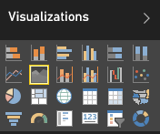

<properties
   pageTitle="Tutorial: Gráfico de áreas básicas"
   description="Tutorial: Gráfico de áreas básicas."
   services="powerbi"
   documentationCenter=""
   authors="mihart"
   manager="mblythe"
   backup=""
   editor=""
   tags=""
   qualityFocus="no"
   qualityDate=""/>

<tags
   ms.service="powerbi"
   ms.devlang="NA"
   ms.topic="article"
   ms.tgt_pltfrm="NA"
   ms.workload="powerbi"
   ms.date="10/07/2016"
   ms.author="mihart"/>

# Tutorial: Gráfico de áreas básicas  

El gráfico de áreas básicas (también conocidas como capas del área de gráfico.) se basa en el gráfico de líneas. El área situada entre el eje y en línea se rellena con colores para indicar el volumen. 

Gráficos de áreas destacan la magnitud de cambiar con el tiempo y puede usarse para llamar la atención sobre el valor total en una tendencia. Por ejemplo, se pueden trazar datos que representan el beneficio en el tiempo en un gráfico de área para destacar el beneficio total.

## Cuándo utilizar un gráfico de áreas básicas  
Gráficos de áreas básicas son una excelente opción:

-   Para ver y comparar la tendencia de volumen a través de la serie temporal 

-   para las series individuales que representa un físicamente contable establecido

## Crear un gráfico de áreas básicas  
Para continuar, inicie sesión Power BI y seleccione **obtener datos \> ejemplos \> ejemplo de análisis de venta**. 

1.  En el panel "Ejemplo de análisis de venta", seleccione la **Total almacenes** icono para abrir el informe "Ejemplo de análisis de venta directa".

2.  Seleccione **Editar informe** para abrir el informe en la vista de edición.

3.  Agregue una nueva página del informe.

4.  Crear un gráfico de área que muestra las ventas de este año y ventas del último año por mes.

    a.  Desde el **panel campos**, seleccione **ventas \> ventas del último año**, y **ventas de este año > valor**.

    b.  Convertir el gráfico a un gráfico de superficie básica.    
    

    c.  Seleccione **tiempo \> mes** para agregarlo a la **eje** bien.   
    

    d.  Para mostrar el gráfico por mes, seleccione el botón de puntos suspensivos (esquina superior derecha del objeto visual) y elija **Ordenar por mes**.

## Resaltado y filtrado cruzado  
Para obtener información acerca de cómo utilizar el panel de filtros, consulte [Agregar un filtro a un informe](powerbi-service-add-a-filter-to-a-report.md).

Para seleccionar un área, haga clic dentro de esa área o a lo largo de la línea superior.  Gráficos de áreas básicas no filtro cruzado las otras visualizaciones en la página del informe. Sin embargo, los gráficos de áreas son un destino para filtrar entre desencadenado por otras visualizaciones en la página del informe.

## Sugerencias y trucos para los gráficos de áreas básicas  
-   Gráficos de áreas básicas no son eficaces para comparar los valores debido a la oclusión en las áreas de capas. Power BI usa transparencia para indicar la superposición de áreas. Sin embargo, sólo funciona bien con dos o tres áreas diferentes. Si necesita comparar tendencia a más de tres medidas, intente con gráficos de líneas. Cuando se necesita comparar el volumen a más de tres medidas, pruebe a usar treemap.

## Consulte también  
[Informes de Power BI](powerbi-service-reports.md)  
[Visualizaciones en informes de Power BI](powerbi-service-visualizations-for-reports.md)  
[Power BI: conceptos básicos](powerbi-service-basic-concepts.md)  
¿Preguntas más frecuentes? [Pruebe la Comunidad de Power BI](http://community.powerbi.com/)
