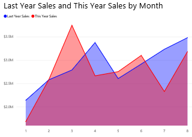

<properties
   pageTitle="Tutorial: Basic Area chart"
   description="Tutorial: Basic Area chart."
   services="powerbi"
   documentationCenter=""
   authors="mihart"
   manager="mblythe"
   backup=""
   editor=""
   tags=""
   qualityFocus="no"
   qualityDate=""/>

<tags
   ms.service="powerbi"
   ms.devlang="NA"
   ms.topic="article"
   ms.tgt_pltfrm="NA"
   ms.workload="powerbi"
   ms.date="10/07/2016"
   ms.author="mihart"/>

# Tutorial: Basic Area chart  

The basic area chart (aka layered area chart.) is based on the line chart. The area between axis and line is filled with colors to indicate volume. 

Area charts emphasize the magnitude of change over time, and can be used to draw attention to the total value across a trend. For example, data that represents profit over time can be plotted in an area chart to emphasize the total profit.

## When to use a basic area chart  
Basic area charts are a great choice:

-   to see and compare the volume trend across time series 

-   for individual series representing a physically countable set

## Create a basic area chart  
To follow along, sign in to Power BI and select <bpt id="p1">**</bpt>Get Data <ph id="ph1">\&gt;</ph> Samples <ph id="ph2">\&gt;</ph> Retail Analysis Sample<ept id="p1">**</ept>. 

1.  From the "Retail Analysis Sample" dashboard, select the <bpt id="p1">**</bpt>Total Stores<ept id="p1">**</ept> tile to open the "Retail Analysis Sample" report.

2.  Select <bpt id="p1">**</bpt>Edit Report<ept id="p1">**</ept> to open the report in Editing View.

3.  Add a new report page.

4.  Create an area chart that displays this year's sales and last year's sales by month.

    a.  From the <bpt id="p1">**</bpt>Fields pane<ept id="p1">**</ept>, select <bpt id="p2">**</bpt>Sales <ph id="ph1">\&gt;</ph> Last Year Sales<ept id="p2">**</ept>, and <bpt id="p3">**</bpt>This Year Sales &gt; Value<ept id="p3">**</ept>.

    b.  Convert the chart to a basic area chart.    
    

    c.  Select <bpt id="p1">**</bpt>Time <ph id="ph1">\&gt;</ph> Month<ept id="p1">**</ept> to add it to the <bpt id="p2">**</bpt>Axis<ept id="p2">**</ept> well.   
    

    d.  To display the chart by month, select the ellipses (top right corner of the visual) and choose <bpt id="p1">**</bpt>Sort by month<ept id="p1">**</ept>.

## Highlighting and cross-filtering  
For information about using the Filters pane, see <bpt id="p1">[</bpt>Add a filter to a report<ept id="p1">](powerbi-service-add-a-filter-to-a-report.md)</ept>.

To select an area, click inside that area or along the top line.  Basic area charts do not cross-filter the other visualizations on the report page. However, area charts are a target for cross-filtering triggered by other visualizations on the report page.

## Tips and tricks for Basic Area charts  
-   Basic area charts are not effective for comparing the values due to the occlusion on the layered areas. Power BI uses transparency to indicate the overlap of areas. However, it only works well with two or three different areas. When you need to compare trend to more than three measures, try using line charts. When you need to compare volume to more than three measures, try using treemap.

## Consulte también  
[Reports in Power BI](powerbi-service-reports.md)  
[Visualizations in Power BI reports](powerbi-service-visualizations-for-reports.md)  
[Power BI - Basic Concepts](powerbi-service-basic-concepts.md)  
More questions? [Try the Power BI Community](http://community.powerbi.com/)
