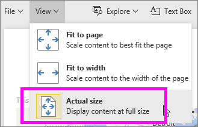
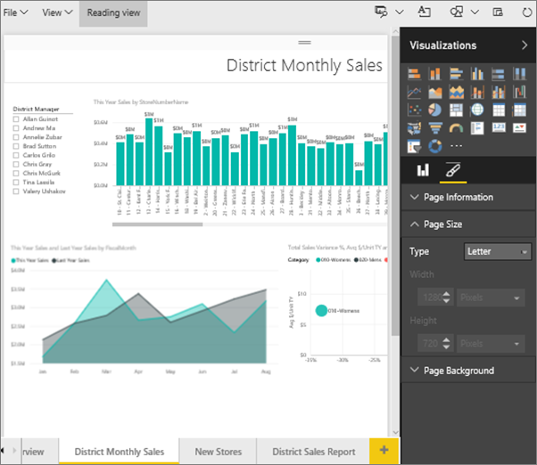

<properties
   pageTitle="Tutorial: Cambiar la configuración de pantalla de una página en un informe de Power BI"
   description="Tutorial: Cambiar la configuración de pantalla de una página en un informe de Power BI"
   services="powerbi"
   documentationCenter=""
   authors="mihart"
   manager="mblythe"
   backup=""
   editor=""
   tags=""
   qualityFocus="modifying"
   qualityDate=""/>

<tags
   ms.service="powerbi"
   ms.devlang="NA"
   ms.topic="article"
   ms.tgt_pltfrm="NA"
   ms.workload="powerbi"
   ms.date="08/15/2016"
   ms.author="mihart"/>

# Tutorial: Cambiar la configuración de pantalla de una página en un informe de Power BI

En el [anterior artículo y vídeo](powerbi-service-change-report-display-settings.md) aprendido acerca de dos maneras distintas de controlar la presentación de página en los informes de Power BI: **vista** y **tamaño de la página**. Ahora vamos a intentarlo nosotros mismos.

## En primer lugar, vamos a cambiar la configuración de la vista de página

1.  Abra un informe en la vista de edición. Este ejemplo usa la página de "New almacenes" de la [ejemplo de análisis de venta](powerbi-sample-retail-analysis-take-a-tour.md).  De forma predeterminada, las páginas se muestran con el **Ajustar a la página** configuración.  En este caso, ajustar a la página muestra la página del informe sin barras de desplazamiento, pero algunos de los detalles y los títulos son demasiado pequeños para leerlo.

    

2.  Asegúrese de que ninguna de las visualizaciones se seleccionan en el lienzo. Seleccione **vista** y revise las opciones de presentación.

    

3.  Veamos cómo se ve la página con el **tamaño real** configuración.

    

    No muy bien, el panel tiene ahora las dobles barras de desplazamiento.

4.  Cambiar a **Ajustar a ancho**.

    

   Tiene un mejor aspecto, que ahora tiene barras de desplazamiento, pero es más fácil de leer los detalles.

## Cambiar la vista predeterminada de una página de informe

Todos los predeterminados de informes de Power BI para **Ajustar a la página** vista. Pero ¿qué ocurre si desea que esta página del informe para que siempre se abra en **tamaño real** vista?

1.  En el **nuevos almacenes** página del informe, cambie a **tamaño real** vista.

    

2.  Guardar el informe con un nombre diferente al seleccionar **archivo > Guardar como**. Ahora tiene 2 copias del informe. en el informe original, **nuevos almacenes** continuará abriendo en la vista predeterminada, pero en el nuevo informe se abrirá en **tamaño real** vista. Vamos a ver.

    

3.  Vuelva a la **ejemplo de análisis de venta directa** panel seleccionándola en el panel de navegación. Desplácese hacia abajo hasta la **informes** sección y busque el nuevo informe (tendrá un asterisco amarillo).  

    

4.  Seleccione el informe para abrirlo y elija el **nuevos almacenes** página. Se abre en **tamaño real** vista!

    

## Ahora, vamos a explorar la *tamaño de página* configuración

1.  Abra la página "Del distrito de ventas mensuales" de la [ejemplo de análisis de venta](powerbi-sample-retail-analysis-take-a-tour.md) en la vista de edición.

2.  Asegúrese de que ninguna de las visualizaciones se seleccionan en el lienzo.  En el **visualizaciones** panel, seleccione el icono de pincel .

3.  Seleccione **tamaño de página** &gt; **tipo** para mostrar las opciones de tamaño de página.

    

4.  Seleccione **letra**.  En el lienzo, sólo el contenido que se ajustan a 816 x 1056 píxeles (tamaño carta) permanece en la parte en blanco del lienzo.

    

5.  Si cambiamos **vista** a "Ajustar a ancho", nuestro lienzo ahora muestra sólo el contenido de la página que caben en el tamaño de letra.

    

6.  Seleccione **16:9** relación.

    

    La página del informe se muestra mediante una relación de 16 amplia 9 alta. Para ver el tamaño de píxeles reales que se usa, eche un vistazo atenuado ancho y alto campos (1280 x 720). Hay una gran cantidad de espacio vacío que rodea el lienzo de informes; Esto es porque se ha establecido previamente **vista** a "Ajustar a ancho".

7.  Continuar explorando el **tamaño de página** Opciones.

## Uso conjunto de vista de la página y el tamaño de página

Usar tamaño de página y la vista de la página juntos para crear un informe que el mejor aspecto cuando se incrusta en otra aplicación.

En este ejercicio, creará una página de informe que se mostrará en una aplicación que tenga espacio para 500 píxeles de ancho por 750 píxeles de alto.

En el paso anterior, recuerde que vimos que nuestra página de informe está mostrando actualmente en la amplia 1280 por 720 alta. Por lo que sabemos que necesitaremos hacer una gran cantidad de cambio de tamaño y reorganizar si queremos que todos nuestros gráficos para ajustarse.

1. Cambiar el tamaño y mover los elementos visuales para que se ajusten en menos de la mitad del área de lienzo actual.

    

2. Seleccione **tamaño de página** &gt; **personalizado**.

3. Establezca el ancho en 500 y establezca el alto a 750.

    

4. Ajustar la página informe de forma que parezca que el mejor rendimiento. Cambiar entre **Ver > tamaño real** y **Vista > Ajustar a la página** para realizar ajustes.

    

## Consulte también

            [¿Crear informes de Cortana](powerbi-service-cortana-desktop-entity-cards.md) a [configuración de pantalla de página en un informe de Power BI](powerbi-service-change-report-display-settings.md) Obtenga más información sobre  [informes en Power B ](powerbi-service-reports.md)
[Power BI: conceptos básicos de](powerbi-service-basic-concepts.md) más preguntas? [Pruebe la Comunidad de Power BI](http://community.powerbi.com/)
