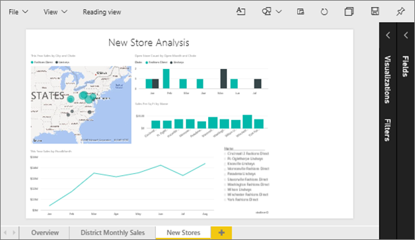
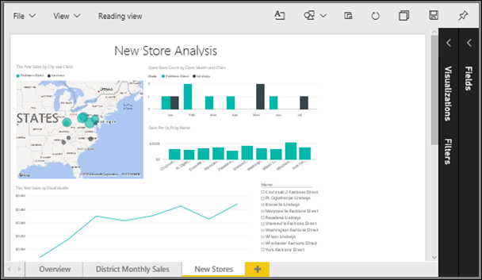
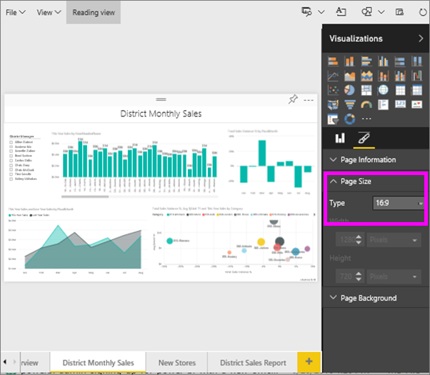

<properties
   pageTitle="Tutorial: Change the display settings for a page in a Power BI report"
   description="Tutorial: Change the display settings for a page in a Power BI report"
   services="powerbi"
   documentationCenter=""
   authors="mihart"
   manager="mblythe"
   backup=""
   editor=""
   tags=""
   qualityFocus="modifying"
   qualityDate=""/>

<tags
   ms.service="powerbi"
   ms.devlang="NA"
   ms.topic="article"
   ms.tgt_pltfrm="NA"
   ms.workload="powerbi"
   ms.date="08/15/2016"
   ms.author="mihart"/>

# Tutorial: Change the display settings for a page in a Power BI report

In the <bpt id="p1">[</bpt>previous article and video<ept id="p1">](powerbi-service-change-report-display-settings.md)</ept> you learned about two different ways to control page display in Power BI reports: <bpt id="p2">**</bpt>View<ept id="p2">**</ept> and <bpt id="p3">**</bpt>Page Size<ept id="p3">**</ept>. Now let's try it ourselves.

## First, let's change the page View setting

1.  Open a report in Editing View. This example uses the "New Stores" page of the <bpt id="p1">[</bpt>Retail Analysis sample<ept id="p1">](powerbi-sample-retail-analysis-take-a-tour.md)</ept>.  By default, pages display using the <bpt id="p1">**</bpt>Fit to Page<ept id="p1">**</ept> setting.  In this case, Fit to Page displays the report page without scrollbars, but some of the detail and titles are too small to read.

    

2.  Make sure that no visualizations are selected on the canvas. Select <bpt id="p1">**</bpt>View<ept id="p1">**</ept> and review the display options.

    

3.  Let's see how the page looks using the <bpt id="p1">**</bpt>Actual size<ept id="p1">**</ept> setting.

    

    Not great, the dashboard now has double scrollbars.

4.  Switch to <bpt id="p1">**</bpt>Fit to Width<ept id="p1">**</ept>.

    

   Looks better, we now have scrollbars but it's easier to read the detail.

## Change the default view for a report page

All Power BI reports default to <bpt id="p1">**</bpt>Fit to page<ept id="p1">**</ept> view. But what if you want this report page to always open in <bpt id="p1">**</bpt>Actual size<ept id="p1">**</ept> view?

1.  On the <bpt id="p1">**</bpt>New stores<ept id="p1">**</ept> page of the report, switch back to <bpt id="p2">**</bpt>Actual size<ept id="p2">**</ept> view.

    

2.  Save the report with a different name by selecting <bpt id="p1">**</bpt>File &gt; Save as<ept id="p1">**</ept>. You now have 2 copies of this report; in the original report, <bpt id="p1">**</bpt>New stores<ept id="p1">**</ept> will continue to open in the default view but in the new report it will open in <bpt id="p2">**</bpt>Actual size<ept id="p2">**</ept> view. Let's go see.

    

3.  Return to the <bpt id="p1">**</bpt>Retail Analysis Sample<ept id="p1">**</ept> dashboard by selecting it in the navigation pane. Scroll down to the <bpt id="p1">**</bpt>Reports<ept id="p1">**</ept> section and find the new report (it will have a yellow asterisk).  

    

4.  Select the report to open it and choose the <bpt id="p1">**</bpt>New stores<ept id="p1">**</ept> page. It opens in <bpt id="p1">**</bpt>Actual size<ept id="p1">**</ept> view!

    

## Now, let's explore the <bpt id="p1">*</bpt>page size<ept id="p1">*</ept> setting

1.  Open the "District monthly sales" page of the <bpt id="p1">[</bpt>Retail Analysis sample<ept id="p1">](powerbi-sample-retail-analysis-take-a-tour.md)</ept> in Editing View.

2.  Make sure that no visualizations are selected on the canvas.  In the <bpt id="p1">**</bpt>Visualizations<ept id="p1">**</ept> pane, select the paintbrush icon <ph id="ph1"></ph>.

3.  Select <bpt id="p1">**</bpt>Page Size<ept id="p1">**</ept> <ph id="ph1">&amp;gt;</ph> <bpt id="p2">**</bpt>Type<ept id="p2">**</ept> to display the page size options.

    

4.  Select <bpt id="p1">**</bpt>Letter<ept id="p1">**</ept>.  On the canvas, only the contents that fit within 816 x 1056 pixels (Letter size) remain on the white portion of the canvas.

    

5.  If we change <bpt id="p1">**</bpt>View<ept id="p1">**</ept> to "Fit to Width," our canvas now displays only the page contents that fit into the letter size.

    

6.  Select <bpt id="p1">**</bpt>16:9<ept id="p1">**</ept> page ratio.

    

    The report page displays using a ratio of 16 wide by 9 high. To see the actual pixel size being used, take a look at the greyed out Width and Height fields (1280x720). There is a lot of empty space around the report canvas; this is because we previously set <bpt id="p1">**</bpt>View<ept id="p1">**</ept> to "Fit to width".

7.  Continue exploring the <bpt id="p1">**</bpt>Page Size<ept id="p1">**</ept> options.

## Using page View and Page Size together

Use page View and Page Size together to create a report that looks its best when embedded in another application.

In this exercise, you'll create a report page that will display in an application that has space for 500 pixels wide by 750 pixels high.

Remember in the previous step we saw that our report page is currently displaying at 1280 wide by 720 high. So we know that we'll need to do a lot of resizing and rearranging if we want all of our visuals to fit.

1. Resize and move the visuals so that they fit in less than half of the current canvas area.

    

2. Select <bpt id="p1">**</bpt>Page Size<ept id="p1">**</ept> <ph id="ph1">&amp;gt;</ph> <bpt id="p2">**</bpt>Custom<ept id="p2">**</ept>.

3. Set Width to 500 and set Height to 750.

    

4. Tweak the report page so that it looks its best. Switch between <bpt id="p1">**</bpt>View &gt; Actual size<ept id="p1">**</ept> and <bpt id="p2">**</bpt>View &gt; Fit to page<ept id="p2">**</ept> to make adjustments.

    

## Consulte también
<bpt id="p1">[</bpt>Create reports for Cortana<ept id="p1">](powerbi-service-cortana-desktop-entity-cards.md)</ept> Back to <bpt id="p2">[</bpt>Page display settings in a Power BI report<ept id="p2">](powerbi-service-change-report-display-settings.md)</ept> Read more about  <bpt id="p3">[</bpt>reports in Power B <ept id="p3">](powerbi-service-reports.md)</ept><ph id="ph1">
</ph><bpt id="p4">[</bpt>Power BI - Basic Concepts<ept id="p4">](powerbi-service-basic-concepts.md)</ept> More questions? [Try the Power BI Community](http://community.powerbi.com/)
