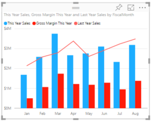
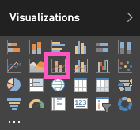

<properties
   pageTitle="Tutorial: Gráfico combinado en Power BI"
   description="Esta documentación es un tutorial (con vídeo) que se muestra por qué y cómo crear un gráfico combinado en Power BI."
   services="powerbi"
   documentationCenter=""
   authors="mihart"
   manager="mblythe"
   backup=""
   editor=""
   tags=""
   featuredVideoId="lnv66cTZ5ho"
   qualityFocus="monitoring"
   qualityDate=""/>

<tags
   ms.service="powerbi"
   ms.devlang="NA"
   ms.topic="article"
   ms.tgt_pltfrm="NA"
   ms.workload="powerbi"
   ms.date="08/29/2016"
   ms.author="mihart"/>
# Tutorial: Gráfico combinado en Power BI

En Power BI, un gráfico combinado es una visualización única que combina un gráfico de líneas y un gráfico de columnas. Combinación de 2 gráficos en uno permite realizar una comparación más rápida de los datos.

Gráficos combinados pueden tener uno o dos ejes Y.

## Cuándo usar un gráfico combinado

Gráficos combinados son una excelente opción:

-   Cuando tiene un gráfico de líneas y un gráfico de columnas con el mismo eje X.

-   para comparar varias medidas con distintos intervalos de valores.

-   Para ilustrar la correlación entre dos medidas en una visualización.

-   Para comprobar si una medida cumplen el destino que se define por otra medida

-   para ahorrar espacio en el lienzo.

## Creación de un eje único básico, gráfico combinado

Inspección creará un gráfico combinado con las ventas y Marketing de ejemplo.

<iframe width="560" height="315" src="https://www.youtube.com/embed/lnv66cTZ5ho?list=PL1N57mwBHtN0JFoKSR0n-tBkUJHeMP2cP" frameborder="0" allowfullscreen></iframe>

Para crear su propio gráfico combinado, inicie sesión Power BI y seleccione **obtener datos \> ejemplos \> ejemplo de análisis de venta**. 

1. En el panel "Ejemplo de análisis de venta", seleccione la **Total almacenes** icono para abrir el informe "Ejemplo de análisis de venta directa".

2. Seleccione **Editar informe** para abrir el informe en la vista de edición.

3. 
            [Agregar una nueva página de informe](powerbi-service-add-a-page-to-a-report.md).

4. Crear un gráfico de columnas que muestra el margen bruto y de ventas de este año por mes.

    a.  En el panel de campos, seleccione **ventas** \> **ventas de este año** > **valor**.

    b.  Arrastre **ventas** \> **presente, margen bruto año** a la **valor** bien.

    c.  Seleccione **tiempo** \> **FiscalMonth** para agregarlo a la **eje** bien. 

    

5. Convertir el gráfico de columnas en un gráfico combinado. Con el gráfico de columnas seleccionado, desde el **visualizaciones** panel, seleccione la **línea y el gráfico de columnas agrupadas**.

    

7.  Desde el **campos** arrastre **ventas** \> **ventas del último año** a la **los valores de línea** depósito.

    

    El gráfico combinado debe tener este aspecto:

    

## Crear un gráfico combinado con dos ejes

En esta tarea, compararemos margen bruto y ventas.

1.  Crear un nuevo gráfico de líneas que % de margen bruto pistas el año pasado.  En enero GM % fue 35%, máximo es 45% en abril, colocado en julio y Tec en agosto. ¿Se verá un patrón similar en ventas año anterior y este año?

    

2.  Agregar **ventas de este año > valor** y **ventas del último año** para el gráfico de líneas. La escala de **% último año de GM** es mucho menor que la escala de **ventas** lo que hace difícil comparar.      

    

3.  Para que el objeto visual fáciles de leer e interpretar, convertir el gráfico de líneas en un gráfico de líneas y columnas apiladas.

    

4.  Arrastre **% de margen bruto año pasado** de **valores de columna** en **línea valores**. Power BI crea dos ejes, lo que permite a los conjuntos de datos se escale de manera diferente; la izquierda mide dólares y el porcentaje de las medidas adecuadas.

        

## Agregar títulos a los ejes

1.  Seleccione la flecha abajo para expandir la **eje y** Opciones.

2.  Para **eje y (columna)**, establezca **posición** a **izquierda**, establezca **título** a **en**, **estilo** a  **Mostrar título sólo**, y **Mostrar** como **millones**.

    

4.  Bajo **eje y (columna)** Asegúrese también de que **Mostrar secundaria** está establecido en **en**. Muestra opciones para dar formato a la parte de gráfico de línea del gráfico combinado.

    

5.  Para **eje y (línea)**, deje **posición** como **derecha**, activar **título** a **en**, y establecer **estilo** a **Mostrar título sólo**.

    Gráfico combinado muestra ahora los dos ejes, ambos con títulos.

    

Desde aquí puede:

-  
            [Agregar el gráfico combinado como un icono de panel](powerbi-service-dashboard-tiles.md).

-  
            [Guardar el informe](powerbi-service-save-a-report.md).

## Resaltado y filtrado cruzado

Para obtener información acerca de cómo utilizar el panel de filtros, consulte [Agregar un filtro a un informe](powerbi-service-add-a-filter-to-a-report.md).

Filtros en resaltando una columna o una línea en un gráfico combinado entre las otras visualizaciones en la página de informe... y viceversa.

## Consulte también

[Agregar una visualización a un informe](https://powerbi.uservoice.com/knowledgebase/articles/441777)

[Visualizaciones en informes de Power BI](powerbi-service-visualizations-for-reports.md)

[Tipos de visualización en Power BI](powerbi-service-visualization-types-for-reports-and-q-and-a.md)

[Power BI: conceptos básicos](powerbi-service-basic-concepts.md)

[¡Probar--es gratuito!](https://powerbi.com/)

¿Preguntas más frecuentes? [Pruebe la Comunidad de Power BI](http://community.powerbi.com/)
