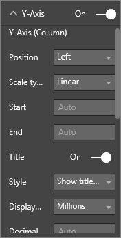

<properties
   pageTitle="Tutorial: Combo Chart in Power BI"
   description="This documentation is a tutorial (with video) that shows you why and how to create a Combo Chart in Power BI."
   services="powerbi"
   documentationCenter=""
   authors="mihart"
   manager="mblythe"
   backup=""
   editor=""
   tags=""
   featuredVideoId="lnv66cTZ5ho"
   qualityFocus="monitoring"
   qualityDate=""/>

<tags
   ms.service="powerbi"
   ms.devlang="NA"
   ms.topic="article"
   ms.tgt_pltfrm="NA"
   ms.workload="powerbi"
   ms.date="08/29/2016"
   ms.author="mihart"/>
# Tutorial: Combo Chart in Power BI

In Power BI, a combo chart is a single visualization that combines a line chart and a column chart. Combining the 2 charts into one lets you make a quicker comparison of the data.

Combo charts can have one or two Y axes.

## When to use a Combo Chart

Combo charts are a great choice:

-   when you have a line chart and a column chart with the same X axis.

-   to compare multiple measures with different value ranges.

-   to illustrate the correlation between two measures in one visualization.

-   to check whether one measure meet the target which is defined by another measure

-   to conserve canvas space.

## Create a basic, single-axis, Combo Chart

Watch Will create a combo chart using the Sales and Marketing sample.

<iframe width="560" height="315" src="https://www.youtube.com/embed/lnv66cTZ5ho?list=PL1N57mwBHtN0JFoKSR0n-tBkUJHeMP2cP" frameborder="0" allowfullscreen></iframe>

To create your own combo chart, sign in to Power BI and select <bpt id="p1">**</bpt>Get Data <ph id="ph1">\&gt;</ph> Samples <ph id="ph2">\&gt;</ph> Retail Analysis Sample<ept id="p1">**</ept>. 

1. From the "Retail Analysis Sample" dashboard, select the <bpt id="p1">**</bpt>Total Stores<ept id="p1">**</ept> tile to open the "Retail Analysis Sample" report.

2. Select <bpt id="p1">**</bpt>Edit Report<ept id="p1">**</ept> to open the report in Editing View.

3. <bpt id="p1">[</bpt>Add a new report page<ept id="p1">](powerbi-service-add-a-page-to-a-report.md)</ept>.

4. Create a column chart that displays this year's sales and gross margin by month.

    a.  From the Fields pane, select <bpt id="p1">**</bpt>Sales<ept id="p1">**</ept> <ph id="ph1">\&gt;</ph> <bpt id="p2">**</bpt>This Year Sales<ept id="p2">**</ept><ph id="ph2"> &gt; </ph><bpt id="p3">**</bpt>Value<ept id="p3">**</ept>.

    b.  Drag <bpt id="p1">**</bpt>Sales<ept id="p1">**</ept> <ph id="ph1">\&gt;</ph> <bpt id="p2">**</bpt>Gross Margin This Year<ept id="p2">**</ept> to the <bpt id="p3">**</bpt>Value<ept id="p3">**</ept> well.

    c.  Select <bpt id="p1">**</bpt>Time<ept id="p1">**</ept> <ph id="ph1">\&gt;</ph> <bpt id="p2">**</bpt>FiscalMonth<ept id="p2">**</ept> to add it to the <bpt id="p3">**</bpt>Axis<ept id="p3">**</ept> well. 

    

5. Convert the column chart to a combo chart. With the column chart selected, from the <bpt id="p1">**</bpt>Visualizations<ept id="p1">**</ept> pane select the <bpt id="p2">**</bpt>Line and clustered column chart<ept id="p2">**</ept>.

    

7.  From the <bpt id="p1">**</bpt>Fields<ept id="p1">**</ept> pane, drag <bpt id="p2">**</bpt>Sales<ept id="p2">**</ept> <ph id="ph1">\&gt;</ph> <bpt id="p3">**</bpt>Last Year Sales<ept id="p3">**</ept> to the <bpt id="p4">**</bpt>Line Values<ept id="p4">**</ept> bucket.

    

    Your combo chart should look like this:

    

## Create a combo chart with two axes

In this task, we'll compare gross margin and sales.

1.  Create a new line chart that tracks Gross Margin % last year.  In January GM% was 35%, peaked at 45% in April, dropped in July and peaked again in August. Will we see a similar pattern in sales last year and this year?

    

2.  Add <bpt id="p1">**</bpt>This Year Sales &gt; Value<ept id="p1">**</ept> and <bpt id="p2">**</bpt>Last Year Sales<ept id="p2">**</ept> to the line chart. The scale of <bpt id="p1">**</bpt>GM% Last Year<ept id="p1">**</ept> is much smaller than the scale of <bpt id="p2">**</bpt>Sales<ept id="p2">**</ept> which makes it difficult to compare.      

    

3.  To make the visual easier to read and interpret, convert the line chart to a Line and Stacked Column chart.

    

4.  Drag <bpt id="p1">**</bpt>Gross Margin% Last Year<ept id="p1">**</ept> from <bpt id="p2">**</bpt>Column Values<ept id="p2">**</ept> into <bpt id="p3">**</bpt>Line Values<ept id="p3">**</ept>. Power BI creates two axes, thus allowing the datasets to be scaled differently; the left measures dollars and the right measures percentage.

        

## Add titles to the axes

1.  Select the down arrow to expand the <bpt id="p1">**</bpt>Y-axis<ept id="p1">**</ept> options.

2.  For <bpt id="p1">**</bpt>Y-Axis (Column)<ept id="p1">**</ept>, set <bpt id="p2">**</bpt>Position<ept id="p2">**</ept> to <bpt id="p3">**</bpt>Left<ept id="p3">**</ept>, set <bpt id="p4">**</bpt>Title<ept id="p4">**</ept> to <bpt id="p5">**</bpt>On<ept id="p5">**</ept>, <bpt id="p6">**</bpt>Style<ept id="p6">**</ept> to  <bpt id="p7">**</bpt>Show title only<ept id="p7">**</ept>, and <bpt id="p8">**</bpt>Display<ept id="p8">**</ept> as <bpt id="p9">**</bpt>Millions<ept id="p9">**</ept>.

    

4.  Under <bpt id="p1">**</bpt>Y-Axis (Column)<ept id="p1">**</ept> also ensure that <bpt id="p2">**</bpt>Show Secondary<ept id="p2">**</ept> is set to <bpt id="p3">**</bpt>On<ept id="p3">**</ept>. This displays options for formatting the line chart portion of the combo chart.

    

5.  For <bpt id="p1">**</bpt>Y-Axis (Line)<ept id="p1">**</ept>, leave <bpt id="p2">**</bpt>Position<ept id="p2">**</ept> as <bpt id="p3">**</bpt>Right<ept id="p3">**</ept>, turn <bpt id="p4">**</bpt>Title<ept id="p4">**</ept> to <bpt id="p5">**</bpt>On<ept id="p5">**</ept>, and set <bpt id="p6">**</bpt>Style<ept id="p6">**</ept> to <bpt id="p7">**</bpt>Show title only<ept id="p7">**</ept>.

    Your combo chart now displays dual axes, both with titles.

    

From here you might want to:

-  <bpt id="p1">[</bpt>Add the combo chart as a dashboard tile<ept id="p1">](powerbi-service-dashboard-tiles.md)</ept>.

-  <bpt id="p1">[</bpt>Save the report<ept id="p1">](powerbi-service-save-a-report.md)</ept>.

## Highlighting and cross-filtering

For information about using the Filters pane, see <bpt id="p1">[</bpt>Add a filter to a report<ept id="p1">](powerbi-service-add-a-filter-to-a-report.md)</ept>.

Highlighting a column or line in a combo chart cross-filters the other visualizations on the report page... and vice versa.

## Consulte también

[Add a visualization to a report](https://powerbi.uservoice.com/knowledgebase/articles/441777)

[Visualizations in Power BI  reports](powerbi-service-visualizations-for-reports.md)

[Visualization types in Power BI](powerbi-service-visualization-types-for-reports-and-q-and-a.md)

[Power BI - Basic Concepts](powerbi-service-basic-concepts.md)

[Try it out -- it's free!](https://powerbi.com/)

More questions? [Try the Power BI Community](http://community.powerbi.com/)
