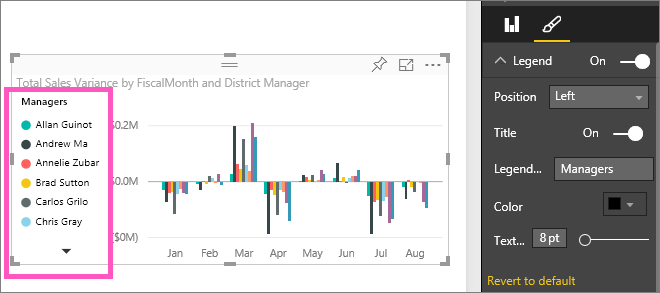

<properties
   pageTitle="Tutorial: Personalizar visuales títulos, leyendas y fondos. "
   description="Tutorial: Personalizar la leyenda, el fondo y el título de visualización"
   services="powerbi"
   documentationCenter=""
   authors="mihart"
   manager="mblythe"
   backup=""
   editor=""
   tags=""
   qualityFocus="monitoring"
   qualityDate=""/>

<tags
   ms.service="powerbi"
   ms.devlang="NA"
   ms.topic="article"
   ms.tgt_pltfrm="NA"
   ms.workload="powerbi"
   ms.date="10/01/2016"
   ms.author="mihart"/>

# Tutorial: Personalizar la leyenda, el fondo y el título de visualización

En este tutorial aprenderá diferentes formas de personalizar las visualizaciones. No todas las visualizaciones se pueden personalizar, [Ver la lista completa](#list).  En concreto, este tutorial trata la personalización:  
-   títulos de visualización  
-   fondos de visualización  
-   leyendas de visualización

## Personalizar los títulos de visualización de informes    
He iniciado sesión en el servicio Power BI y voy a empezar con el informe de ejemplo de análisis de venta directa en [vista de edición de](powerbi-service-interact-with-a-report-in-editing-view.md). Para continuar, [conectarse a la muestra de análisis de venta](powerbi-sample-downloads.md).

>[AZURE.NOTE]  
>Cuando ancla una visualización a un panel, se convierte en un icono de panel.  También se pueden personalizar los mosaicos a sí mismos con [nuevos títulos y subtítulos, hipervínculos y cuyo tamaño ha cambiado](powerbi-service-edit-a-tile-in-a-dashboard.md).

1.  Desplácese a la página "New tiendas" del informe y seleccione el gráfico de columnas "Abrir recuento de tienda por abrir... mes".

2.  En el panel de visualizaciones y los filtros, seleccione el icono de pincel  para mostrar las opciones de formato y seleccione **título** para expandir esa sección.  
    

3.  Activar  **título** y desactivar seleccionando el On (o desactivar) control deslizante. Por ahora, deje **en**.  
    

4.  Cambio **texto de título** escribiendo **almacenar recuento por mes abre** en el campo de texto.  

5.  Cambio **color de fuente** a naranja y **Color de fondo** a amarillo.

    -   Seleccione la lista desplegable y elija un color en la **colores del tema**, **colores recientes**, o **color personalizado**.

    -   Seleccione la lista desplegable para cerrar la ventana de color.  
    

    Siempre puede volver a los colores predeterminados seleccionando **volver al valor predeterminado** en la ventana de color.

6.  La personalización del último que haremos en el título del gráfico es alinear en el centro de la visualización. De forma predeterminada, la posición del título alineado a la izquierda.  

    En este punto del tutorial, el gráfico de columnas **título** debe ser similar a algo parecido a esto:  
    

    Para revertir toda la personalización del título que hemos hecho hasta ahora, seleccione **Revertir predeterminado**, en la parte inferior de la **título** panel personalización.  
    

## Personalizar los fondos de visualización  
Con el mismo gráfico de columna seleccionado, expanda las opciones de fondo.

1.  Activar y desactivar fondo seleccionando el On (o desactivar) control deslizante. Por ahora, deje **en**.

2.  Cambiar el color de fondo a gris 74%.

    -   Seleccione la lista desplegable y elija un color gris de la **colores del tema**, **colores recientes**, o **color personalizado**.

    -    Cambiar la transparencia 74%.   
    

    Para revertir toda la personalización del fondo de título que hemos hecho hasta ahora, seleccione **Revertir predeterminado**, en la parte inferior de la **fondo** panel personalización.

## Personalizar las leyendas de visualización  

1. Abra la **Introducción** página de informe y seleccione el gráfico ""Total Sales varianza por FiscalMonth y distrito administrador.

2. En la ficha de visualización, seleccione el icono de pincel para abrir el panel de formato.  

3. Expanda **leyenda** Opciones.

      

3.  Activar la leyenda y desactivar seleccionando el On (o desactivar) control deslizante. Por ahora, deje **en**.

4.  Mover la leyenda a la izquierda de la visualización.    

3.  Agregar un título de leyenda alternando **título** a **en** y, en el **nombre de leyenda** campo, escriba **administradores**.
    

    Para revertir toda la personalización de la leyenda que hemos hecho hasta ahora, seleccione **Revertir predeterminado**, en la parte inferior de la **leyenda** panel personalización.

## Tipos de visualización que se pueden personalizar  
| Visualización  | Título  | Contexto | Leyenda |
|:---------------|:-------|:-----------|:-------|
| área           | sí    | Sí.        | sí    |
| barra            | sí    | Sí.        | sí    |
| tarjeta           | sí    | sí        | n/a    |
| tarjeta de varias filas | sí    | sí        | n/a    |
| columna         | sí    | Sí.        | sí    |
| cuadro combinado          | sí    | Sí.        | sí    |
| Donut          | sí    | Sí.        | sí    |
| mapa coroplético     | sí    | Sí.        | sí    |
| embudo         | sí    | sí        | n/a    |
| medidor          | sí    | sí        | n/a    |
| KPI            | sí    | sí        | n/a    |
| línea           | sí    | Sí.        | sí    |
| map            | sí    | Sí.        | sí    |
| matriz         | sí    | sí        | n/a    |
| gráfico circular            | sí    | Sí.        | sí    |
| Dispersión        | sí    | Sí.        | sí    |
| segmentación de datos         | sí    | sí        | n/a    |
| tabla          | sí    | sí        | n/a    |
| cuadro de texto        | no     | sí        | n/a    |
| TreeMap        | sí    | Sí.        | sí    |
| en cascada      | sí    | Sí.        | sí    |

## Consulte también  
Más información sobre [visualizaciones en informes de Power BI](powerbi-service-visualizations-for-reports.md)  
[Personalizar los ejes x y y](powerbi-service-tutorial-customize-x-axis-and-y-axis-properties.md)  
[Personalizar los colores y las propiedades del eje](powerbi-service-getting-started-with-color-formatting-and-axis-properties.md)  
[Power BI: conceptos básicos](powerbi-service-basic-concepts.md)  
¿Preguntas más frecuentes? [Pruebe la Comunidad de Power BI](http://community.powerbi.com/)
