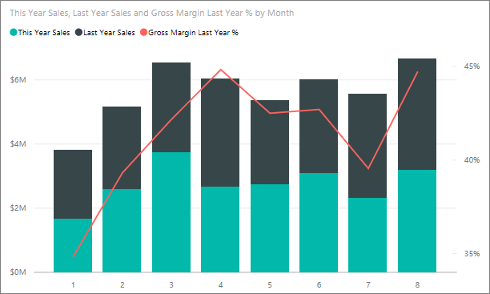

<properties
   pageTitle="Tutorial: Customize X-axis and Y-axis properties"
   description="Tutorial: Customize X-axis and Y-axis properties"
   services="powerbi"
   documentationCenter=""
   authors="mihart"
   manager="mblythe"
   backup=""
   editor=""
   tags=""
   qualityFocus="monitoring"
   qualityDate="05/23/2016"/>

<tags
   ms.service="powerbi"
   ms.devlang="NA"
   ms.topic="article"
   ms.tgt_pltfrm="NA"
   ms.workload="powerbi"
   ms.date="10/08/2016"
   ms.author="mihart"/>
# Tutorial: Customize X-axis and Y-axis properties

In this tutorial you'll learn many different ways to customize the X-axis and Y-axis of your visuals. Not all visuals have axes or can be customized; Pie charts, for example, don't have axes. And customization options vary from visual to visual, too many options to cover in a single article. So we'll take a look at some of the most-used axes customizations and get you comfortable using the visual formatting tab in the Power BI report canvas.  

>[AZURE.NOTE] This page applies to both Power BI service and Power BI Desktop. These customizations, which are available when the <bpt id="p1">**</bpt>Format<ept id="p1">**</ept> (the paint roller icon <ph id="ph1"></ph> ) is selected, are also available in Power BI Desktop.  

## Customizing visualization X-axes in reports

Sign in to the Power BI service and open the <bpt id="p1">**</bpt>Retail Analysis Sample<ept id="p1">**</ept> report in <bpt id="p2">[</bpt>Editing View<ept id="p2">](powerbi-service-interact-with-a-report-in-editing-view.md)</ept>. To follow along, <bpt id="p1">[</bpt>connect to the Retail Analysis sample<ept id="p1">](powerbi-sample-downloads.md)</ept>.

1.  Create a new column chart that shows this year's sales and last year's sales by fiscal month. 

2. Convert it to a Stacked column chart.

3.  In the Visualizations and Filters pane, select <bpt id="p1">**</bpt>Format<ept id="p1">**</ept> (the paint roller icon <ph id="ph1"></ph> ) to reveal the customization options.

4.  Expand the X-Axis options.

5.  Turn the X-axis on and off by selecting the On (or Off) slider. For now, leave it <bpt id="p1">**</bpt>On<ept id="p1">**</ept>.  Turning the X-axis off removes the X-axis label and saves space for more data.

    

6.  Turn the X-axis title <bpt id="p1">**</bpt>On<ept id="p1">**</ept> and display the name of the X axis -- in this case, <bpt id="p2">**</bpt>FiscalMonth<ept id="p2">**</ept>.  

    After all these customizations, your column chart should look something like this:

     

    >[AZURE.NOTE] If the X-axis is categorized by the report owner as a date type, the <bpt id="p1">**</bpt>Type<ept id="p1">**</ept> option will display and you can select between continuous or categorical. 

To revert all the X-axis customization you've done so far, select <bpt id="p1">**</bpt>Revert To Default <ept id="p1">**</ept>at the bottom of the <bpt id="p2">**</bpt>X-axis<ept id="p2">**</ept> customization pane.

## Customizing visualization Y-axes in reports

Some visualizations have Y-axes and these too can be customized. There are even some visualizations that have dual Y-axes, and you'll learn how to customize those as well.

1.  From the <bpt id="p1">**</bpt>New Stores<ept id="p1">**</ept> tab of the Retail Analysis Sample report, select the chart "This Year Sales by FiscalMonth."

    

2. From the Fields pane, select <bpt id="p1">**</bpt>Store<ept id="p1">**</ept><ph id="ph1"> &gt; </ph><bpt id="p2">**</bpt>Name<ept id="p2">**</ept> to add it as a <bpt id="p3">**</bpt>Legend<ept id="p3">**</ept>.

    

3.  In the Visualizations and Filters pane, select <bpt id="p1">**</bpt>Format<ept id="p1">**</ept> (the paint roller icon.
     ) to reveal the customization options.

4. Expand the Y-Axis options and ensure that the Y-Axis slider is toggled to <bpt id="p1">**</bpt>On<ept id="p1">**</ept>.

     

4.  Turn the Title <bpt id="p1">**</bpt>On<ept id="p1">**</ept> so that colleagues can see at-a-glance what is being measured. And set the <bpt id="p1">**</bpt>Style<ept id="p1">**</ept> to <bpt id="p2">**</bpt>Show title<ept id="p2">**</ept> <bpt id="p3">**</bpt>only<ept id="p3">**</ept> (instead of <bpt id="p4">**</bpt>Show both<ept id="p4">**</ept> or <bpt id="p5">**</bpt>Show unit only<ept id="p5">**</ept>) since the Y-axis already shows that the unit of measurement is thousands of dollars.

3.  Change the Y-axis Position to <bpt id="p1">**</bpt>Right<ept id="p1">**</ept> to move it away from the legend and easier to read.

4.  Change the Start and End range to display only the companies with the higher sales.

    -   Set Start to <bpt id="p1">**</bpt>35,000<ept id="p1">**</ept>

    -   Set End to <bpt id="p1">**</bpt>100,000<ept id="p1">**</ept>

6.  After all these customizations, your line chart should look like this:

    

    To revert all the Y-axis customization you've done so far, select <bpt id="p1">**</bpt>Revert To Default<ept id="p1">**</ept>, at the bottom of the <bpt id="p2">**</bpt>Y-axis<ept id="p2">**</ept> customization pane.

## Customizing visualizations with dual Y-axes

First you'll create a Combo chart that looks at the impact store count has on sales.  This is the same chart that is created in the <bpt id="p1">[</bpt>Combo chart Tutorial<ept id="p1">](powerbi-service-tutorial-combo-chart-merge-visualizations.md)</ept>. Then you'll format the dual Y-axes.

### Create a chart with two Y-axes

1.  Create a new line chart that tracks <bpt id="p1">**</bpt>Sales &gt; Gross Margin last year %<ept id="p1">**</ept> by <bpt id="p2">**</bpt>Time &gt; Month<ept id="p2">**</ept>. 

2. Sort the visual by month by selecting the ellipses (...) and choosing <bpt id="p1">**</bpt>Sort by Month<ept id="p1">**</ept>

    

3. In January GM% was 35%, peaked at 45% in April, dropped in July and peaked again in August. Will we see a similar pattern in sales last year and this year?

4.  Add <bpt id="p1">**</bpt>This Year Sales &gt; Value<ept id="p1">**</ept> and <bpt id="p2">**</bpt>Last Year Sales<ept id="p2">**</ept> to the line chart. The scale of <bpt id="p1">**</bpt>GM% Last Year<ept id="p1">**</ept> is much smaller than the scale of <bpt id="p2">**</bpt>Sales<ept id="p2">**</ept> which makes it difficult to compare.      

    

5.  To make the visual easier to read and interpret, convert the line chart to a Line and Stacked Column chart.

    

4.  Drag <bpt id="p1">**</bpt>Gross Margin Last Year %<ept id="p1">**</ept> from <bpt id="p2">**</bpt>Column Values<ept id="p2">**</ept> into <bpt id="p3">**</bpt>Line Values<ept id="p3">**</ept>. Power BI creates two axes, thus allowing the datasets to be scaled differently; the left measures dollars and the right measures percentage.

    

  
### Format the secondary Y-axis

1.  In the <bpt id="p1">**</bpt>Visualizations<ept id="p1">**</ept> pane, select the paint roller icon to display the formatting options.

2.  Expand the Y-Axis options by selecting the down arrow.

3.  Scroll through the list until you find the options for <bpt id="p1">**</bpt>Show secondary<ept id="p1">**</ept>. Toggle <bpt id="p1">**</bpt>Show Secondary<ept id="p1">**</ept> from <bpt id="p2">**</bpt>Off<ept id="p2">**</ept> to <bpt id="p3">**</bpt>On<ept id="p3">**</ept>.

    

    

4.  (Optional) Customize the two axes. If you switch <bpt id="p1">**</bpt>Position<ept id="p1">**</ept> for either the column axis or the line axis, then the two axes switch sides.

    

### Add titles to both axes

With a visualization this complicated, it helps to add axes titles.  Titles help your colleagues understand the story your visualization is telling.

1.  Toggle <bpt id="p1">**</bpt>Title<ept id="p1">**</ept> to <bpt id="p2">**</bpt>On<ept id="p2">**</ept> for <bpt id="p3">**</bpt>Y-Axis (Column)<ept id="p3">**</ept> and the <bpt id="p4">**</bpt>Y-Axis (Line)<ept id="p4">**</ept>.

2.  Set <bpt id="p1">**</bpt>Style<ept id="p1">**</ept> to <bpt id="p2">**</bpt>Show title only<ept id="p2">**</ept>.

    

3.  Your Combo chart now displays dual axes, both with titles.

    

For more information, see <bpt id="p1">[</bpt>Tips and tricks for color formatting, labeling, and axis properties<ept id="p1">](powerbi-service-tips-and-tricks-for-color-formatting.md)</ept>.

## Consulte también

More about <bpt id="p1">[</bpt>Visualizations in Power BI reports<ept id="p1">](powerbi-service-visualizations-for-reports.md)</ept>

<bpt id="p1">[</bpt>Customize t<ept id="p1">](powerbi-service-tutorial-customize-visualization-title-background-and-legend.md)</ept><bpt id="p2">[</bpt>itles, backgrounds, and legends<ept id="p2">](powerbi-service-tutorial-customize-visualization-title-background-and-legend.md)</ept>

[Customize colors and axis properties](powerbi-service-getting-started-with-color-formatting-and-axis-properties.md)

[Power BI - Basic Concepts](powerbi-service-basic-concepts.md)

More questions? [Try the Power BI Community](http://community.powerbi.com/)
