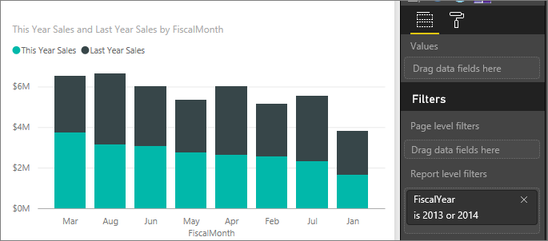
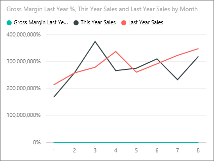
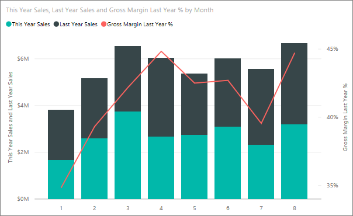

<properties
   pageTitle="Tutorial: Personalizar las propiedades del eje x y el eje y"
   description="Tutorial: Personalizar las propiedades del eje x y el eje y"
   services="powerbi"
   documentationCenter=""
   authors="mihart"
   manager="mblythe"
   backup=""
   editor=""
   tags=""
   qualityFocus="monitoring"
   qualityDate="05/23/2016"/>

<tags
   ms.service="powerbi"
   ms.devlang="NA"
   ms.topic="article"
   ms.tgt_pltfrm="NA"
   ms.workload="powerbi"
   ms.date="10/08/2016"
   ms.author="mihart"/>
# Tutorial: Personalizar las propiedades del eje x y el eje y

En este tutorial aprenderá diferentes formas de personalizar los ejes x y y de los objetos visuales. No todos los elementos visuales tienen ejes o se pueden personalizar; Por ejemplo, los gráficos circulares no tienen ejes. Y opciones de personalización varían visual a visual demasiadas opciones que trataré en un solo artículo. Por lo tanto, echaremos un vistazo a algunas de las personalizaciones de ejes más usados y obtener se siente cómodo usando la ficha formato visual en el lienzo de informe de Power BI.  

>[AZURE.NOTE] Esta página se aplica al servicio Power BI y Power BI Desktop. Estas personalizaciones, que están disponibles cuando el **formato** (el icono de rodillos de pintura  ) está seleccionada, también están disponibles en Power BI Desktop.  

## Personalizar la visualización de ejes x en informes

Inicie sesión en el servicio Power BI y abra el **ejemplo de análisis de venta directa** informes en [vista de edición de](powerbi-service-interact-with-a-report-in-editing-view.md). Para continuar, [conectarse a la muestra de análisis de venta](powerbi-sample-downloads.md).

1.  Cree un nuevo gráfico de columna que muestra este año de ventas y ventas del último año por mes fiscal. 

2. Convertir a un gráfico de columnas apiladas.

3.  En el panel de visualizaciones y los filtros, seleccione **formato** (el icono de rodillos de pintura  ) para mostrar las opciones de personalización.

4.  Expanda las opciones del eje x.

5.  Activar el eje x y desactivar seleccionando el On (o desactivar) control deslizante. Por ahora, deje **en**.  Desactivar el eje x quita la etiqueta del eje x y ahorra espacio más datos.

    

6.  Activar el título del eje x **en** y mostrar el nombre del eje X, en este caso, **FiscalMonth**.  

    Después de todas estas personalizaciones, el gráfico de columnas debe tener un aspecto similar al siguiente:

     

    >[AZURE.NOTE] Si el eje x está clasificado por el propietario del informe como un tipo de fecha, la **tipo** mostrará la opción y puede seleccionar entre continuas o de categorías. 

Para revertir toda la personalización del eje x ha hecho hasta ahora, seleccione **Revertir predeterminado **en la parte inferior de la **eje x** panel personalización.

## Personalizar la visualización de ejes en los informes

Algunas visualizaciones tienen ejes y éstos también se pueden personalizar. Hay incluso algunas visualizaciones que tienen dos ejes y aprenderá a personalizarlos así.

1.  Desde el **nuevo almacenes** ficha del informe de ejemplo de análisis de venta directa, seleccione el gráfico "Ventas de este año por FiscalMonth".

    

2. En el panel de campos, seleccione **almacén** > **nombre** para agregarlo como un **leyenda**.

    

3.  En el panel de visualizaciones y los filtros, seleccione **formato** (el icono de rodillos de pintura.
     ) para mostrar las opciones de personalización.

4. Expanda las opciones del eje y y asegúrese de que el control deslizante de eje y se cambia a **en**.

     

4.  Activar el título **en** para que pueden ver sus colegas un vistazo lo que se va a medir. Y establecer el **estilo** a **Mostrar título** **sólo** (en lugar de **Mostrar ambos** o **Mostrar unidad sólo**) desde el eje y muestra ya que la unidad de medida es miles de dólares.

3.  Cambiar la posición del eje y a **derecha** para moverlo fuera de la leyenda y más fácil de leer.

4.  Cambiar el intervalo de inicio y finalización para mostrar sólo las compañías con las ventas mayores.

    -   Establecer inicio en **35.000**

    -   Extremo del conjunto **100.000**

6.  Después todas estas personalizaciones, el gráfico de líneas debe ser similar al siguiente:

    

    Para revertir toda la personalización de eje y ha hecho hasta ahora, seleccione **Revertir predeterminado**, en la parte inferior de la **eje y** panel personalización.

## Personalizar visualizaciones con dos ejes

Primero creará un gráfico combinado que busca en el recuento de almacén de impacto tiene en ventas.  Este es el mismo gráfico que se crea en el [gráfico combinado de Tutorial](powerbi-service-tutorial-combo-chart-merge-visualizations.md). A continuación, aplicará formato a los dos ejes.

### Crear un gráfico con dos ejes y

1.  Crear un nuevo gráfico de líneas que realiza un seguimiento de **ventas > margen bruto último año %** por **tiempo > mes**. 

2. Ordenar el objeto visual por mes, seleccione el botón de puntos suspensivos (...) y elija **Ordenar por mes**

    

3. En enero GM % fue 35%, máximo es 45% en abril, colocado en julio y Tec en agosto. ¿Se verá un patrón similar en ventas año anterior y este año?

4.  Agregar **ventas de este año > valor** y **ventas del último año** para el gráfico de líneas. La escala de **% último año de GM** es mucho menor que la escala de **ventas** lo que hace difícil comparar.      

    

5.  Para que el objeto visual fáciles de leer e interpretar, convertir el gráfico de líneas en un gráfico de líneas y columnas apiladas.

    

4.  Arrastre **margen bruto último año %** de **valores de columna** en **línea valores**. Power BI crea dos ejes, lo que permite a los conjuntos de datos se escale de manera diferente; la izquierda mide dólares y el porcentaje de las medidas adecuadas.

    

  
### Dar formato al eje y secundario

1.  En el **visualizaciones** panel, seleccione el icono de rodillos de pintura para mostrar el formato opciones.

2.  Expanda las opciones del eje y seleccionando la flecha hacia abajo.

3.  Desplácese por la lista hasta que encuentre las opciones de **Mostrar secundario**. Alternar **Mostrar secundaria** desde **desactivar** a **en**.

    

    

4.  (Opcional) Personalizar los dos ejes. Si cambia **posición** para el eje de columna o el eje de la línea, a continuación, los dos ejes intercambiar lados.

    

### Agregar títulos a los ejes

Con una visualización de que este complicado, ayuda a agregar títulos de eje.  Títulos a sus colegas comprender la historia que está indicando la visualización.

1.  Alternar **título** a **en** de **eje y (columna)** y **eje y (línea)**.

2.  Establecer **estilo** a **Mostrar título sólo**.

    

3.  Gráfico combinado muestra ahora los dos ejes, ambos con títulos.

    

Para obtener más información, consulte [sugerencias y trucos para las propiedades de formato, el etiquetado y el eje de color](powerbi-service-tips-and-tricks-for-color-formatting.md).

## Consulte también

Más información sobre [visualizaciones en informes de Power BI](powerbi-service-visualizations-for-reports.md)

            [Personalizar t](powerbi-service-tutorial-customize-visualization-title-background-and-legend.md)[itles, fondos y leyendas](powerbi-service-tutorial-customize-visualization-title-background-and-legend.md)

[Personalizar los colores y las propiedades del eje](powerbi-service-getting-started-with-color-formatting-and-axis-properties.md)

[Power BI: conceptos básicos](powerbi-service-basic-concepts.md)

¿Preguntas más frecuentes? [Pruebe la Comunidad de Power BI](http://community.powerbi.com/)
