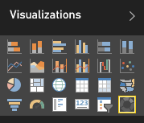

<properties
   pageTitle="Tutorial: Gráficos de anillos en Power BI"
   description="Tutorial: Gráficos de anillos en Power BI"
   services="powerbi"
   documentationCenter=""
   authors="mihart"
   manager="mblythe"
   backup=""
   editor=""
   tags=""
   qualityFocus="no"
   qualityDate=""/>

<tags
   ms.service="powerbi"
   ms.devlang="NA"
   ms.topic="article"
   ms.tgt_pltfrm="NA"
   ms.workload="powerbi"
   ms.date="08/11/2016"
   ms.author="mihart"/>

# Tutorial: Gráficos de anillos en Power BI

Un gráfico de anillos es similar a un gráfico circular que muestra la relación de partes con un todo. La única diferencia es que el centro está en blanco y permite espacio para una etiqueta o un icono.

## Crear un gráfico de anillos

Para continuar, inicie sesión Power BI y seleccione **obtener datos** \> **ejemplos** \> **ejemplo de análisis de venta**. 

1. En el panel "Ejemplo de análisis de venta", seleccione la **Total almacenes** icono para abrir el informe "Ejemplo de análisis de venta directa".

2. Seleccione **Editar informe** para abrir el informe en la vista de edición.

3. Agregue una nueva página del informe.

4. Crear un gráfico en cascada que muestra las ventas de este año por categoría.

  - Desde el **campos** panel, seleccione **ventas** \> **ventas del último año**.

  - Convertir a un gráfico de anillos. Si no está en ventas del último año el **valores** área, lo arrastra.

        

  - Seleccione **elemento** \> **categoría** para agregarlo al área de leyenda. 

        

## Sugerencias y trucos para los gráficos de anillos

-   La suma de los valores del gráfico de anillos debe agregar un 100%.

-   Demasiadas categorías dificultan leer e interpretar.

-   Gráficos de anillos son útiles para comparar una sección concreta para todo, en lugar de comparar las secciones entre sí. 

## Consulte también

[Informes de Power BI](powerbi-service-reports.md)

[Tipos de visualización en Power BI](powerbi-service-visualization-types-for-reports-and-q-and-a.md)

[Visualizaciones en informes de Power BI](powerbi-service-visualizations-for-reports.md)

[Power BI: conceptos básicos](powerbi-service-basic-concepts.md)

¿Preguntas más frecuentes? [Pruebe la Comunidad de Power BI](http://community.powerbi.com/)
