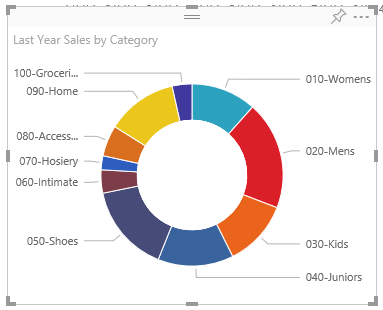

<properties
   pageTitle="Tutorial: Doughnut charts in Power BI"
   description="Tutorial: Doughnut charts in Power BI"
   services="powerbi"
   documentationCenter=""
   authors="mihart"
   manager="mblythe"
   backup=""
   editor=""
   tags=""
   qualityFocus="no"
   qualityDate=""/>

<tags
   ms.service="powerbi"
   ms.devlang="NA"
   ms.topic="article"
   ms.tgt_pltfrm="NA"
   ms.workload="powerbi"
   ms.date="08/11/2016"
   ms.author="mihart"/>

# Tutorial: Doughnut charts in Power BI

A  doughnut chart is similar to a pie chart in that it shows the relationship of parts to a whole. The only difference is that the center is blank and allows space for a label or icon.

## Create a doughnut chart

To follow along, sign in to Power BI and select <bpt id="p1">**</bpt>Get Data<ept id="p1">**</ept> <ph id="ph1">\&gt;</ph> <bpt id="p2">**</bpt>Samples<ept id="p2">**</ept> <ph id="ph2">\&gt;</ph> <bpt id="p3">**</bpt>Retail Analysis Sample<ept id="p3">**</ept>. 

1. From the "Retail Analysis Sample" dashboard, select the <bpt id="p1">**</bpt>Total Stores<ept id="p1">**</ept> tile to open the "Retail Analysis Sample" report.

2. Select <bpt id="p1">**</bpt>Edit Report<ept id="p1">**</ept> to open the report in Editing View.

3. Add a new report page.

4. Create a Waterfall chart that displays this year's sales by category.

  - From the <bpt id="p1">**</bpt>Fields<ept id="p1">**</ept> pane, select <bpt id="p2">**</bpt>Sales<ept id="p2">**</ept> <ph id="ph1">\&gt;</ph> <bpt id="p3">**</bpt>Last Year Sales<ept id="p3">**</ept>.

  - Convert to a doughnut chart. If Last Year Sales is not in the <bpt id="p1">**</bpt>Values<ept id="p1">**</ept> area, drag it there.

        

  - Select <bpt id="p1">**</bpt>Item<ept id="p1">**</ept> <ph id="ph1">\&gt;</ph> <bpt id="p2">**</bpt>Category<ept id="p2">**</ept> to add it to the Legend area. 

        

## Tips and Tricks for doughnut charts

-   The sum of the doughnut chart values must add up to 100%.

-   Too many categories make it difficult to read and interpret.

-   Doughnut charts are best used to compare a particular section to the whole, rather than comparing individual sections with each other. 

## Consulte también

[Reports in Power BI](powerbi-service-reports.md)

[Visualization types in Power BI](powerbi-service-visualization-types-for-reports-and-q-and-a.md)

[Visualizations in Power BI reports](powerbi-service-visualizations-for-reports.md)

[Power BI - Basic Concepts](powerbi-service-basic-concepts.md)

More questions? [Try the Power BI Community](http://community.powerbi.com/)
