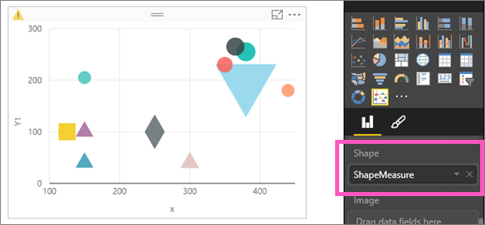
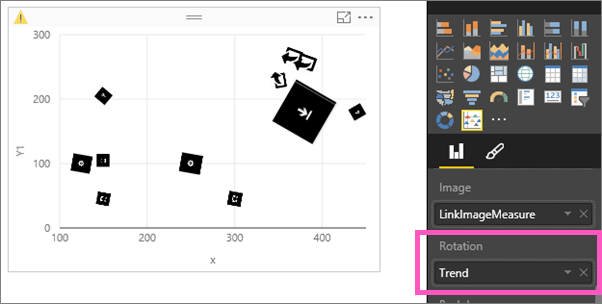

<properties
   pageTitle="Tutorial: Mejorado de los gráficos de dispersión en Power BI"
   description="Tutorial: Mejorar los gráficos de dispersión en Power BI."
   services="powerbi"
   documentationCenter=""
   authors="mihart"
   manager="mblythe"
   backup=""
   editor=""
   tags=""
   qualityFocus="no"
   qualityDate=""/>

<tags
   ms.service="powerbi"
   ms.devlang="NA"
   ms.topic="article"
   ms.tgt_pltfrm="NA"
   ms.workload="powerbi"
   ms.date="08/11/2016"
   ms.author="mihart"/>

# Tutorial: mejorado de los gráficos de dispersión en Power BI

El gráfico de dispersión mejorada es sólo uno de los Microsoft creó elementos visuales personalizados disponibles para su descarga desde el [Galería de elementos visuales de BI energía](https://app.powerbi.com/visuals).  Un gráfico de dispersión mejorada es similar a un gráfico de dispersión o burbujas estándar, que muestra la relación entre las variables de 2 a 3. La diferencia es que no está limitado a los círculos (burbujas). Puede mostrar formas, imágenes, agregar imágenes de fondo y mucho más.

Para obtener más información, vea este vídeo acerca de [mejorada de dispersión](https://youtu.be/xCfM0cjM4do?list=PL1N57mwBHtN1vIjfvuBIzZllrmKo-Vz6x).

Los pasos siguientes muestran simplemente una forma de utilizar la dispersión mejorada--para crear un elemento visual que se asigna la página clics por número y la ubicación de una página web. Utilice su propio conjunto de datos y descubrir más formas de usar este nuevo objeto visual personalizado.

>[AZURE.NOTE] Desafortunadamente, el conjunto de datos que se utiliza en este tutorial no está disponible para su descarga.

## Empiece por crear un gráfico de burbujas básica

El gráfico de burbujas mostrará información de tráfico del sitio Web.

1. Abra un informe en la vista de edición y agregue una página en blanco.

2. Agregar un gráfico de dispersión vacía al lienzo seleccionando el icono de gráfico de dispersión.

3. En el panel de campos, seleccione **página uso** \> **PageNum** para agregarla a  **detalles**.

4. Seleccione **vínculo**, y, a continuación, el **x** y **Y1** coordenadas para esos vínculos. Asegúrese de que agrega Power BI **vínculo** a **leyenda**, **x** a **eje X**, y **Y1** a **eje Y**.

5. Por último, agregue **hace clic en** para **tamaño**.

      

He creado un gráfico típico de burbujas. Los pasos siguientes muestran las capacidades avanzadas de la dispersión mejorada.  

## Convertir el gráfico de burbujas en un gráfico de dispersión mejorada

1. 
            [Descargue la visualización mejorada de dispersión](powerbi-custom-visuals-download-from-the-gallery.md) y [Agregar al informe](powerbi-custom-visuals-add-to-report.md).

2. Si recibe un mensaje pidiéndole que para habilitar elementos visuales personalizados, lea la advertencia y seleccione **Habilitar elementos visuales personalizados**.

3. Seleccione el gráfico de burbujas y convertirlo en un gráfico de dispersión mejorada seleccionando el icono de gráfico de dispersión mejorada     desde el **visualizaciones** panel.

    

  En este punto, el gráfico debe ser exactamente el mismo.  Si no es así, compruebe que los campos de los depósitos de visualización no cambian.  Si es así, muévalos a su sus depósitos originales.  Por ejemplo, si **Y1** movido de **eje Y** a **tamaño**, vuelva a poner **eje Y**, etc..

## Agregar formas, imágenes, rotación y fondo

Los módulos de dispersión mejorada incluso más información en una sola visualización. En estos pasos, agregue formas, imágenes, rotación y un fondo.

>[AZURE.IMPORTANT]  Estos campos de visualización requieren el conjunto de datos para que las medidas que devuelve un valor de texto. Si tiene una columna que contiene el nombre de la forma o imagen direcciones URL, tendrá que crear una medida para devolver la primera fila en blanco (o cualquier otra lógica que usaría devuelven un valor de texto y que en este depósito de campo de visualización).

1. Agregar formas que visualmente identifica el tipo de vínculo: descargar, obtener más información, precios, página de inicio, etc.. Arrastre **ShapeMeasure** para **forma**.  Power BI permite: círculo, cruz, rombo, Hexágono cuadrado, el triángulo, de triángulo abajo, estrella, x, flecha arriba y flecha abajo. Estos valores ya debe existir en (o agregarse a) el conjunto de datos.

    

    Asegúrese de que sus colegas saben lo que significa cada forma.  Puede hacerlo mediante la adición de un cuadro de texto al informe.  O bien, utilizar los gráficos que generalmente reconocible.

2. Quitar **ShapeMeasure** desde el **forma** área y arrastre **LinkImageMeasure** a **imagen**.

    

3. Para comunicar información incluso más gráficamente, arrastre **tendencia** a **giro**.  La rotación de cada imagen indica si el número de clics se sube o baja.

    

4. Para que este gráfico incluso más fáciles de leer, agregar una imagen de la página web como fondo.  En este ejemplo, no sólo estamos agregando una sola imagen, pero muestra una medida que controla la página web.
Quitar **LinkImageMeasure** y arrastre **PageLayout** > **ImageMeasure** a **telón de fondo**.

    

5. Utilice las áreas xmin, xmax, ymin y ymax para alinear la imagen de fondo con x e y coordenadas usados para trazar los datos.
  - Arrastre **xmin** a **X iniciar**.
  - Arrastre **xmax** a **End X**.
  - Arrastre **ymin** a **Y inicio**
  - Arrastre **ymax** a **Y final**

    

## Agregar una segmentación de datos

Derecha ahora, esta visualización no es útil ya que está mostrando clics total para todas las páginas 3 Web en una imagen única página Web.  Agregar una segmentación de datos para controlar qué página Web (y datos) para mostrar.

1. Agregar una segmentación de datos a un área en blanco del lienzo del informe seleccionando el icono de segmentación de datos .

2. Seleccione **PageName** para agregarlo a la **campo** área.

    

    

3. Segmento del gráfico de dispersión mejorada para mostrar, haga clic en los datos de cada página web: uno en uno.

    

    

    

## Consulte también

[Informes de Power BI](powerbi-service-reports.md)

[Tipos de visualización en Power BI](powerbi-service-visualization-types-for-reports-and-q-and-a.md)

[Visualizaciones en informes de Power BI](powerbi-service-visualizations-for-reports.md)

[Power BI: conceptos básicos](powerbi-service-basic-concepts.md)

¿Preguntas más frecuentes? [Pruebe la Comunidad de Power BI](http://community.powerbi.com/)
