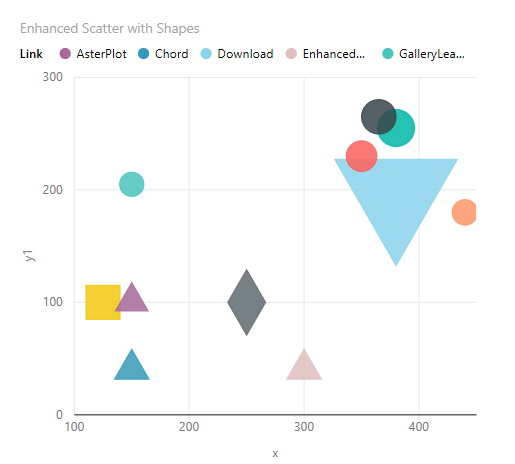
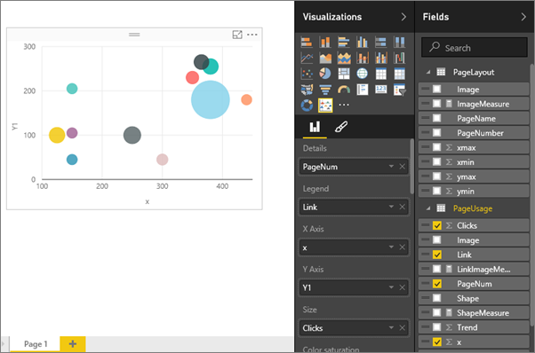

<properties
   pageTitle="Tutorial: Enhanced Scatter charts in Power BI"
   description="Tutorial: Enhanced Scatter charts in Power BI."
   services="powerbi"
   documentationCenter=""
   authors="mihart"
   manager="mblythe"
   backup=""
   editor=""
   tags=""
   qualityFocus="no"
   qualityDate=""/>

<tags
   ms.service="powerbi"
   ms.devlang="NA"
   ms.topic="article"
   ms.tgt_pltfrm="NA"
   ms.workload="powerbi"
   ms.date="08/11/2016"
   ms.author="mihart"/>

# Tutorial: enhanced scatter charts in Power BI

The enhanced scatter chart is just one of the Microsoft-created custom visuals available for download from the <bpt id="p1">[</bpt>Power BI Visuals gallery<ept id="p1">](https://app.powerbi.com/visuals)</ept>.  An enhanced scatter chart is similar to a standard scatter or bubble chart in that it displays the relationship between 2 to 3 variables. The  difference is that you are not limited to circles (bubbles). You can display shapes, images, add images to the background, and much more.

For more information, watch this video about <bpt id="p1">[</bpt>Enhanced Scatter<ept id="p1">](https://youtu.be/xCfM0cjM4do?list=PL1N57mwBHtN1vIjfvuBIzZllrmKo-Vz6x)</ept>.

The steps below show just one way to use the enhanced scatter -- to create a visual that maps page clicks by number and location on a web page. Use your own dataset and discover even more ways to use this new custom visual.

>[AZURE.NOTE] Unfortunately, the dataset used in this tutorial is not available for download.

## Start by creating a basic bubble chart

The bubble chart will display website traffic details.

1. Open a report in Editing View and add a blank page.

2. Add an empty scatter chart to the canvas by selecting the scatter chart icon.

3. From the Fields pane, select <bpt id="p1">**</bpt>Page Usage<ept id="p1">**</ept> <ph id="ph1">\&gt;</ph> <bpt id="p2">**</bpt>PageNum<ept id="p2">**</ept> to add it to  <bpt id="p3">**</bpt>Details<ept id="p3">**</ept>.

4. Select <bpt id="p1">**</bpt>Link<ept id="p1">**</ept>, and then the <bpt id="p2">**</bpt>x<ept id="p2">**</ept> and <bpt id="p3">**</bpt>Y1<ept id="p3">**</ept> coordinates for those links. Ensure Power BI adds <bpt id="p1">**</bpt>Link<ept id="p1">**</ept> to <bpt id="p2">**</bpt>Legend<ept id="p2">**</ept>, <bpt id="p3">**</bpt>x<ept id="p3">**</ept> to <bpt id="p4">**</bpt>X Axis<ept id="p4">**</ept>, and <bpt id="p5">**</bpt>Y1<ept id="p5">**</ept> to <bpt id="p6">**</bpt>Y Axis<ept id="p6">**</ept>.

5. Finally, add <bpt id="p1">**</bpt>Clicks<ept id="p1">**</ept> to <bpt id="p2">**</bpt>Size<ept id="p2">**</ept>.

      

I've created a typical bubble chart. The next steps demonstrate the advanced capabilities of the enhanced scatter.  

## Convert the bubble chart to an enhanced scatter chart

1. <bpt id="p1">[</bpt>Download the enhanced scatter visualization<ept id="p1">](powerbi-custom-visuals-download-from-the-gallery.md)</ept> and <bpt id="p2">[</bpt>add it to the report<ept id="p2">](powerbi-custom-visuals-add-to-report.md)</ept>.

2. If you receive a message asking you to enable custom visuals, read the warning and select <bpt id="p1">**</bpt>Enable custom visuals<ept id="p1">**</ept>.

3. Select the bubble chart and convert it to an enhanced scatter chart by selecting the enhanced scatter chart icon    <ph id="ph1"></ph> from the <bpt id="p1">**</bpt>Visualizations<ept id="p1">**</ept> pane.

    

  At this point, the chart should look exactly the same.  If it does not, check to see that the fields in the Visualization buckets didn't change.  If they did, move them back to their original buckets.  For example, if <bpt id="p1">**</bpt>Y1<ept id="p1">**</ept> moved from <bpt id="p2">**</bpt>Y Axis<ept id="p2">**</ept> to <bpt id="p3">**</bpt>Size<ept id="p3">**</ept>, move it back to <bpt id="p4">**</bpt>Y Axis<ept id="p4">**</ept>, etc.

## Add shapes, images, rotation, and background

The enhanced scatter packs even more information into a single visualization. In these steps, add shapes, images, rotation, and a background.

>[AZURE.IMPORTANT]  These visualization fields require your dataset to have measures that returns a text value. If you have a column containing the shape name or image URLs, then you need to create a measure to return the first non-blank row (or any other logic that would return one text value and use that in this visualization field bucket).

1.    Power BI allows: circle, cross, diamond, square, triangle-up, triangle-down, star, hexagon, x, up arrow, and down arrow. These values must already exist in (or be added to) your dataset.

    

    Ensure that your colleagues know what each shape means.  You could do this by adding a text box to the report.  Or, use graphics that are generally universally understood.

2. Remove <bpt id="p1">**</bpt>ShapeMeasure<ept id="p1">**</ept> from the <bpt id="p2">**</bpt>Shape<ept id="p2">**</ept> area and drag <bpt id="p3">**</bpt>LinkImageMeasure<ept id="p3">**</ept> to <bpt id="p4">**</bpt>Image<ept id="p4">**</ept>.

    

3. To communicate even more information graphically, drag <bpt id="p1">**</bpt>Trend<ept id="p1">**</ept> to <bpt id="p2">**</bpt>Rotation<ept id="p2">**</ept>.  The rotation of each image indicates whether the number of clicks is trending up or down.

    

4. To make this chart even easier to read, add an image of the actual web page as a background.  In this example, we're not simply adding a single image, but a measure that controls which web page displays.
Remove <bpt id="p1">**</bpt>LinkImageMeasure<ept id="p1">**</ept> and drag <bpt id="p2">**</bpt>PageLayout<ept id="p2">**</ept><ph id="ph1"> &gt; </ph><bpt id="p3">**</bpt>ImageMeasure<ept id="p3">**</ept> to <bpt id="p4">**</bpt>Backdrop<ept id="p4">**</ept>.

    

5. Use the xmin, xmax, ymin, and ymax areas to align the background image with the x and y coordinates used to plot the data.
  - drag <bpt id="p1">**</bpt>xmin<ept id="p1">**</ept> to <bpt id="p2">**</bpt>X Start<ept id="p2">**</ept>.
  - drag <bpt id="p1">**</bpt>xmax<ept id="p1">**</ept> to <bpt id="p2">**</bpt>X End<ept id="p2">**</ept>.
  - drag <bpt id="p1">**</bpt>ymin<ept id="p1">**</ept> to <bpt id="p2">**</bpt>Y Start<ept id="p2">**</ept>
  - drag <bpt id="p1">**</bpt>ymax<ept id="p1">**</ept> to <bpt id="p2">**</bpt>Y End<ept id="p2">**</ept>

    

## Add a slicer

Right now, this visualization is not useful since it's displaying total clicks for all 3 webpages onto a single webpage image.  Add a slicer to control which webpage (and data) to display.

1. Add a slicer to a blank area of the report canvas by selecting the slicer icon <ph id="ph1"></ph>.

2. Select <bpt id="p1">**</bpt>PageName<ept id="p1">**</ept> to add it to the <bpt id="p2">**</bpt>Field<ept id="p2">**</ept> area.

    

    

3. Slice the enhanced scatter chart to display click data for each web page -- one at a time.

    

    

    

## Consulte también

[Reports in Power BI](powerbi-service-reports.md)

[Visualization types in Power BI](powerbi-service-visualization-types-for-reports-and-q-and-a.md)

[Visualizations in Power BI reports](powerbi-service-visualizations-for-reports.md)

[Power BI - Basic Concepts](powerbi-service-basic-concepts.md)

More questions? [Try the Power BI Community](http://community.powerbi.com/)
