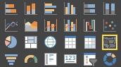
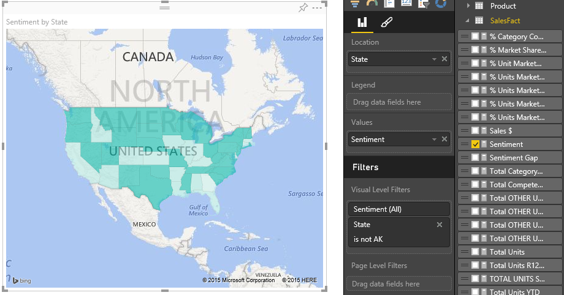
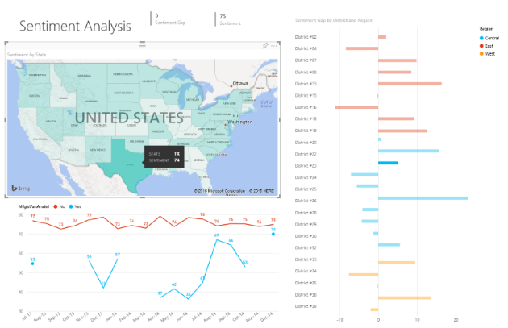

<properties
   pageTitle="Tutorial: Rellenadas mapas (Choropleths) en Power BI"
   description="Documentación: tutorial sobre la creación de mapas de rellenado (Choropleths) en Power BI"
   services="powerbi"
   documentationCenter=""
   authors="mihart"
   manager="mblythe"
   backup=""
   editor=""
   tags=""
   featuredVideoId="ajTPGNpthcg"
   qualityFocus="no"
   qualityDate=""/>

<tags
   ms.service="powerbi"
   ms.devlang="NA"
   ms.topic="article"
   ms.tgt_pltfrm="NA"
   ms.workload="powerbi"
   ms.date="08/23/2016"
   ms.author="mihart"/>

# Tutorial: rellenar mapas (choropleths) en Power BI  

Un mapa coroplético utiliza sombreado o tintes o patrones para mostrar cómo difiere de un valor en proporción a través de una zona geográfica o la región.  Mostrar rápidamente estas diferencias relativas con sombreado que va de luz (menos frecuente o inferior) a oscuro (más frecuentes y más).    

## Cuándo usar una asignación de rellenada  
Mapas de rellenadas son una excelente opción:

-   para mostrar información cuantitativa en un mapa.

-   para mostrar las relaciones y patrones espaciales.

-   Cuando los datos está normalizados.

-   Cuando se trabaja con datos socioeconómicos.

-   Cuando las regiones definidas son importantes.

-   Para obtener una visión general de la distribución en las ubicaciones geográficas.

## Crear un mapa básico de relleno
En este vídeo, Ana crea un mapa básico y lo convierte en un mapa de relleno.

<iframe width="560" height="315" src="https://www.youtube.com/embed/ajTPGNpthcg" frameborder="0" allowfullscreen></iframe>

Para crear su propia asignación rellena, [descargar las ventas y Marketing ejemplo](powerbi-sample-downloads.md) al iniciar sesión en Power BI y seleccionando **obtener datos \> archivos \> archivo Local \> ventas y Marketing**.

1.  Iniciar en un [página del informe en blanco ](powerbi-service-add-a-page-to-a-report.md) en [vista de edición de](powerbi-service-interact-with-a-report-in-editing-view.md) en el ejemplo de Marketing y ventas conjunto de datos  

2.  y seleccione el **geográfica** \> **estado** campo.    

3.  
            [Convertir el gráfico](powerbi-service-change-the-type-of-visualization-in-a-report.md) a un mapa de relleno. Observe que **estado** está ahora en la **ubicación** bien. Mapas de Bing utiliza el campo de la **ubicación** apropiado para crear el mapa.  La ubicación puede ser una gran variedad de ubicaciones válidas: países, Estados, provincias, ciudades, códigos postales u otros códigos postales, etc.. Bing Maps proporciona mapas de relleno para las ubicaciones en todo el mundo. Sin una entrada válida en el cuadro de ubicación, Power BI no puede crear el mapa de relleno.  

4.  Filtrar el mapa para mostrar a sólo el territorio continental de Estados Unidos.

    a.  En la parte inferior del panel de visualizaciones, busque el **filtros** área.

    b.  Mantenga el mouse sobre **estado** y haga clic en el botón de contenido adicional  
    

    c.  Coloque una marca de verificación junto a **todos los** y quite la marca de verificación junto a **AK**.

    

5.  Seleccione **SalesFact** \> **opinión** para agregarlo a la **valores** bien. El campo en el **valores** también controla el sombreado del mapa.  

6.  El mapa de relleno se sombrean en azul, con azul claro que representan los números menores de opiniones y la opinión posterior, más positivo azul oscuro.  Aquí se han resaltado el estado de Wyoming (WY) y ver que la opinión es muy buena, 74.  

7.  
            [Agregar el mapa rellenado un mosaico del panel (pin visual)](powerbi-service-dashboard-tiles.md). 

8.  
            [Guardar el informe](powerbi-service-save-a-report.md).

## Resaltado y filtrado cruzado  
Para obtener información acerca de cómo utilizar el panel de filtros, consulte [Agregar un filtro a un informe](powerbi-service-add-a-filter-to-a-report.md).

Filtros en resaltado de una ubicación de un mapa de relleno entre las otras visualizaciones en la página de informe... y viceversa.

1.  En el mapa de relleno, seleccione un estado.  Esto resalta las otras visualizaciones en la página. Seleccionar **Texas**, por ejemplo, me muestra que opinión es 74, Texas está en el distrito del centro \#23 y que la mayoría del volumen de ventas procede de los segmentos de moderación y comodidad.   
    

2.  En el gráfico de líneas, alternar entre **No** y **Sí**. Esto filtra el mapa de rellenado para mostrar la opinión de VanArsdel y de la competencia de VanArsdel.  
    

## Solucionar problemas  
Datos de asignación pueden ser ambiguas.  Por ejemplo, hay un París, Francia, pero también hay un Paris, Texas. Los datos geográficos probablemente se almacenan en columnas independientes: una columna para los nombres de ciudades, una columna para los nombres de estado o provincia, etc., lo que Bing no podrá saber qué Paris es que. Si el conjunto de datos ya contiene datos de latitud y longitud, Power BI tiene campos especiales para ayudar a que los datos del mapa no ambigua. Arrastre el campo que contiene los datos de latitud en las visualizaciones \> área de latitud.  Y hacer lo mismo para los datos de longitud.  
 

Si tiene permisos para editar el conjunto de datos en Power BI Desktop, vea este vídeo para obtener ayuda sobre direccionamiento ambigüedad de mapa.

<iframe width="560" height="315" src="https://www.youtube.com/embed/Co2z9b-s_yM" frameborder="0" allowfullscreen></iframe>

Si no tiene acceso a los datos de latitud y longitud, [siga estas instrucciones para actualizar el conjunto de datos](https://support.office.com/article/Maps-in-Power-View-8A9B2AF3-A055-4131-A327-85CC835271F7).

Para obtener más ayuda con visualizaciones de mapas, vea [sugerencias y trucos para las visualizaciones de mapas](powerbi-service-tips-and-tricks-for-power-bi-map-visualizations).

## Consulte también  
 [Agregar una visualización a un informe](https://powerbi.uservoice.com/knowledgebase/articles/441777)  

             [Tipos de visualización en Power BI](powerbi-service-visualization-types-for-reports-and-q-and-a.md)
 [cambiar el tipo de visualización que se va a usar](powerbi-service-change-the-type-of-visualization-in-a-report.md)
 [ancla una visualización a un panel](powerbi-service-pin-a-tile-to-a-dashboard-from-a-report.md)  
 [Power BI: conceptos básicos](powerbi-service-basic-concepts.md)  
[¡Probar--es gratuito!](https://powerbi.com/)  
¿Preguntas más frecuentes? [Pruebe la Comunidad de Power BI](http://community.powerbi.com/)
