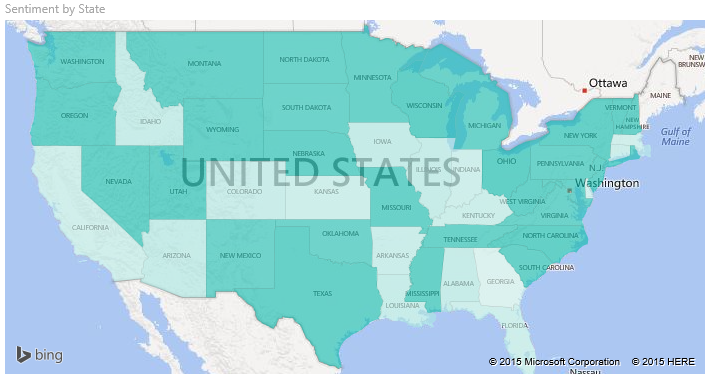
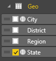
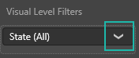
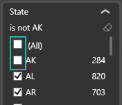
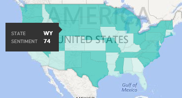
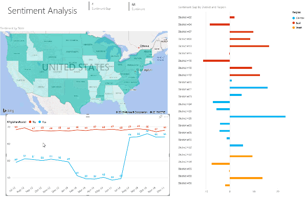

<properties
   pageTitle="Tutorial: Filled Maps (Choropleths) in Power BI"
   description="Documentation - tutorial on creating Filled Maps (Choropleths) in Power BI"
   services="powerbi"
   documentationCenter=""
   authors="mihart"
   manager="mblythe"
   backup=""
   editor=""
   tags=""
   featuredVideoId="ajTPGNpthcg"
   qualityFocus="no"
   qualityDate=""/>

<tags
   ms.service="powerbi"
   ms.devlang="NA"
   ms.topic="article"
   ms.tgt_pltfrm="NA"
   ms.workload="powerbi"
   ms.date="08/23/2016"
   ms.author="mihart"/>

# Tutorial: filled maps (choropleths) in Power BI  

A filled map uses shading or tinting or patterns to display how a value differs in proportion across a geography or region.  Quickly display these relative differences with shading that ranges from light (less-frequent/lower) to dark (more-frequent/more).    

## When to use a filled map  
Filled maps are a great choice:

-   to display quantitative information on a map.

-   to show spatial patterns and relationships.

-   when your data is standardized.

-   when working with socioeconomic data.

-   when defined regions are important.

-   to get an overview of the distribution across the geographic locations.

## Create a basic filled map
In this video, Kim creates a basic map and converts it to a filled map.

<iframe width="560" height="315" src="https://www.youtube.com/embed/ajTPGNpthcg" frameborder="0" allowfullscreen></iframe>

To create your own filled map, <bpt id="p1">[</bpt>download the Sales and Marketing sample<ept id="p1">](powerbi-sample-downloads.md)</ept> by signing in to Power BI and selecting <bpt id="p2">**</bpt>Get Data <ph id="ph1">\&gt;</ph> Files <ph id="ph2">\&gt;</ph> Local File <ph id="ph3">\&gt;</ph> Sales and Marketing<ept id="p2">**</ept>.

1.  Start on a <bpt id="p1">[</bpt>blank report page <ept id="p1">](powerbi-service-add-a-page-to-a-report.md)</ept> in <bpt id="p2">[</bpt>Editing View<ept id="p2">](powerbi-service-interact-with-a-report-in-editing-view.md)</ept> from the Sales and Marketing Sample dataset  

2.  and select the <bpt id="p1">**</bpt>Geo<ept id="p1">**</ept> <ph id="ph1">\&gt;</ph> <bpt id="p2">**</bpt>State<ept id="p2">**</ept> field.    

3.  <bpt id="p1">[</bpt>Convert the chart<ept id="p1">](powerbi-service-change-the-type-of-visualization-in-a-report.md)</ept> to a filled map. Notice that <bpt id="p1">**</bpt>State<ept id="p1">**</ept> is now in the <bpt id="p2">**</bpt>Location<ept id="p2">**</ept> well. Bing Maps uses the field in the <bpt id="p1">**</bpt>Location<ept id="p1">**</ept> well to create the map.    Without a valid entry in the Location well, Power BI cannot create the filled map.  

4.  Filter the map to display only the continental United States.

    a.  At the bottom of the Visualizations pane, look for the <bpt id="p1">**</bpt>Filters<ept id="p1">**</ept> area.

    b.  Hover over <bpt id="p1">**</bpt>State<ept id="p1">**</ept> and click the expand chevron  
    

    c.  Place a checkmark next to <bpt id="p1">**</bpt>All<ept id="p1">**</ept> and remove the checkmark next to <bpt id="p2">**</bpt>AK<ept id="p2">**</ept>.

    

5.  Select <bpt id="p1">**</bpt>SalesFact<ept id="p1">**</ept> <ph id="ph1">\&gt;</ph> <bpt id="p2">**</bpt>Sentiment<ept id="p2">**</ept> to add it to the <bpt id="p3">**</bpt>Values<ept id="p3">**</ept> well. The field in the <bpt id="p1">**</bpt>Values<ept id="p1">**</ept> well controls the map shading.  

6.  The filled map is shaded in blue, with light blue representing the lower sentiment numbers and dark blue representing the higher, more-positive sentiment.  Here I've highlighted the state of Wyoming (WY) and see that Sentiment is very good, 74.  

7.  <bpt id="p1">[</bpt>Add the filled map as a dashboard tile (pin the visual)<ept id="p1">](powerbi-service-dashboard-tiles.md)</ept>. 

8.  <bpt id="p1">[</bpt>Save the report<ept id="p1">](powerbi-service-save-a-report.md)</ept>.

## Highlighting and cross-filtering  
For information about using the Filters pane, see <bpt id="p1">[</bpt>Add a filter to a report<ept id="p1">](powerbi-service-add-a-filter-to-a-report.md)</ept>.

Highlighting a Location in a Filled Map cross-filters the other visualizations on the report page... and vice versa.

1.  On the filled map, select a state.  This highlights the other visualizations on the page. Selecting <bpt id="p1">**</bpt>Texas<ept id="p1">**</ept>, for example, shows me that Sentiment is 74, Texas is in the Central District <ph id="ph1">\#</ph>23, and that most of the sales volume comes from the Moderation and Convenience segments.   
    

2.  On the line chart, toggle between <bpt id="p1">**</bpt>No<ept id="p1">**</ept> and <bpt id="p2">**</bpt>Yes<ept id="p2">**</ept>. This filters the Filled Map to show Sentiment for VanArsdel and for VanArsdel's competition.  
    

## Solucionar problemas  
Map data can be ambiguous.  For example, there's a Paris, France, but there's also a Paris, Texas. Your geographic data is probably stored in separate columns – a column for city names, a column for state or province names, etc. – so Bing may not be able to tell which Paris is which. If your dataset already contains latitude and longitude data, Power BI has special fields to help make the map data unambiguous. Just drag the field that contains your latitude data into the Visualizations <ph id="ph1">\&gt;</ph> Latitude area.  And do the same for your longitude data.  
 

If you have permissions to edit the dataset in Power BI Desktop, watch this video for help addressing map ambiguity.

<iframe width="560" height="315" src="https://www.youtube.com/embed/Co2z9b-s_yM" frameborder="0" allowfullscreen></iframe>

If you do not have access to latitude and longitude data, <bpt id="p1">[</bpt>follow these instructions to update your dataset<ept id="p1">](https://support.office.com/article/Maps-in-Power-View-8A9B2AF3-A055-4131-A327-85CC835271F7)</ept>.

For more help with Map visualizations, see <bpt id="p1">[</bpt>Tips and tricks for map visualizations<ept id="p1">](powerbi-service-tips-and-tricks-for-power-bi-map-visualizations)</ept>.

## Consulte también  
 [Add a visualization to a report](https://powerbi.uservoice.com/knowledgebase/articles/441777)  
<bpt id="p1"> [</bpt>Visualization types in Power BI<ept id="p1">](powerbi-service-visualization-types-for-reports-and-q-and-a.md)</ept><ph id="ph1">
</ph><bpt id="p2"> [</bpt>Change the type of visualization being used<ept id="p2">](powerbi-service-change-the-type-of-visualization-in-a-report.md)</ept><ph id="ph2">
</ph><bpt id="p3"> [</bpt>Pin a visualization to a dashboard<ept id="p3">](powerbi-service-pin-a-tile-to-a-dashboard-from-a-report.md)</ept>  
 [Power BI - Basic Concepts](powerbi-service-basic-concepts.md)  
[Try it out -- it's free!](https://powerbi.com/)  
More questions? [Try the Power BI Community](http://community.powerbi.com/)
