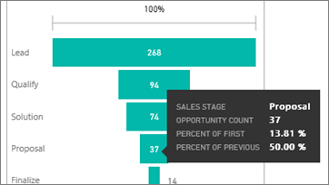
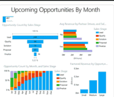

<properties
   pageTitle="Tutorial: Gráficos en Power BI de embudo"
   description="Tutorial: Gráficos en Power BI de embudo"
   services="powerbi"
   documentationCenter=""
   authors="mihart"
   manager="mblythe"
   backup=""
   editor=""
   tags=""
   featuredVideoId="maTzOJSRB3g"
   qualityFocus="no"
   qualityDate=""/>

<tags
   ms.service="powerbi"
   ms.devlang="NA"
   ms.topic="article"
   ms.tgt_pltfrm="NA"
   ms.workload="powerbi"
   ms.date="10/07/2016"
   ms.author="mihart"/>
# Tutorial: gráficos en Power BI de embudo

Un gráfico de embudo le ayuda a visualizar un proceso lineal que tiene fases conectados secuenciales. Por ejemplo, un motor de ventas que realiza el seguimiento de los clientes por etapas: provocar \> provocar completo \> potenciales \> contrato \> Cerrar.  En resumen, la forma de embudo transmite el estado del proceso que se está realizando el seguimiento.

Cada fase de embudo representa un porcentaje del total. Por lo tanto, en la mayoría de los casos, un gráfico de embudo tiene la forma de un embudo--con la primera fase de ser el más grande y cada fase posterior menor que su predecesor.  Un embudo en forma de pera también es útil, puede identificar un problema en el proceso.  Pero por lo general, la primera fase, la fase de "consumo", es el mayor.

## Cuándo utilizar un gráfico de embudo

Los gráficos de embudo son una excelente opción:

-   Cuando los datos es secuenciales y se mueven a través de al menos 4 fases.

-   Cuando el número de "elementos" en la primera fase se espera que sea mayor que el número en la fase final.

-   para calcular el potencial (ingresos, ventas, ofertas/etc.) por etapas.

-   para calcular y realizar un seguimiento de las tasas de conversión y retención.

-   para revelar cuellos de botella en un proceso lineal.

-   para realizar el seguimiento de un flujo de trabajo de carro de la compra.

-   para realizar un seguimiento del progreso y el éxito de click-through de las campañas de publicidad y marketing.

## Trabajar con gráficos de embudo
gráficos de embudo:

-   Se pueden anclar de informes y de preguntas y respuestas.

-   Se puede ordenar.

-   Admite múltiplos.

-   Puede ser resaltado y filtrado cruzado por otras visualizaciones en la misma página de informe.

-   Puede utilizarse para resaltar y otras visualizaciones en la misma página de informe de filtro cruzado.

## Crear un gráfico de embudo básica

Vea este vídeo para ver será crear un gráfico de embudo con las ventas y Marketing de ejemplo.

<iframe width="560" height="315" src="https://www.youtube.com/embed/maTzOJSRB3g" frameborder="0" allowfullscreen></iframe>

Crear su propio gráfico de embudo que muestra el número de oportunidades que tenemos en cada una de las fases de nuestras ventas.

Estas instrucciones utilizan el ejemplo de seguimiento de oportunidad. Para continuar, [Descargue el ejemplo](powerbi-sample-downloads.md), inicie sesión en Power BI y seleccione **obtener datos \> ejemplos \> ejemplo de análisis de la oportunidad de \> Conectar**.

1. Iniciar en un [página del informe en blanco ](powerbi-service-add-a-page-to-a-report.md)en [vista de edición](powerbi-service-interact-with-a-report-in-editing-view.md) y seleccione la **SalesStage** \> **fase de ventas** campo.  

    

2. 
            [Convertir el gráfico](powerbi-service-change-the-type-of-visualization-in-a-report.md) a un embudo. Observe que **fase de ventas** está en el **grupo** bien. 

3. Desde el **campos** panel, seleccione **hechos** \> **recuento de oportunidades**.

    

4. Al mantener el mouse sobre una barra muestra una gran cantidad de información.

    -   El nombre de la fase

    -   Número de oportunidades en esta fase

    -   Tasa de conversión general (% de plomo) 

    -   Etapa-a-otra (también conocido como tasa de eliminación) que es el porcentaje de la fase anterior (en este caso, la fase de fase o solución propuesta)

    

5. 
            [Agregue el embudo como un icono de panel](powerbi-service-dashboard-tiles.md). 

6. 
            [Guardar el informe](powerbi-service-save-a-report.md).

## Resaltado y filtrado cruzado

Para obtener información acerca de cómo utilizar el panel de filtros, consulte [Agregar un filtro a un informe](powerbi-service-add-a-filter-to-a-report.md).

Filtros en Resaltar una barra en un embudo entre las otras visualizaciones en la página de informe... y viceversa. Para poder continuar, agregue algunos elementos visuales más a la página del informe que contiene el gráfico de embudo.

1.  En el embudo, seleccione la **propuesta** barra. Esto entre-información destacada de las otras visualizaciones en la página. 

    

    >[AZURE.TIP]  Utilice CTRL para seleccionar varios. 

2.  En el gráfico "Tenerse en cuenta los ingresos por oportunidad", resalte el **grande** barra de filtro entre las otras visualizaciones en la página, incluidos el gráfico de embudo.

3. Para establecer preferencias para elementos visuales resaltan y filtro entre ellos, consulte [Visual interacciones en Power BI](powerbi-service-visual-interactions.md)

## Crear un gráfico de embudo en preguntas y respuestas

Resalte el panel que tiene al menos una visualización anclada desde el conjunto de datos de "Seguimiento de oportunidad".  Cuando escriba una pregunta en preguntas y respuestas, Power BI busca respuestas en todos los conjuntos de datos que están asociadas a (ha mosaico anclado a) el panel seleccionado. Para obtener más información, consulte [Power BI: conceptos básicos de](powerbi-service-basic-concepts.md).

1.  Resalte un panel que tiene al menos un mosaico anclado del conjunto de datos de seguimiento de oportunidad.

2.   Comience a escribir su pregunta en las preguntas y un cuadro de pregunta.

    

    No olvide agregar "como embudo" para que sepa de Power BI visualización que prefiere el tipo.

## Consulte también

[Agregar una visualización a un informe](powerbi-custom-visuals-add-to-report.md)

[Tipos de visualización en Power BI](powerbi-service-visualization-types-for-reports-and-q-and-a.md)

[Ancla una visualización a un panel](powerbi-service-pin-a-tile-to-a-dashboard-from-a-report.md)

[Power BI: conceptos básicos](powerbi-service-basic-concepts.md)

¿Preguntas más frecuentes? [Pruebe la Comunidad de Power BI](http://community.powerbi.com/)
