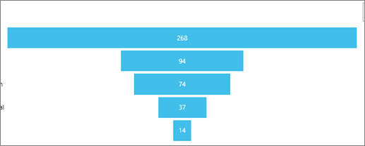
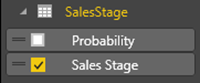
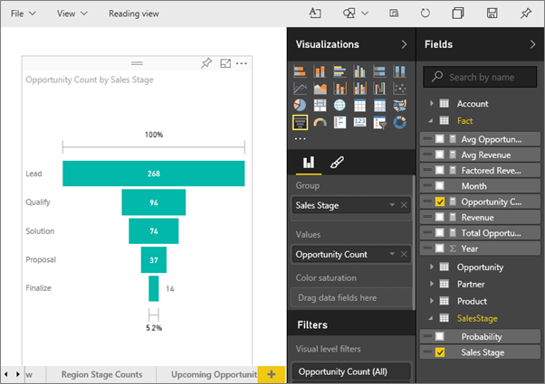

<properties
   pageTitle="Tutorial: Funnel charts in Power BI"
   description="Tutorial: Funnel charts in Power BI"
   services="powerbi"
   documentationCenter=""
   authors="mihart"
   manager="mblythe"
   backup=""
   editor=""
   tags=""
   featuredVideoId="maTzOJSRB3g"
   qualityFocus="no"
   qualityDate=""/>

<tags
   ms.service="powerbi"
   ms.devlang="NA"
   ms.topic="article"
   ms.tgt_pltfrm="NA"
   ms.workload="powerbi"
   ms.date="10/07/2016"
   ms.author="mihart"/>
# Tutorial: funnel charts in Power BI

A funnel chart helps you visualize a linear process that has sequential connected stages. For example, a sales funnel that tracks customers through stages: Lead <ph id="ph1">\&gt;</ph> Qualified Lead <ph id="ph2">\&gt;</ph> Prospect <ph id="ph3">\&gt;</ph> Contract <ph id="ph4">\&gt;</ph> Close.  At a glance, the shape of the funnel conveys the health of the process you're tracking.

Each funnel stage represents a percentage of the total. So, in most cases, a funnel chart is shaped like a funnel -- with the first stage being the largest, and each subsequent stage smaller than its predecessor.  A pear-shaped funnel is also useful -- it can identify a problem in the process.  But typically, the first stage, the "intake" stage, is the largest.

## When to use a funnel chart

Funnel charts are a great choice:

-   when the data is sequential and moves through at least 4 stages.

-   when the number of "items" in the first stage is expected to be greater than the number in the final stage.

-   to calculate potential (revenue/sales/deals/etc.) by stages.

-   to calculate and track conversion and retention rates.

-   to reveal bottlenecks in a linear process.

-   to track a shopping cart workflow.

-   to track the progress and success of click-through advertising/marketing campaigns.

## Working with funnel charts
funnel charts:

-   Can be pinned from reports and from Q&amp;A.

-   Can be sorted.

-   Support multiples.

-   Can be highlighted and cross-filtered by other visualizations on the same report page.

-   Can be used to highlight and cross-filter other visualizations on the same report page.

## Create a basic funnel chart

Watch this video to see Will create a Funnel chart using the Sales and Marketing sample.

<iframe width="560" height="315" src="https://www.youtube.com/embed/maTzOJSRB3g" frameborder="0" allowfullscreen></iframe>

Now create your own funnel chart that shows the number of opportunities we have in each of our sales stages.

These instructions use the Opportunity Tracking Sample. To follow along, <bpt id="p1">[</bpt>download the sample<ept id="p1">](powerbi-sample-downloads.md)</ept>, sign in to Power BI and select <bpt id="p2">**</bpt>Get Data <ph id="ph1">\&gt;</ph> Samples <ph id="ph2">\&gt;</ph> Opportunity Analysis Sample <ph id="ph3">\&gt;</ph> Connect<ept id="p2">**</ept>.

1. Start on a <bpt id="p1">[</bpt>blank report page <ept id="p1">](powerbi-service-add-a-page-to-a-report.md)</ept>in <bpt id="p2">[</bpt>Editing View<ept id="p2">](powerbi-service-interact-with-a-report-in-editing-view.md)</ept> and select the <bpt id="p3">**</bpt>SalesStage<ept id="p3">**</ept> <ph id="ph1">\&gt;</ph> <bpt id="p4">**</bpt>Sales Stage<ept id="p4">**</ept> field.  

    

2. <bpt id="p1">[</bpt>Convert the chart<ept id="p1">](powerbi-service-change-the-type-of-visualization-in-a-report.md)</ept> to a funnel. Notice that <bpt id="p1">**</bpt>Sales Stage<ept id="p1">**</ept> is in the <bpt id="p2">**</bpt>Group<ept id="p2">**</ept> well. 

3. From the <bpt id="p1">**</bpt>Fields<ept id="p1">**</ept> pane, select <bpt id="p2">**</bpt>Fact<ept id="p2">**</ept> <ph id="ph1">\&gt;</ph> <bpt id="p3">**</bpt>Opportunity Count<ept id="p3">**</ept>.

    

4. Hovering over a bar displays a wealth of information.

    -   The name of the stage

    -   Number of opportunities currently in this stage

    -   Overall conversion rate (% of Lead) 

    -   Stage-to-stage (aka Drop Rate) which is the % of the previous stage (in this case, Proposal Stage/Solution Stage)

    

5. <bpt id="p1">[</bpt>Add the Funnel as a dashboard tile<ept id="p1">](powerbi-service-dashboard-tiles.md)</ept>. 

6. <bpt id="p1">[</bpt>Save the report<ept id="p1">](powerbi-service-save-a-report.md)</ept>.

## Highlighting and cross-filtering

For information about using the Filters pane, see <bpt id="p1">[</bpt>Add a filter to a report<ept id="p1">](powerbi-service-add-a-filter-to-a-report.md)</ept>.

Highlighting a bar in a funnel cross-filters the other visualizations on the report page... and vice versa. To follow along, add a few more visuals to the report page that contains the funnel chart.

1.  On the funnel, select the <bpt id="p1">**</bpt>Proposal<ept id="p1">**</ept> bar. This cross-highlights the other visualizations on the page. 

    

    >[AZURE.TIP]  Use CTRL to multi-select. 

2.  In the "Factored Revenue by Opportunity" chart, highlight the <bpt id="p1">**</bpt>Large<ept id="p1">**</ept> bar to cross-filter the other visualizations on the page, including the funnel chart.

3. To set preferences for how visuals cross-highlight and cross-filter each other, see <bpt id="p1">[</bpt>Visual interactions in Power BI<ept id="p1">](powerbi-service-visual-interactions.md)</ept>

## Create a funnel chart in Q&amp;A

Highlight the dashboard that has at least one visualization pinned from the "Opportunity Tracking" dataset.  When you type a question in Q&amp;A, Power BI searches for answers in all the datasets that are associated with (have tiles pinned to) the selected dashboard. For more information see, <bpt id="p1">[</bpt>Power BI - basic concepts<ept id="p1">](powerbi-service-basic-concepts.md)</ept>.

1.  Highlight a dashboard that has at least one tile pinned from the Opportunity Tracking dataset.

2.   Begin typing your question in the Q&amp;A question box.

    

    Be sure to add "as funnel" so Power BI knows which visualization type you'd prefer.

## Consulte también

[Add a visualization to a report](powerbi-custom-visuals-add-to-report.md)

[Visualization types in Power BI](powerbi-service-visualization-types-for-reports-and-q-and-a.md)

[Pin a visualization to a dashboard](powerbi-service-pin-a-tile-to-a-dashboard-from-a-report.md)

[Power BI - Basic Concepts](powerbi-service-basic-concepts.md)

More questions? [Try the Power BI Community](http://community.powerbi.com/)
