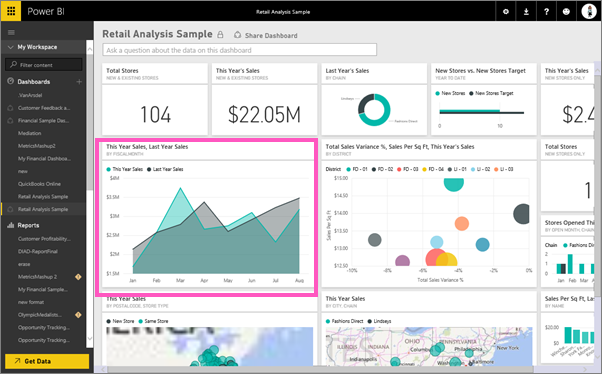
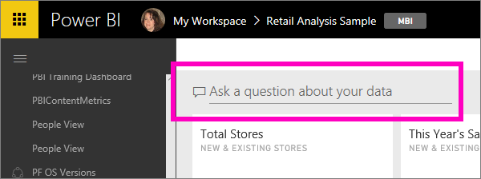

<properties
   pageTitle="Tutorial: Get started with Power BI Q&amp;A"
   description="Tutorial: get started with Power BI Q&amp;A with the Retail Analysis sample"
   services="powerbi"
   documentationCenter=""
   authors="mihart"
   manager="mblythe"
   backup=""
   editor=""
   tags=""
   qualityFocus="monitoring"
   qualityDate=""/>

<tags
   ms.service="powerbi"
   ms.devlang="NA"
   ms.topic="article"
   ms.tgt_pltfrm="NA"
   ms.workload="powerbi"
   ms.date="10/05/2016"
   ms.author="mihart"/>
# Tutorial: use Power BI Q&amp;A with the Retail Analysis sample

Sometimes the fastest way to get an answer from your data is to ask a question using natural language.  In this tutorial we'll look at 2 different ways of creating the same visualization: building it in a report and asking a question with Q&amp;A.  

## Method 1: using the report editor
1. From your Power BI workspace, select <bpt id="p1">**</bpt>Get Data<ept id="p1">**</ept> <ph id="ph1">\&gt;</ph> <bpt id="p2">**</bpt>Samples<ept id="p2">**</ept> <ph id="ph2">\&gt;</ph> <bpt id="p3">**</bpt>Retail Analysis Sample<ept id="p3">**</ept><ph id="ph3"> &gt; </ph><bpt id="p4">**</bpt>Connect<ept id="p4">**</ept>.

    

2. The dashboard contains an area chart tile for "Last Year Sales and This Year Sales."  Select this tile. 

    -   If this tile was created with Q&amp;A, selecting the tile will open Q&amp;A. 

    -   But this tile was created in a report, so the report opens to the page that contains this visualization.

3. Open the report in Editing View by selecting <bpt id="p1">**</bpt>Edit Report<ept id="p1">**</ept>.

    

4. Select the area chart and review the settings in the <bpt id="p1">**</bpt>Fields<ept id="p1">**</ept> pane.  The report creator built this chart by selecting these 3 values (<bpt id="p1">**</bpt>Time &gt; FiscalMonth<ept id="p1">**</ept>, <bpt id="p2">**</bpt>Sales &gt; This Year Sales<ept id="p2">**</ept>, <bpt id="p3">**</bpt>Sales &gt;Last Year Sales &gt;Value<ept id="p3">**</ept>) and organizing them in the <bpt id="p4">**</bpt>Axis<ept id="p4">**</ept> and <bpt id="p5">**</bpt>Values<ept id="p5">**</ept> wells.

    

## Method 2: using Q&amp;A
How would we go about creating this same line chart using Q&amp;A?
    

1.  Navigate back to your the Retail Analysis Sample dashboard.

2.  Using natural language, type something like this into the question box:

    **what were this year sales and last year sales by month as area chart**

    As you type your question, Q&amp;A picks the best visualization to display your answer; and the visualization changes dynamically as you modify the question. Also, Q&amp;A helps you format your question with suggestions, auto-complete, and spelling corrections.

    When you finish typing your question, the result is the exact same chart that we saw in the report.  But creating it this way was much faster!

    

4. Similar to working with reports, within Q&amp;A you have access to the Visualizations, Filters and Fields panes.  Open these panes to further explore and modify your visual.

3.  To pin the chart to your dashboard, select the pin icon <ph id="ph1"></ph>.

## Consulte también

[What type of questions can I ask Q&amp;A?](powerbi-service-q-and-a.md)

[Q&amp;A in Power BI](powerbi-service-q-and-a.md)

[Make your data work well with Q&amp;A in Power BI](powerbi-service-make-your-data-work-well-with-q-and-a.md)

[preparing a workbook for Q&amp;A](powerbi-service-make-your-data-work-well-with-q-and-a.md)

More questions? [Try the Power BI Community](http://community.powerbi.com/)
