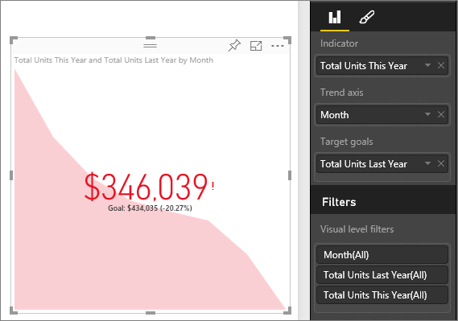

<properties
   pageTitle="KPI visuals"
   description="create KPI in power bi"
   services="powerbi"
   documentationCenter=""
   authors="mihart"
   manager="mblythe"
   backup=""
   editor=""
   tags=""
   featuredVideoId="xmja6EpqaO0"
   qualityFocus="no"
   qualityDate=""/>

<tags
   ms.service="powerbi"
   ms.devlang="NA"
   ms.topic="article"
   ms.tgt_pltfrm="NA"
   ms.workload="powerbi"
   ms.date="08/23/2016"
   ms.author="mihart"/>

# KPIs in Power BI

A Key Performance Indicator (KPI) is a visual cue that communicates the amount of progress made toward a measurable goal. For more information about KPIs, see <bpt id="p1">[</bpt>Microsoft Developer Network<ept id="p1">](https://msdn.microsoft.com/library/hh272050)</ept>.

##  When to use a KPI
KPIs are a great choice:

-   to measure progress (what am I ahead or behind on?)

-   to measure distance to a goal (how far ahead or behind am I?)   

##  KPI visual requirements
A Key Performance Indicator (KPI) is based on a specific measure and is designed to help you evaluate the current value and status of a metric against a defined target. Therefore, a KPI visual requires a <bpt id="p1">*</bpt>base<ept id="p1">*</ept> measure that evaluates to a value and a <bpt id="p2">*</bpt>target<ept id="p2">*</ept> measure or value, and a threshold or goal.

>[AZURE.NOTE] Currently, a KPI dataset needs to contain goal values for a KPI. This can be done by adding an excel sheet with goals to your data model or PBIX file.

##  How to create a KPI  

To follow along, sign in to Power BI and select <bpt id="p1">**</bpt>Get Data &gt; Samples &gt; Retail Analysis Sample<ept id="p1">**</ept>. We'll create a KPI that measures the progress we've made toward a sales goal.

Or watch Will show you how to create single metric visuals: gauges, cards, and KPIs.
<iframe width="560" height="315" src="https://www.youtube.com/embed/xmja6EpqaO0?list=PL1N57mwBHtN0JFoKSR0n-tBkUJHeMP2cP" frameborder="0" allowfullscreen></iframe>

1.  Select <bpt id="p1">**</bpt>Sales &gt; Total Units This Year<ept id="p1">**</ept>.  This will be the indicator.

2.  Add <bpt id="p1">**</bpt>Time &gt; Month<ept id="p1">**</ept>.  This will be represent the trend.

2. Convert the visual to a KPI by selecting the KPI icon from the Visualization pane.

    

3. Add a goal. Add last years sales as the goal. Drag <bpt id="p1">**</bpt>Total Units Last Year<ept id="p1">**</ept> to the <bpt id="p2">**</bpt>Target goals<ept id="p2">**</ept> field.

    

4.  Optionally, format the KPI by selecting the paintbrush icon to open the Formatting pane.

    -   <bpt id="p1">**</bpt>Indicator<ept id="p1">**</ept> - controls the indicator’s display units and decimal places.

    -   <bpt id="p1">**</bpt>Trend axis<ept id="p1">**</ept> - when set to <bpt id="p2">**</bpt>On<ept id="p2">**</ept>, the trend axis is displayed as the background of the KPI visual.  

    -   <bpt id="p1">**</bpt>Goals<ept id="p1">**</ept> - when set to <bpt id="p2">**</bpt>On<ept id="p2">**</ept>, the visual displays the goal and the distance from the goal as a percentage.

    -   <bpt id="p1">**</bpt>Status<ept id="p1">**</ept> - some KPIs are considered <bpt id="p2">*</bpt>better<ept id="p2">*</ept> for higher values and some are considered <bpt id="p3">*</bpt>better<ept id="p3">*</ept> for lower values. For example, earnings VS. wait time. Typically a higher value of earnings is better versus a higher value of wait time – that is usually considered as worse. This toggle allows the selection of a KPI behavior. The status selection defaults to <bpt id="p1">**</bpt>high is better<ept id="p1">**</ept>.

6.  When you have the KPI as you want it, <bpt id="p1">[</bpt>pin it to a dashboard<ept id="p1">](powerbi-service-pin-a-tile-to-a-dashboard-from-a-report.md)</ept>.

KPIs are also available on your mobile devices – keeping you always connected to your businesses heartbeat

##  Consulte también

[Reports in Power BI](powerbi-service-reports.md)

[Visualizations in Power BI reports](powerbi-service-visualizations-for-reports.md)

[Power BI - Basic Concepts](powerbi-service-basic-concepts.md)

More questions? [Try the Power BI Community](http://community.powerbi.com/)
