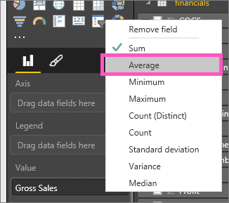
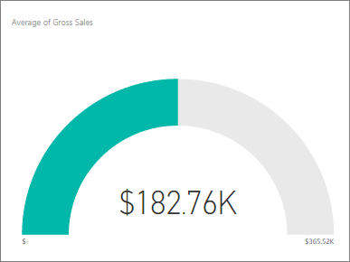

<properties
   pageTitle="Tutorial: Gráficos de medidor Radial en Power BI"
   description="Tutorial: Gráficos de medidor Radial en Power BI"
   services="powerbi"
   documentationCenter=""
   authors="mihart"
   manager="mblythe"
   backup=""
   editor=""
   tags=""
   featuredVideoId="xmja6Epqa"
   qualityFocus="no"
   qualityDate=""/>

<tags
   ms.service="powerbi"
   ms.devlang="NA"
   ms.topic="article"
   ms.tgt_pltfrm="NA"
   ms.workload="powerbi"
   ms.date="08/22/2016"
   ms.author="mihart"/>

# Tutorial: gráficos de medidor radial en Power BI

Un gráfico de medidor radial tiene un arco circular y muestra un valor único que se mide el progreso hacia un objetivo o KPI.  El objetivo o el valor de destino, se representa mediante la línea (aguja). Progreso hacia ese objetivo se representa mediante el sombreado.  Y el valor que representa ese proceso se muestra en negrita dentro del arco. Todos los valores posibles están repartidos por igual a lo largo del arco, del mínimo (extremo izquierdo valor) al máximo (valor más a la derecha).

En el ejemplo siguiente, estamos un distribuidor de automóvil, seguimiento promedio de ventas de nuestro equipo de ventas por mes. Nuestro objetivo es 140 y representado por la aguja negra.  Las ventas promedio posibles mínimas es 0 y hemos configurado el máximo 200.  El sombreado azul muestra que nos estamos actualmente el promedio de aproximadamente 120 ventas este mes. Por suerte, todavía tenemos otra semana a lograr nuestro objetivo.

## Cuándo usar un medidor radial

Los medidores radiales son una excelente elección para:

-   Mostrar el progreso hacia un objetivo.

-   Representa una medida de percentil, como un KPI.

-   Mostrar el estado de una sola medida.

-   Muestra la información que puede examinar rápidamente y comprender.

## Crear un medidor radial básico

Estas instrucciones utilizan el ejemplo financieros. Para continuar, [Descargue el ejemplo](http://go.microsoft.com/fwlink/?LinkID=521962) en el equipo, inicie sesión Power BI y seleccione **obtener datos \> archivos \>  archivo Local > Abrir**. 

O inspección le mostrará cómo crear elementos visuales de métrica únicos: medidores, tarjetas y KPI.
<iframe width="560" height="315" src="https://www.youtube.com/embed/xmja6EpqaO0?list=PL1N57mwBHtN0JFoKSR0n-tBkUJHeMP2cP" frameborder="0" allowfullscreen></iframe>

### Paso 1: Abrir el archivo de Excel de ejemplo financieros.

1.  Abra el archivo en Power BI seleccionando **obtener datos \> archivos** y vaya a la ubicación donde guardó el archivo. Seleccione **importación**. El ejemplo financieros se agrega al área de trabajo como un conjunto de datos.

2.  Seleccione **ejemplo financieros** para abrirlo en modo de exploración.

### Paso 2: Crear un medidor para realizar un seguimiento de ventas brutas

1.  En la **campos** panel, seleccione **ventas brutas**.

    

2.  Cambiar la agregación a **Media**.

    

3.  Seleccione el icono del medidor  para convertir el gráfico de columnas a un medidor.

  De forma predeterminada, Power BI crea un gráfico de medidor, donde el valor actual (en este caso, el promedio de ventas brutas) se supone que en el punto central en el medidor. Dado que el promedio de ventas brutas es $182. 76K, el valor inicial (mínimo) se establece en 0 y se establece el valor final (máximo) para duplicar el valor actual.

  

### Paso 3: Establecer un valor de destino

1. Arrastre **COGS** a la **valor de destino** bien.

2.  Cambiar la agregación a **Media**.
  Power BI agrega una aguja para representar el valor de destino de **$145. 48K**. Tenga en cuenta que nos hemos superado nuestro objetivo.

    

    >[AZURE.NOTE] Puede escribir manualmente un valor de destino.  Consulte "Uso de opciones de formato al establecer manualmente los valores mínimo, máximo y destino" a continuación.

### Paso 4: Establecer un valor máximo

En el paso 2, Power BI usa el campo de valor para establecer automáticamente (inicio) de mínimo y máximo (final).  Pero ¿qué ocurre si desea configurar su propio valor máximo?  ¿Supongamos que en lugar de duplicar el valor actual como el valor máximo posible, desea establecer para el número de ventas brutas más alto del conjunto de datos? 

2.  Arrastre **ventas brutas** desde el **campos** lista para la **valor máximo** bien.

2.  Cambiar la agregación para **máximo**.

    

    Se vuelve a dibujar el medidor con un nuevo valor final, ventas 1.21 millones en bruto.

### Paso 5: Guardar el informe

6.  
            [Guardar el informe](powerbi-service-save-a-report.md).

7. 
            [Agregar el gráfico de medidor como un icono de panel](powerbi-service-dashboard-tiles.md). 

## Use las opciones de formato para establecer manualmente los valores mínimo, máximo y destino

1. Quitar **máximo de ventas brutas** desde el **valor máximo** bien.

2.  Abra el panel de formato seleccionando el icono de pincel.

    

2. Expanda el **eje medidor** y especifique los valores de **Min** y **Max**.

    

3. Quitar el valor de destino actual quitando la marca de verificación junto a **COGS**.

    

4. Cuando el **destino** campo aparece bajo **eje medidor**, escriba un valor.

    

5. Opcionalmente, continúe formato gráfico medidor.

## Consulte también

[Informes de Power BI](powerbi-service-reports.md)

[Tipos de visualización en Power BI](powerbi-service-visualization-types-for-reports-and-q-and-a.md)

[Agregar una visualización a un informe](https://powerbi.uservoice.com/knowledgebase/articles/441777)

[Ancla una visualización a un panel](powerbi-service-pin-a-tile-to-a-dashboard-from-a-report.md)

[ Power BI: conceptos básicos](powerbi-service-basic-concepts.md)

¿Preguntas más frecuentes? [Pruebe la Comunidad de Power BI](http://community.powerbi.com/)
