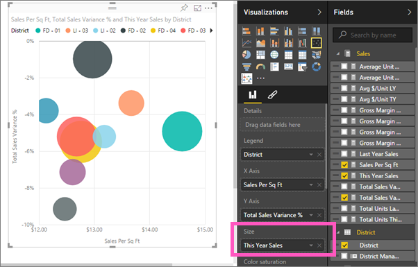
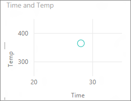

<properties
   pageTitle="Tutorial: Dispersión gráficos en Power BI"
   description="Tutorial: Dispersión gráficos en Power BI"
   services="powerbi"
   documentationCenter=""
   authors="mihart"
   manager="mblythe"
   backup=""
   editor=""
   tags=""
   featuredVideoId="PVcfPoVE3Ys"
   qualityFocus="no"
   qualityDate=""/>

<tags
   ms.service="powerbi"
   ms.devlang="NA"
   ms.topic="article"
   ms.tgt_pltfrm="NA"
   ms.workload="powerbi"
   ms.date="08/29/2016"
   ms.author="mihart"/>

# Tutorial: dispersión diagramas y gráficos de burbujas en Power BI  

Un gráfico de dispersión siempre tiene dos ejes de valores para mostrar un conjunto de datos numéricos en un eje horizontal y otro conjunto de valores numéricos a lo largo de un eje vertical. Valor numérico de y, la combinación de estos valores en datos puntos y el gráfico muestra los puntos en la intersección de una x. Estos puntos de datos pueden estar distribuidos uniformemente o de forma desigual entre el eje horizontal, dependiendo de los datos.

Un gráfico de burbujas reemplaza los puntos de datos de burbujas, con la burbuja *tamaño* que representa una dimensión adicional de los datos.

## Cuándo utilizar un gráfico de dispersión o gráfico de burbujas

### Los gráficos de dispersión son una excelente opción:

-  para mostrar las relaciones entre 2 (Dispersión) o 3 (burbuja) **numérico** valores.

-  Para trazar dos grupos de números como una serie de coordenadas xy.

-  en lugar de un gráfico de líneas si desea cambiar la escala del eje horizontal    

- para convertir el eje horizontal en una escala logarítmica.

- para mostrar los datos de hoja de cálculo que incluyen pares o conjuntos de valores agrupan. En un gráfico de dispersión, puede ajustar las escalas independientes de los ejes para obtener más información acerca de los valores agrupados.

- para mostrar patrones en grandes conjuntos de datos, por ejemplo, mostrando los valores atípicos, clústeres y tendencias lineales o no lineal.

- para comparar grandes números de puntos de datos sin tener en cuenta en el tiempo de los datos más que tener en cuenta gráfico, mejor las comparaciones que se pueden realizar.

### Los gráficos de burbujas son una excelente opción:

- Si los datos tienen 3 series de datos que contienen un conjunto de valores.

- para presentar los datos financieros.  Los tamaños de burbuja diferentes son útiles para resaltar visualmente los valores específicos.

- Para utilizar con cuadrantes.

## Crear un gráfico de dispersión

<iframe width="560" height="315" src="https://www.youtube.com/embed/PVcfPoVE3Ys?list=PL1N57mwBHtN0JFoKSR0n-tBkUJHeMP2cP" frameborder="0" allowfullscreen></iframe>

1.  Abra el ejemplo de análisis de venta directa en [vista de edición](powerbi-service-interact-with-a-report-in-editing-view.md) y [Agregar una nueva página de informe](powerbi-service-add-a-page-to-a-report.md).

2. En el panel de campos, seleccione **ventas** > **ventas por Sq Ft** y **ventas** > **% del Total de ventas varianza**.

3. En el panel de campos, seleccione **distrito > distrito**.

    

4. Convertir a un gráfico de dispersión. En el panel de visualización, seleccione el icono de gráfico de dispersión.
 .

5. Arrastre **distrito** desde **detalles** a **leyenda**.

    

Ahora tenemos un gráfico de dispersión que traza el Total de ventas de varianza % a lo largo del eje Y y gráficos de ventas por pies cuadrados en el eje X.  Colores representan distritos de punto de datos.  Ahora vamos a agregar una tercera dimensión.

## Crear un gráfico de burbujas

1.  En el panel de campos, arrastre **ventas** > **ventas de este año** > **valor** a la **tamaño** área. 

    

2. Mantenga el mouse sobre una burbuja.  El tamaño de la burbuja refleja el valor de **ventas de este año**.

    

3. Opcionalmente, [dar formato a los colores de visualización, etiquetas, títulos, fondo y](powerbi-service-getting-started-with-color-formatting-and-axis-properties.md).

## Solucionar problemas

### **El gráfico de dispersión tiene sólo un punto de datos**  

¿El gráfico de dispersión tiene sólo un punto de datos que agrega todos los valores de los ejes X e Y?  ¿O quizás agrega todos los valores a lo largo de una sola línea horizontal o vertical?

Agregar un campo a la **detalles** área para indicar cómo se agruparán los valores de Power BI. El campo debe ser único para cada punto de trazado.  

* Como el número de fila simple o un campo de Id.:

    

* O bien, si no tiene en los datos, puede crear un campo que concatena los valores X e Y en un valor exclusivo por cada punto:   

   Utilice el Editor de consultas para agregar una columna de índice para el conjunto de datos.  A continuación, agregar esta columna a la **detalles** área de su visualización.

  Para obtener más información, consulte [agregados en los informes](powerbi-service-aggregates.md).

## Consulte también  
 [Agregar una visualización a un informe](powerbi-service-add-visualizations-to-a-report-i.md)  

 [Tipos de visualización en Power BI](powerbi-service-visualization-types-for-reports-and-q-and-a.md)

 [Power BI: conceptos básicos](powerbi-service-basic-concepts.md)  

[¡Probar--es gratuito!](https://powerbi.com/)  

¿Preguntas más frecuentes? [Pruebe la Comunidad de Power BI](http://community.powerbi.com/)
