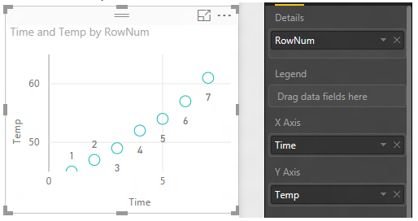

<properties
   pageTitle="Tutorial: Scatter Charts in Power BI"
   description="Tutorial: Scatter Charts in Power BI"
   services="powerbi"
   documentationCenter=""
   authors="mihart"
   manager="mblythe"
   backup=""
   editor=""
   tags=""
   featuredVideoId="PVcfPoVE3Ys"
   qualityFocus="no"
   qualityDate=""/>

<tags
   ms.service="powerbi"
   ms.devlang="NA"
   ms.topic="article"
   ms.tgt_pltfrm="NA"
   ms.workload="powerbi"
   ms.date="08/29/2016"
   ms.author="mihart"/>

# Tutorial: scatter charts and bubble charts in Power BI  

A scatter chart always has two value axes to show one set of numerical data along a horizontal axis and another set of numerical values along a vertical axis. The chart displays points at the intersection of an x and y numerical value, combining these values into single data points. These data points may be distributed evenly or unevenly across the horizontal axis, depending on the data.

A bubble chart replaces the data points with bubbles, with the bubble <bpt id="p1">*</bpt>size<ept id="p1">*</ept> representing an additional dimension of the data.

## When to use a scatter chart or bubble chart

### Scatter charts are a great choice:

-  to show relationships between 2 (scatter) or 3 (bubble) <bpt id="p1">**</bpt>numerical<ept id="p1">**</ept> values.

-  To plot two groups of numbers as one series of xy coordinates.

-  instead of a line chart when you want to change the scale of the horizontal axis    

- to turn the horizontal axis into a logarithmic scale.

- to display worksheet data that includes pairs or grouped sets of values. In a scatter chart, you can adjust the independent scales of the axes to reveal more information about the grouped values.

- to show patterns in large sets of data, for example by showing linear or non-linear trends, clusters, and outliers.

- to compare large numbers of data points without regard to time    The more data that you include in a scatter chart, the better the comparisons that you can make.

### Bubble charts are a great choice:

- if your data has 3 data series that each contain a set of values.

- to present financial data.  Different bubble sizes are useful to visually emphasize specific values.

- to use with quadrants.

## Create a scatter chart

<iframe width="560" height="315" src="https://www.youtube.com/embed/PVcfPoVE3Ys?list=PL1N57mwBHtN0JFoKSR0n-tBkUJHeMP2cP" frameborder="0" allowfullscreen></iframe>

1.  Open the Retail Analysis Sample in <bpt id="p1">[</bpt>Editing View<ept id="p1">](powerbi-service-interact-with-a-report-in-editing-view.md)</ept> and <bpt id="p2">[</bpt>add a new report page<ept id="p2">](powerbi-service-add-a-page-to-a-report.md)</ept>.

2. From the Fields pane, select <bpt id="p1">**</bpt>Sales<ept id="p1">**</ept><ph id="ph1"> &gt; </ph><bpt id="p2">**</bpt>Sales Per Sq Ft<ept id="p2">**</ept> and <bpt id="p3">**</bpt>Sales<ept id="p3">**</ept><ph id="ph2"> &gt; </ph><bpt id="p4">**</bpt>Total Sales Variance %<ept id="p4">**</ept>.

3. From the Fields pane, select <bpt id="p1">**</bpt>District &gt; District<ept id="p1">**</ept>.

    

4. Convert to a scatter chart. In the Visualization pane, select the Scatter chart icon.
 .

5. Drag <bpt id="p1">**</bpt>District<ept id="p1">**</ept> from <bpt id="p2">**</bpt>Details<ept id="p2">**</ept> to <bpt id="p3">**</bpt>Legend<ept id="p3">**</ept>.

    

We now have a scatter chart that plots Total Sales Variance % along the Y axis, and plots Sales Per Square Feet along the X axis.  The data point colors represent districts.  Now let's add a third dimension.

## Create a bubble chart

1.  From the Fields pane, drag <bpt id="p1">**</bpt>Sales<ept id="p1">**</ept><ph id="ph1"> &gt; </ph><bpt id="p2">**</bpt>This Year Sales<ept id="p2">**</ept><ph id="ph2"> &gt; </ph><bpt id="p3">**</bpt>Value<ept id="p3">**</ept> to the <bpt id="p4">**</bpt>Size<ept id="p4">**</ept> area. 

    

2. Hover over a bubble.  The size of the bubble reflects the value of <bpt id="p1">**</bpt>This Year Sales<ept id="p1">**</ept>.

    

3. Optionally, <bpt id="p1">[</bpt>format the visualization colors, labels, titles, background, and more<ept id="p1">](powerbi-service-getting-started-with-color-formatting-and-axis-properties.md)</ept>.

## Solucionar problemas

### **Your scatter chart has only one data point**  

Does your scatter chart have only one data point that aggregates all the values on the X and Y axes?  Or maybe it aggregates all the values along a single horizontal or vertical line?

Add a field to the <bpt id="p1">**</bpt>Details<ept id="p1">**</ept> area to tell Power BI how to group the values. The field must be unique for each point you want to plot.  

* Like a simple row number or ID field:

    

* Or if you don’t have that in your data, you can create a field that concatenates your X and Y values together into something unique per point: <ph id="ph1">  </ph>

   Use the Query Editor to add an Index Column to your dataset.  Then add this column to the <bpt id="p1">**</bpt>Details<ept id="p1">**</ept> area of your visualization.

  For more information, see <bpt id="p1">[</bpt>Aggregates in reports<ept id="p1">](powerbi-service-aggregates.md)</ept>.

## Consulte también  
 [Add a visualization to a report](powerbi-service-add-visualizations-to-a-report-i.md)  

 [Visualization types in Power BI](powerbi-service-visualization-types-for-reports-and-q-and-a.md)

 [Power BI - Basic Concepts](powerbi-service-basic-concepts.md)  

[Try it out -- it's free!](https://powerbi.com/)  

More questions? [Try the Power BI Community](http://community.powerbi.com/)
