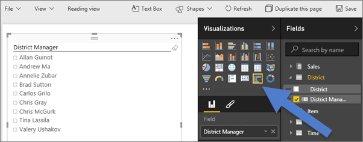
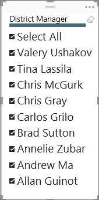

<properties
   pageTitle="Tutorial: Segmentaciones de datos en Power BI"
   description="Tutorial: Segmentaciones de datos en Power BI"
   services="powerbi"
   documentationCenter=""
   authors="mihart"
   manager="mblythe"
   backup=""
   editor=""
   tags=""
   featuredVideoId="7rrvpa6KUto"
   qualityFocus="monitoring"
   qualityDate=""/>

<tags
   ms.service="powerbi"
   ms.devlang="NA"
   ms.topic="article"
   ms.tgt_pltfrm="NA"
   ms.workload="powerbi"
   ms.date="10/08/2016"
   ms.author="mihart"/>

# Tutorial: segmentaciones de datos en Power BI  

El Vicepresidente de ventas desea buscar en un número de métricas para toda la división y el Administrador de cada distrito individuales. También podría crear una página de informe independiente para cada administrador o podría utilizar una segmentación de datos. Una segmentación de datos limita la parte del conjunto de datos que se muestra en las otras visualizaciones en la página.  Las segmentaciones de datos son una forma alternativa de filtrado.

    

## Cuándo usar una segmentación de datos  
Las segmentaciones de datos son una excelente opción en las siguientes situaciones.

-   Para mostrar filtros importantes o utilizadas en el lienzo de informe para facilitar el acceso.

-   Para hacerlo más fácil de ver el estado actual de filtrado sin tener que abrir una lista desplegable para buscar los detalles del filtrado.

- Si desea ocultar columnas no necesita pero aún es posible usarlas para filtrar - Esto hace más estrechas y más limpia tablas.

- Para crear más centrado informes - puesto que segmentaciones de datos son objetos que se coloca junto a la parte interesante del informe que desea que los usuarios centrarse en flotantes.

## Crear una segmentación de datos

<iframe width="560" height="315" src="https://www.youtube.com/embed/7rrvpa6KUto" frameborder="0" allowfullscreen></iframe>

1.  Abra la [ejemplo de análisis de venta](powerbi-sample-retail-analysis-take-a-tour) en [vista de edición](powerbi-service-interact-with-a-report-in-editing-view.md) y [Agregar una nueva página de informe](powerbi-service-add-a-page-to-a-report.md).

2. En el panel de campos, seleccione **distrito > District Manager**. 

    

3.  Convertir la visualización en una segmentación de datos. En el panel de visualizaciones, seleccione el icono de segmentación de datos.

    

## Dar formato a la segmentación de datos

1. Con la segmentación de datos seleccionado, en el panel de visualizaciones, seleccione el icono de rodillos de pintura  para mostrar las opciones de formato.

2. Seleccione **General > color del contorno** y elija azul oscuro y cambie el **peso** a **6**.

    

3. Bajo **controles de selección de**, de forma predeterminada, **Seleccionar todo** es **desactivar** y **Seleccione solo** es **en**. Esto significa que tengo que usar la tecla CTRL para seleccionar más de un nombre a la vez. Activar **Seleccionar todo** a **en** y **único seleccione** a **desactivar**.

    

  - Observe que la segmentación de datos tiene ahora un **Seleccionar todo** opción en la parte superior de la lista. Alternar **Seleccionar todo** para seleccionar todos los nombres o seleccione ninguno de los nombres.

  - Y ahora puede seleccionar más de un nombre sin tener que utilizar la tecla CTRL.

4. Bajo **elementos**, aumentar el tamaño del texto a 14pt.  Queremos estar seguro de que nuestros colegas Observe esta segmentación de datos.

5. Por último, establezca **color de fuente** a una color rojo oscura.  Esto distinguirá los nombres seleccionados de los nombres no seleccionados en la segmentación de datos.

    

6. Diviértase explorar las otras opciones disponibles para las segmentaciones de datos.

## Usar la segmentación de datos en un informe

1. Agregar algunas visualizaciones adicionales a la página del informe o abrir el [informe de ejemplo de análisis de venta directa](powerbi-sample-retail-analysis-take-a-tour.md) y seleccione la **ventas mensuales de distrito** ficha.

    

2. Segmentar la página informe de Carlos. Observe cómo las otras visualizaciones se actualizan para reflejar las selecciones.

    

3. Ordenar alfabéticamente por apellido del jefe de la segmentación de datos.  Seleccione el botón de puntos suspensivos (...) en la esquina superior derecha de la segmentación de datos y elija **District Manager**.

    

    

## Controlar el efecto que pueda tener la segmentación de datos en otros elementos visuales en la página

¿Desea que la segmentación de datos para filtrar sólo algunos de los elementos visuales en la página de informe?  Utilice la **interacciones Visual** control para configurar esta opción.

1. Seleccione la segmentación de datos para que esté activo y, en la barra de menús, elija **interacciones Visual**.

    

2. Controles de filtro aparecerán sobre todos los otros elementos visuales en la página. Si un elemento visual que debería filtrar la segmentación de datos, seleccione la **filtro** icono.  Si la segmentación de datos debe tener ningún efecto en el objeto visual, seleccione la **Ninguno** icono.

    

Para obtener más información, consulte [interacciones Visual en un informe de Power BI](documentation/powerbi-service-visual-interactions.md).

##  Limitaciones de las segmentaciones de datos en Power BI
Existen algunas limitaciones para utilizar segmentaciones de datos en Power BI, que son los siguientes:
1.  Las segmentaciones de datos no admiten los campos de entrada.

2.  No se puede usar una segmentación de datos solo en un informe completo. Una segmentación de datos solo afecta a la página actual.

3.  Las segmentaciones de datos no puede fijarse en un panel.

4.  No se admite la obtención de detalles para las segmentaciones de datos.

¿Tiene ideas sobre cómo mejorar Power BI? 
            [Enviar una idea](https://ideas.powerbi.com/forums/265200-power-bi-ideas).

## Consulte también  
 [Agregar una visualización a un informe](powerbi-service-add-visualizations-to-a-report-i.md)  

 [Tipos de visualización en Power BI](powerbi-service-visualization-types-for-reports-and-q-and-a.md)

 [Power BI: conceptos básicos](powerbi-service-basic-concepts.md)  

[¡Probar--es gratuito!](https://powerbi.com/)  

¿Preguntas más frecuentes? [Pruebe la Comunidad de Power BI](http://community.powerbi.com/)
