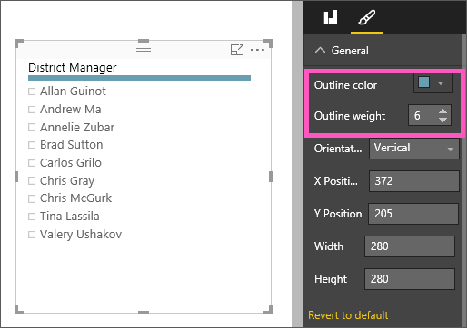
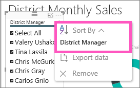
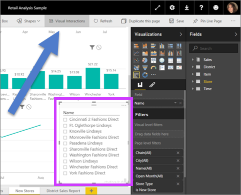

<properties
   pageTitle="Tutorial: Slicers in Power BI"
   description="Tutorial: Slicers in Power BI"
   services="powerbi"
   documentationCenter=""
   authors="mihart"
   manager="mblythe"
   backup=""
   editor=""
   tags=""
   featuredVideoId="7rrvpa6KUto"
   qualityFocus="monitoring"
   qualityDate=""/>

<tags
   ms.service="powerbi"
   ms.devlang="NA"
   ms.topic="article"
   ms.tgt_pltfrm="NA"
   ms.workload="powerbi"
   ms.date="10/08/2016"
   ms.author="mihart"/>

# Tutorial: slicers in Power BI  

Your VP of Sales wants to be able to look at a number of metrics, for the entire division and for each individual District Manager. She could create a separate report page for each manager, or she could use a slicer. A slicer narrows the portion of the dataset shown in the other visualizations on the page.  Slicers are an alternate way of filtering.

    

## When to use a slicer  
Slicers are a great choice in the following situations.

-   To display commonly-used or important filters on the report canvas for easier access.

-   To make it easier to see the current filtered state without having to open a drop-down list to find the filtering details.

- When you want to hide columns you don't need but still be able to use them to filter - this makes for narrower, cleaner tables.

- To create more focused reports - since slicers are floating objects you can put them next to the interesting part of the report you want your users to focus on.

## Create a slicer

<iframe width="560" height="315" src="https://www.youtube.com/embed/7rrvpa6KUto" frameborder="0" allowfullscreen></iframe>

1.  Open the <bpt id="p1">[</bpt>Retail Analysis Sample<ept id="p1">](powerbi-sample-retail-analysis-take-a-tour)</ept> in <bpt id="p2">[</bpt>Editing View<ept id="p2">](powerbi-service-interact-with-a-report-in-editing-view.md)</ept> and <bpt id="p3">[</bpt>add a new report page<ept id="p3">](powerbi-service-add-a-page-to-a-report.md)</ept>.

2. From the Fields pane, select <bpt id="p1">**</bpt>District &gt; District Manager<ept id="p1">**</ept>. 

    

3.  Convert the visualization to a slicer. In the Visualizations pane, select the slicer icon.

    

## Format the slicer

1. With the slicer selected, in the Visualizations pane, select the paint roller icon <ph id="ph1"></ph> to display the Format options.

2. Select <bpt id="p1">**</bpt>General &gt; Outline color<ept id="p1">**</ept> and choose dark blue and change the <bpt id="p2">**</bpt>Weight<ept id="p2">**</ept> to <bpt id="p3">**</bpt>6<ept id="p3">**</ept>.

    

3. Under <bpt id="p1">**</bpt>Selection Controls<ept id="p1">**</ept>, by default, <bpt id="p2">**</bpt>Select All<ept id="p2">**</ept> is <bpt id="p3">**</bpt>Off<ept id="p3">**</ept> and <bpt id="p4">**</bpt>Single Select<ept id="p4">**</ept> is <bpt id="p5">**</bpt>On<ept id="p5">**</ept>. This means that I have to use the CTRL key to select more than one name at a time. Turn <bpt id="p1">**</bpt>Select All<ept id="p1">**</ept> to <bpt id="p2">**</bpt>On<ept id="p2">**</ept> and <bpt id="p3">**</bpt>Single Select<ept id="p3">**</ept> to <bpt id="p4">**</bpt>Off<ept id="p4">**</ept>.

    

  - Notice that the slicer now has a <bpt id="p1">**</bpt>Select All<ept id="p1">**</ept> option at the top of the list. Toggle <bpt id="p1">**</bpt>Select All<ept id="p1">**</ept> to select all of the names or to select none of the names.

  - And you can now select more than one name without having to use the CTRL key.

4. Under <bpt id="p1">**</bpt>Items<ept id="p1">**</ept>, increase the text size to 14pt.  We want to be sure that our colleagues notice this slicer.

5. Lastly, set <bpt id="p1">**</bpt>Font color<ept id="p1">**</ept> to a dark red.  This will distinguish the selected names from the unselected names in our slicer.

    

6. Have fun exploring the other options available for slicers.

## Use the slicer in a report

1. Add some additional visualizations to the report page or open the <bpt id="p1">[</bpt>Retail Analysis sample report<ept id="p1">](powerbi-sample-retail-analysis-take-a-tour.md)</ept> and select the <bpt id="p2">**</bpt>District Monthly Sales<ept id="p2">**</ept> tab.

    

2. Slice the report page for Carlos. Notice how the other visualizations update to reflect these selections.

    

3. Sort the slicer alphabetically by District Manager last name.  Select the ellipses (...) in the top right corner of the slicer and choose <bpt id="p1">**</bpt>District Manager<ept id="p1">**</ept>.

    

    

## Control what effect the slicer has on other visuals on the page

Do you want the slicer to only filter some of the visuals on the report page?  Use the <bpt id="p1">**</bpt>Visual interactions<ept id="p1">**</ept> control to set this up.

1. Select the slicer to make it active and, from the menu bar, choose <bpt id="p1">**</bpt>Visual interactions<ept id="p1">**</ept>.

    

2. Filter controls will appear above all the other visuals on the page. If the slicer should filter a visual, select the <bpt id="p1">**</bpt>Filter<ept id="p1">**</ept> icon.  If the slicer should have no effect on the visual, select the <bpt id="p1">**</bpt>None<ept id="p1">**</ept> icon.

    

For more information, see <bpt id="p1">[</bpt>Visual interactions in a Power BI report<ept id="p1">](documentation/powerbi-service-visual-interactions.md)</ept>.

##  Limitations of slicers in Power BI
There are a few limitations to using slicers in Power BI, which are the following:
1.  Slicers do not support input fields.

2.  A single slicer cannot be used across an entire report. A slicer only impacts the current page.

3.  Slicers cannot be pinned to a dashboard.

4.  Drilldown is not supported for slicers.

Do you have ideas for how to improve Power BI? <bpt id="p1">[</bpt>Submit an idea<ept id="p1">](https://ideas.powerbi.com/forums/265200-power-bi-ideas)</ept>.

## Consulte también  
 [Add a visualization to a report](powerbi-service-add-visualizations-to-a-report-i.md)  

 [Visualization types in Power BI](powerbi-service-visualization-types-for-reports-and-q-and-a.md)

 [Power BI - Basic Concepts](powerbi-service-basic-concepts.md)  

[Try it out -- it's free!](https://powerbi.com/)  

More questions? [Try the Power BI Community](http://community.powerbi.com/)
