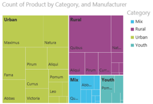
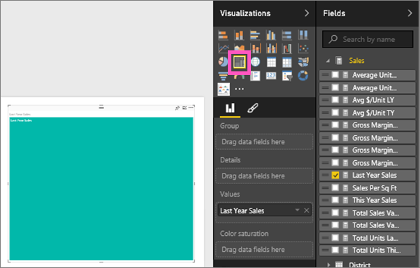

<properties
   pageTitle="Tutorial: Treemaps in Power BI"
   description="Tutorial: Treemaps in Power BI"
   services="powerbi"
   documentationCenter=""
   authors="mihart"
   manager="mblythe"
   backup=""
   editor=""
   tags=""
   featuredVideoId="rnMyiA6Nt6Y"
   qualityFocus="no"
   qualityDate=""/>

<tags
   ms.service="powerbi"
   ms.devlang="NA"
   ms.topic="article"
   ms.tgt_pltfrm="NA"
   ms.workload="powerbi"
   ms.date="10/14/2016"
   ms.author="mihart"/>

# Tutorial: treemaps in Power BI  

Treemaps display hierarchical data as a set of nested rectangles.  Each level of the hierarchy is represented by a colored rectangle (often called a "branch") containing other rectangles ("leaves").  The space inside each rectangle is allocated based on the quantitative value being measured, with the rectangles arranged in size from top left (largest) to bottom right (smallest).

For example, if I'm analyzing my sales, I might have top-level rectangles (branches) for the clothing categories: <bpt id="p1">**</bpt>Urban<ept id="p1">**</ept>, <bpt id="p2">**</bpt>Rural<ept id="p2">**</ept>, <bpt id="p3">**</bpt>Youth<ept id="p3">**</ept>, and <bpt id="p4">**</bpt>Mix<ept id="p4">**</ept>.  My category rectangles would contain smaller rectangles (leaves) for the clothing manufacturers within that category, and these smaller rectangles would be sized and shaded based on the number sold.  In the <bpt id="p1">**</bpt>Urban<ept id="p1">**</ept> branch above, lots of Maximus clothing was sold, less Natura and Fama, and very little Leo.  So, the <bpt id="p1">**</bpt>Urban<ept id="p1">**</ept> branch of my Treemap would have the largest rectangle for Maximus (in the top left corner), slightly-smaller rectangles for Natura and Fama, lots of other rectangles representing all the other clothing sold, and a tiny rectangle for Leo.  And I could compare the number of items sold across the other clothing categories by comparing the size and shading of each leaf node; the larger the rectangle and the darker the shading, the higher the value.

## When to use a treemap  
Treemaps are a great choice:

-   to display large amounts of hierarchical data.

-   when a bar chart can't effectively handle the large number of values.

-   to show the proportions between each part and the whole.

-   to show the pattern of the distribution of the measure across each level of categories in the hierarchy.

-   to show attributes using size and color coding.

-   to spot patterns, outliers, most-important contributors, and exceptions.

## Create a basic treemap  

Want to watch someone else create a treemap first?  Skip to 2:01 in this video to watch Will create a treemap using the Sales and Marketing sample.

<iframe width="560" height="315" src="https://www.youtube.com/embed/rnMyiA6Nt6Y?list=PL1N57mwBHtN0JFoKSR0n-tBkUJHeMP2cP" frameborder="0" allowfullscreen></iframe>

Or, create your own treemap. These instructions use the Retail Analysis Sample. To follow along,  <bpt id="p1">[</bpt>download the sample<ept id="p1">](powerbi-sample-downloads.md)</ept>, sign in to Power BI and select <bpt id="p2">**</bpt>Get Data <ph id="ph1">\&gt;</ph> Excel Workbook <ph id="ph2">\&gt;</ph>  Connect <ph id="ph3">\&gt;</ph> Retail Analysis Sample<ept id="p2">**</ept>.<bpt id="p3">**</bpt>xlsx<ept id="p3">**</ept>.

1.  Start in <bpt id="p1">[</bpt>Editing View<ept id="p1">](powerbi-service-interact-with-a-report-in-editing-view.md)</ept> and select the <bpt id="p2">**</bpt>Sales<ept id="p2">**</ept><ph id="ph1"> &gt; </ph><bpt id="p3">**</bpt>Last Years Sales<ept id="p3">**</ept> measure.   

2.  Convert the chart to a treemap.  

3.  Drag <bpt id="p1">**</bpt>Item<ept id="p1">**</ept><ph id="ph1"> &gt; </ph><bpt id="p2">**</bpt>Category<ept id="p2">**</ept> to the <bpt id="p3">**</bpt>Group<ept id="p3">**</ept> well. Power BI creates a treemap where the size of the rectangles reflect total sales and the color represents the category.  In essence you've created a hierarchy that visually describes the relative size of total sales by category.  The <bpt id="p1">**</bpt>Mens<ept id="p1">**</ept> category has the highest sales and the <bpt id="p2">**</bpt>Hosiery<ept id="p2">**</ept> category has the lowest.
  

4.  Drag <bpt id="p1">**</bpt>Store<ept id="p1">**</ept><ph id="ph1"> &gt; </ph><bpt id="p2">**</bpt>Chain<ept id="p2">**</ept> to the <bpt id="p3">**</bpt>Details<ept id="p3">**</ept> well to complete your treemap. You can now compare last year's sales by category and chain.   

    >[AZURE.NOTE] Color Saturation and Details cannot be used at the same time.

5. Hover over a <bpt id="p1">**</bpt>Chain<ept id="p1">**</ept> area to reveal the tooltip for that portion of the <bpt id="p2">**</bpt>Category<ept id="p2">**</ept>.  For example, hovering over <bpt id="p1">**</bpt>Lindseys<ept id="p1">**</ept> in the <bpt id="p2">**</bpt>040-Juniors<ept id="p2">**</ept> rectangle reveals the tooltip for Lindsey's portion of the Juniors category.  

5.  <bpt id="p1">[</bpt>Add the treemap as a dashboard tile (pin the visual)<ept id="p1">](powerbi-service-dashboard-tiles.md)</ept>. 

6.  <bpt id="p1">[</bpt>Save the report<ept id="p1">](powerbi-service-save-a-report.md)</ept>.

## Highlighting and cross-filtering  
For information about using the Filters pane, see <bpt id="p1">[</bpt>Add a filter to a report<ept id="p1">](powerbi-service-add-a-filter-to-a-report.md)</ept>.

Highlighting a Category or Details in a treemap cross-highlights and cross-filters the other visualizations on the report page... and vice versa. To follow along, either add some visuals to the same page or copy/paste the treemap to a report page that already has other visuals.

1.  On the treemap, select either a Category or a Chain within a Category.  This cross-highlights the other visualizations on the page. Selecting <bpt id="p1">**</bpt>050-Shoes<ept id="p1">**</ept>, for example, shows me that last year's sales for shoes was $3,640,471 with $2,174,185 of that coming from Fashions Direct.  
    

2.  In the <bpt id="p1">**</bpt>Last Year Sales by Chain<ept id="p1">**</ept> pie chart, select the <bpt id="p2">**</bpt>Fashions Direct<ept id="p2">**</ept> slice.  
    

3. To manage how charts cross-highlight and cross-filter each other, see <bpt id="p1">[</bpt>Visualization interactions in a Power BI report<ept id="p1">](powerbi-service-visual-interactions.md)</ept>

## Consulte también  
<bpt id="p1">[</bpt>Reports in Power BI<ept id="p1">](powerbi-service-reports.md)</ept>  
<bpt id="p1">[</bpt>Add a visualization to a report<ept id="p1">](https://powerbi.uservoice.com/knowledgebase/articles/441777)</ept>  
<bpt id="p1">[</bpt>Visualization types in Power BI<ept id="p1">](powerbi-service-visualization-types-for-reports-and-q-and-a.md)</ept><ph id="ph1">
</ph><bpt id="p2">[</bpt> Pin a visualization to a dashboard<ept id="p2">](powerbi-service-pin-a-tile-to-a-dashboard-from-a-report.md)</ept>  
<bpt id="p1">[</bpt>Power BI - Basic Concepts<ept id="p1">](powerbi-service-basic-concepts.md)</ept>  
<bpt id="p1">[</bpt>Try it out -- it's free!<ept id="p1">](https://powerbi.com/)</ept>

More questions? <bpt id="p1">[</bpt>Try the Power BI Community<ept id="p1">](http://community.powerbi.com/)</ept>  
