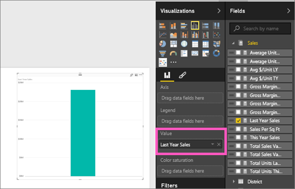
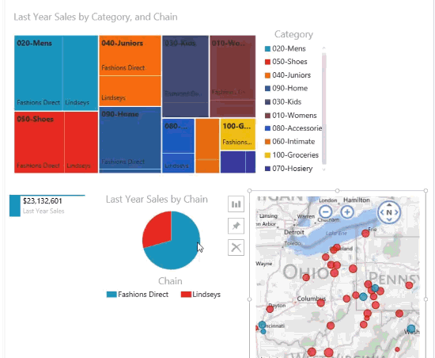

<properties
   pageTitle="Tutorial: Treemaps en Power BI"
   description="Tutorial: Treemaps en Power BI"
   services="powerbi"
   documentationCenter=""
   authors="mihart"
   manager="mblythe"
   backup=""
   editor=""
   tags=""
   featuredVideoId="rnMyiA6Nt6Y"
   qualityFocus="no"
   qualityDate=""/>

<tags
   ms.service="powerbi"
   ms.devlang="NA"
   ms.topic="article"
   ms.tgt_pltfrm="NA"
   ms.workload="powerbi"
   ms.date="10/14/2016"
   ms.author="mihart"/>

# Tutorial: treemaps en Power BI  

Treemaps mostrar datos jerárquicos como un conjunto de rectángulos anidados.  Cada nivel de la jerarquía se representa mediante un rectángulo de color (a menudo denominado "bifurcación") que contiene otros rectángulos ("hojas").  Se asigna el espacio dentro de cada rectángulo basándose en el valor cuantitativo que se va a medir, con los rectángulos que se organizan en el tamaño de la esquina superior izquierda (mayor) a la parte inferior derecha (menor).

Por ejemplo, si estoy analizando los Mis ventas, puede que tenga rectángulos de nivel superior (ramas) para las categorías de ropa: **Urban**, **Rural**, **juventud**, y **combinación**.  Mi rectángulos categoría contendría rectángulos más pequeños (hoja) para la ropa fabricantes dentro de esa categoría y estos rectángulos menor tamaño y sombreados en función del número vendido.  En el **Urban** rama anterior, una gran cantidad de máximos se vendió ropa, menos Natura y Fama y Leo muy poco.  Por lo tanto, la **Urban** rama de mi Treemap tendría el rectángulo más grande de máximos (en la esquina superior izquierda), ligeramente menor rectángulos para Natura y Fama, muchos otros rectángulos que representan todas las demás prendas vendidas y un pequeño rectángulo para Leo.  Y que podía comparar el número de elementos vendidos en otras categorías de ropa comparando el tamaño y el sombreado de cada nodo de hoja; Cuanto mayor sea el rectángulo y cuanto más oscuro el sombreado, cuanto mayor sea el valor.

## Cuándo utilizar un treemap  
Treemaps son una excelente opción:

-   para mostrar grandes cantidades de datos jerárquicos.

-   Cuando un gráfico de barras no puede controlar eficazmente el gran número de valores.

-   para mostrar las proporciones entre cada parte y el conjunto.

-   para mostrar el patrón de la distribución de la medida en cada nivel de categorías de la jerarquía.

-   para mostrar atributos mediante codificación de color y tamaño.

-   para detectar patrones, los valores atípicos, colaboradores más importante y excepciones.

## Crear un treemap básica  

¿Desea ver alguien cree un treemap primero?  Saltar a las 2:01 en este vídeo ver creará un treemap con las ventas y Marketing de ejemplo.

<iframe width="560" height="315" src="https://www.youtube.com/embed/rnMyiA6Nt6Y?list=PL1N57mwBHtN0JFoKSR0n-tBkUJHeMP2cP" frameborder="0" allowfullscreen></iframe>

O bien, puede crear su propio treemap. Estas instrucciones utilizan el ejemplo de análisis de venta directa. Para continuar,  [Descargue el ejemplo](powerbi-sample-downloads.md), inicie sesión en Power BI y seleccione **obtener datos \> libro de Excel \>  Conectar \> ejemplo de análisis de venta**.**xlsx**.

1.  Iniciar en [vista de edición](powerbi-service-interact-with-a-report-in-editing-view.md) y seleccione la **ventas** > **ventas de últimos años** medida.   

2.  Convertir el gráfico a un treemap.  

3.  Arrastre **elemento** > **categoría** a la **grupo** bien. Power BI crea un treemap donde el tamaño de los rectángulos reflejar el total de ventas y el color representa la categoría.  En esencia, ha creado una jerarquía que describe visualmente el tamaño relativo del total de ventas por categoría.  El **hombres** categoría tiene las ventas más altas y **calcetería** categoría tiene los valores más bajos.
  

4.  Arrastre **almacén** > **cadena** a la **detalles** apropiado para completar su treemap. Ahora puede comparar las ventas del último año por categoría y la cadena.   

    >[AZURE.NOTE] Saturación del color y detalles no se puede usar al mismo tiempo.

5. Mantenga el mouse sobre un **cadena** área para mostrar la información sobre herramientas para la parte de la **categoría**.  Por ejemplo, el mouse sobre **Lindseys** en el **Juniors 040** rectángulo revela la información sobre herramientas para parte de Lindsey de la categoría de Juniors.  

5.  
            [Agregue el treemap como un icono de panel (pin visual)](powerbi-service-dashboard-tiles.md). 

6.  
            [Guardar el informe](powerbi-service-save-a-report.md).

## Resaltado y filtrado cruzado  
Para obtener información acerca de cómo utilizar el panel de filtros, consulte [Agregar un filtro a un informe](powerbi-service-add-a-filter-to-a-report.md).

Resaltado de una categoría o detalles en un treemap resaltado de referencias cruzadas y filtros cruzados las otras visualizaciones en la página de informe... y viceversa. Para poder continuar, agregue algunos elementos visuales a la misma página o copiar y pegar el treemap a una página del informe que ya tiene otros elementos visuales.

1.  En el treemap, seleccione una categoría o una cadena dentro de una categoría.  Esto entre-información destacada de las otras visualizaciones en la página. Seleccionar **zapatos 050**, por ejemplo, me muestra que ventas del último año de zapatos era $3,640,471 con $2,174,185 de que procedan de moda directa.  
    

2.  En el **ventas del último año por cadena** gráfico circular, seleccione la **directa de moda** segmento.  
    

3. Para administrar cómo gráficos realzado cruzado y filtro entre ellos, consulte [interacciones de visualización en un informe de Power BI](powerbi-service-visual-interactions.md)

## Consulte también  

            [Informes de Power BI](powerbi-service-reports.md)  

            [Agregar una visualización a un informe](https://powerbi.uservoice.com/knowledgebase/articles/441777)  

            [Tipos de visualización en Power BI](powerbi-service-visualization-types-for-reports-and-q-and-a.md)
[ ancla una visualización a un panel](powerbi-service-pin-a-tile-to-a-dashboard-from-a-report.md)  

            [Power BI: conceptos básicos](powerbi-service-basic-concepts.md)  

            [¡Probar--es gratuito!](https://powerbi.com/)

¿Preguntas más frecuentes? 
            [Pruebe la Comunidad de Power BI](http://community.powerbi.com/)  
