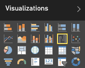
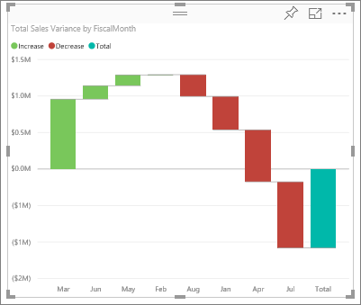

<properties
   pageTitle="Tutorial: Waterfall charts in Power BI"
   description="Tutorial: Waterfall charts in Power BI"
   services="powerbi"
   documentationCenter=""
   authors="mihart"
   manager="mblythe"
   backup=""
   editor=""
   tags=""
   featuredVideoId="maTzOJSRB3g"
   qualityFocus="no"
   qualityDate=""/>

<tags
   ms.service="powerbi"
   ms.devlang="NA"
   ms.topic="article"
   ms.tgt_pltfrm="NA"
   ms.workload="powerbi"
   ms.date="10/07/2016"
   ms.author="mihart"/>
# Tutorial: waterfall charts in Power BI

A waterfall chart shows a running total as values are added or subtracted. It's useful for understanding how an initial value (for example, net income) is affected by a series of positive and negative changes.

The columns are color coded so you can quickly tell increases and decreases. The initial and the final value columns often <bpt id="p1">[</bpt>start on the horizontal axis<ept id="p1">]</ept><bpt id="p2">(https://support.office.com/article/Create-a-waterfall-chart-in-Office-2016-for-Windows-8de1ece4-ff21-4d37-acd7-546f5527f185#BKMK_Float "</bpt>start on the horizontal axis<ept id="p2">")</ept>, while the intermediate values are floating columns. Because of this "look", waterfall charts are also called bridge charts.

<iframe width="560" height="315" src="https://www.youtube.com/embed/maTzOJSRB3g?list=PL1N57mwBHtN0JFoKSR0n-tBkUJHeMP2cP" frameborder="0" allowfullscreen></iframe>

## When to use a waterfall chart

Waterfall charts are a great choice:

-   when you have changes for the measure across time series or different categories

-   to audit the major changes contributing to the total value

-   to plot your company's annual profit by showing various sources of revenue and arrive at the total profit (or loss).

-   to illustrate the beginning and the ending headcount for your company in a year

-   to visualize how much money you make and spend each month, and the running balance for your account. 

## Create a waterfall chart

To follow along, sign in to Power BI and select <bpt id="p1">**</bpt>Get Data <ph id="ph1">\&gt;</ph> Samples <ph id="ph2">\&gt;</ph> Retail Analysis Sample<ept id="p1">**</ept>. 

1. From the "Retail Analysis Sample" dashboard, select the <bpt id="p1">**</bpt>Total Stores<ept id="p1">**</ept> tile to open the "Retail Analysis Sample" report.

2. Select <bpt id="p1">**</bpt>Edit Report<ept id="p1">**</ept> to open the report in Editing View.

3. <bpt id="p1">[</bpt>Add a new report page<ept id="p1">](powerbi-service-add-a-page-to-a-report.md)</ept>.

4. Create a waterfall chart that displays this year's sales and sales goal by month.

  - From the <bpt id="p1">**</bpt>Fields<ept id="p1">**</ept> pane, select <bpt id="p2">**</bpt>Sales <ph id="ph1">\&gt;</ph> Total Sales Variance<ept id="p2">**</ept>.

    - Convert the chart to a <bpt id="p1">**</bpt>Waterfall<ept id="p1">**</ept>. 

        

    - If <bpt id="p1">**</bpt>Total Sales Variance<ept id="p1">**</ept> isn't in the <bpt id="p2">**</bpt>Y Axis<ept id="p2">**</ept> area, drag it there.

    - Select <bpt id="p1">**</bpt>Time<ept id="p1">**</ept> <ph id="ph1">\&gt;</ph> <bpt id="p2">**</bpt>FiscalMonth<ept id="p2">**</ept> to add it to the <bpt id="p3">**</bpt>Category<ept id="p3">**</ept> well. 

    

## Highlighting and cross-filtering

For information about using the Filters pane, see <bpt id="p1">[</bpt>Add a filter to a report<ept id="p1">](powerbi-service-add-a-filter-to-a-report.md)</ept>.

Highlighting a column in a waterfall chart cross-filters the other visualizations on the report page... and vice versa. However, the Total column does not trigger highlighting or respond to cross-filtering.

## Consulte también

[Reports in Power BI](powerbi-service-reports.md)

[Visualization types in Power BI](powerbi-service-visualization-types-for-reports-and-q-and-a.md)

[Visualizations in Power BI reports](powerbi-service-visualizations-for-reports.md)

[Power BI - Basic Concepts](powerbi-service-basic-concepts.md)

More questions? [Try the Power BI Community](http://community.powerbi.com/)
