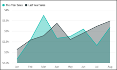
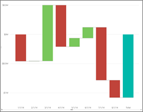

<properties
   pageTitle="Visualization types in Power BI"
   description="Visualization types in Power BI"
   services="powerbi"
   documentationCenter=""
   authors="mihart"
   manager="mblythe"
   backup=""
   editor=""
   tags=""
   qualityFocus="no"
   qualityDate=""/>

<tags
   ms.service="powerbi"
   ms.devlang="NA"
   ms.topic="article"
   ms.tgt_pltfrm="NA"
   ms.workload="powerbi"
   ms.date="09/17/2016"
   ms.author="mihart"/>
# Visualization types in Power BI

## Power BI visualizations

We'll be adding new visualizations, stay tuned!

And check out the community site, visuals.powerbi.com, where you'll find a growing list of  custom visuals you can download and use in your own dashboards and reports. Feeling creative?  Watch this video to learn how to create and add your own visuals to the community site.  

## List of visualizations available in Power BI

All of these visualizations can be added to Power BI reports, specified in Q&amp;A, and pinned to dashboards.

### Bar and column charts

 

 

<bpt id="p1">**</bpt>Tip<ept id="p1">**</ept>: Bar charts are the standard for looking at a specific value across different categories.

### Basic (Layered) and Stacked Area charts

<bpt id="p1">**</bpt>Tip<ept id="p1">**</ept>: The Basic Area chart is based on the line chart with the area between the axis and line filled in.

For more information, see <bpt id="p1">[</bpt>Tutorial: Basic Area chart<ept id="p1">](powerbi-service-tutorial-basic-area-chart.md)</ept>.

### Single number cards

For more information, see <bpt id="p1">[</bpt>Create a big number tile for a dashboard<ept id="p1">](powerbi-service-create-a-big-number-tile-for-a-dashboard.md)</ept>.

### Multi row cards

### Combo charts

<bpt id="p1">**</bpt>Tip<ept id="p1">**</ept>: A Combo chart combines a column chart and a line chart. Choose from <bpt id="p1">*</bpt>Line and Stacked Column<ept id="p1">*</ept> and <bpt id="p2">*</bpt>Line and Clustered Column<ept id="p2">*</ept>.

For more information, see <bpt id="p1">[</bpt>Tutorial: Combo charts in Power BI<ept id="p1">](powerbi-service-tutorial-combo-chart-merge-visualizations.md)</ept>.

### Doughnut charts

<bpt id="p1">**</bpt>Tip<ept id="p1">**</ept>: Doughnut charts are similar to Pie charts.  They show the relationship of parts to a whole.

For more information, see <bpt id="p1">[</bpt>Tutorial: Doughnut charts in Power BI<ept id="p1">](powerbi-service-tutorial-doughnut-charts.md)</ept>.

### Funnel charts

<bpt id="p1">**</bpt>Tip<ept id="p1">**</ept>: Funnels help visualize a process that has stages and items flow sequentially from one stage to the next.  Use a funnel when there is a sequential flow between stages, such as a sales process that starts with leads and ends with purchase fulfillment.

For more information, see <bpt id="p1">[</bpt>Tutorial: Funnel Charts in Power BI<ept id="p1">](powerbi-service-tutorial-funnel-charts.md)</ept>.

### Gauge charts

<bpt id="p1">**</bpt>Tip<ept id="p1">**</ept>: Displays current status in the context of a goal.

For more information, see <bpt id="p1">[</bpt>Tutorial: Gauge Charts in Power BI<ept id="p1">](powerbi-service-tutorial-radial-gauge-charts.md)</ept>.

###   KPI

<bpt id="p1">**</bpt>Tip<ept id="p1">**</ept>: Displays progress toward a measurable goal.

For more information, see <bpt id="p1">[</bpt>Tutorial: KPIs in Power BI<ept id="p1">](powerbi-service-tutorial-kpi.md)</ept>.

### Line charts

<bpt id="p1">**</bpt>Tip<ept id="p1">**</ept>: emphasize the overall shape of an entire series of values, usually over time.

### Maps (basic)

<bpt id="p1">**</bpt>Tip<ept id="p1">**</ept>: are used to associate both categorical and quantitative information with spatial locations.

For more information, see <bpt id="p1">[</bpt>Tips and tricks for map visuals<ept id="p1">](powerbi-service-tips-and-tricks-for-power-bi-map-visualizations.md)</ept>.

### Filled Maps (Choropleth)

<bpt id="p1">**</bpt>Tip<ept id="p1">**</ept>: The more intense the color, the larger the value.

For more information, see <bpt id="p1">[</bpt>Tutorial: Filled Maps in Power BI<ept id="p1">](powerbi-service-tutorial-filled-maps-choropleths.md)</ept>.

### Matrix

### Pie charts

### Scatter and Bubble charts

<bpt id="p1">**</bpt>Tip<ept id="p1">**</ept>: display relationships between 2 (scatter) or 3 (bubble) quantitative measures -- whether or not, in which order, etc.

For more information, see <bpt id="p1">[</bpt>Tutorial: Scatter charts in Power BI<ept id="p1">](powerbi-service-tutorial-scatter.md)</ept>.

### Slicers

For more information, see <bpt id="p1">[</bpt>Tutorial: Slicers in Power BI<ept id="p1">](powerbi-service-tutorial-slicers.md)</ept>.

### Standalone images

For more information, see <bpt id="p1">[</bpt>Add an image widget to a dashboard<ept id="p1">](powerbi-service-add-a-widget-to-a-dashboard.md)</ept>.

### Tablas

<bpt id="p1">**</bpt>Tip<ept id="p1">**</ept>: work well with quantitative comparisons among items where there are many categories.

### Tree Maps

For more information, see <bpt id="p1">[</bpt>Tutorial: Treemaps in Power BI<ept id="p1">](powerbi-service-tutorial-treemaps.md)</ept>.

<bpt id="p1">**</bpt>Tip<ept id="p1">**</ept>: are charts of colored rectangles, with size representing value.  They can be hierarchical, with rectangles nested within the main rectangles.

### Waterfall charts

<bpt id="p1">**</bpt>Tip<ept id="p1">**</ept>: Waterfall charts show a running total as values are added or subtracted.

For more information, see <bpt id="p1">[</bpt>Tutorial Waterfall charts in Power BI<ept id="p1">](powerbi-service-tutorial-waterfall-charts.md)</ept>.

###

## Tell Q&amp;A which visualization to use

When typing natural language queries with Power BI Q&amp;A, you can specify the visualization type in your query.  Por ejemplo:

"<bpt id="p1">***</bpt>sales by state as a treemap<ept id="p1">***</ept>"

## Consulte también

[Visualizations in Power BI reports](powerbi-service-visualizations-for-reports.md)

[Reports in Power BI](powerbi-service-reports.md)

[Power BI - Basic Concepts](powerbi-service-basic-concepts.md)

More questions? [Try the Power BI Community](http://community.powerbi.com/)
