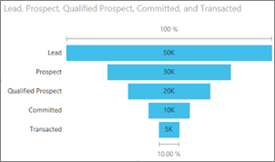
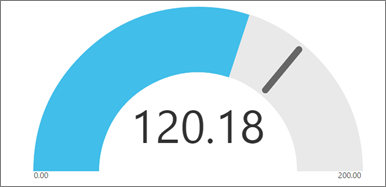
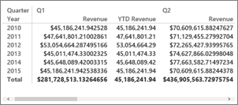

<properties
   pageTitle="Tipos de visualización en Power BI"
   description="Tipos de visualización en Power BI"
   services="powerbi"
   documentationCenter=""
   authors="mihart"
   manager="mblythe"
   backup=""
   editor=""
   tags=""
   qualityFocus="no"
   qualityDate=""/>

<tags
   ms.service="powerbi"
   ms.devlang="NA"
   ms.topic="article"
   ms.tgt_pltfrm="NA"
   ms.workload="powerbi"
   ms.date="09/17/2016"
   ms.author="mihart"/>
# Tipos de visualización en Power BI

## Visualizaciones de Power BI

¡Vamos a agregar nuevas visualizaciones, esté atento!

Y visite el sitio de comunidad, visuals.powerbi.com, donde encontrará una lista creciente de elementos visuales personalizados que puede descargar y utilizar en sus propios paneles e informes. ¿Se siente creativo?  Vea este vídeo para aprender a crear y agregar sus propios elementos visuales al sitio de la Comunidad.  

## Lista de visualizaciones disponibles en Power BI

Todas estas visualizaciones pueden agregadas a los informes de Power BI, especificado en preguntas y respuestas y anclados a paneles.

### Barras y columnas gráficos

 

 

            **Sugerencia**: gráficos de barras son el estándar para buscar en un valor concreto en categorías diferentes.

### Basic (en capas) y los gráficos de áreas apiladas

            **Sugerencia**: gráfico de la superficie básica se basa en el gráfico de líneas con el área situada entre el eje y la línea rellenado.

Para obtener más información, consulte [Tutorial: gráfico de áreas básicas](powerbi-service-tutorial-basic-area-chart.md).

### Tarjetas de número únicas

Para obtener más información, consulte [crear un icono de número grande para un panel](powerbi-service-create-a-big-number-tile-for-a-dashboard.md).

### Varias tarjetas de fila

### Gráficos combinados

            **Sugerencia**: un gráfico combinado combina un gráfico de columnas y un gráfico de líneas. Elegir *línea y columna apilada* y *línea y columna agrupada*.

Para obtener más información, consulte [Tutorial: gráficos combinados en Power BI](powerbi-service-tutorial-combo-chart-merge-visualizations.md).

### Gráficos de anillos

            **Sugerencia**: gráficos de anillos son similares a los gráficos circulares.  Muestran la relación de partes con un todo.

Para obtener más información, consulte [Tutorial: gráficos de anillos en Power BI](powerbi-service-tutorial-doughnut-charts.md).

### Gráficos de embudo

            **Sugerencia**: Embudos ayuda a visualizar un proceso que tiene fases y elementos de flujo secuencialmente de una fase a la siguiente.  Utilice un embudo cuando hay un flujo secuencial entre fases, como un proceso de ventas que empieza con clientes potenciales y finaliza con el cumplimiento de compra.

Para obtener más información, consulte [Tutorial: gráficos de embudo en Power BI](powerbi-service-tutorial-funnel-charts.md).

### Gráficos de medidor

            **Sugerencia**: muestra el estado actual en el contexto de un objetivo.

Para obtener más información, consulte [Tutorial: gráficos de medidor en Power BI](powerbi-service-tutorial-radial-gauge-charts.md).

###   KPI

            **Sugerencia**: muestra el progreso hacia un objetivo cuantificable.

Para obtener más información, consulte [Tutorial: KPI en Power BI](powerbi-service-tutorial-kpi.md).

### Gráficos de líneas

            **Sugerencia**: Resalte la forma general de toda una serie de valores, normalmente con el tiempo.

### Mapas (basic)

            **TI p**: se utilizan para asociar la información de categorías y cuantitativa con ubicaciones espaciales.

Para obtener más información, consulte [sugerencias y trucos para elementos visuales de mapa](powerbi-service-tips-and-tricks-for-power-bi-map-visualizations.md).

### Mapas de rellenadas (Choropleth)

            **Sugerencia**: más intensa el color, cuanto mayor sea el valor.

Para obtener más información, consulte [Tutorial: rellenar mapas en Power BI](powerbi-service-tutorial-filled-maps-choropleths.md).

### Matriz

### Gráficos circulares

### Dispersión y burbujas

            **Sugerencia**: mostrar las relaciones entre 2 (Dispersión) o medidas cuantitativas de 3 (burbuja)--o no, en qué orden, etc..

Para obtener más información, consulte [Tutorial: gráficos en Power BI de dispersión](powerbi-service-tutorial-scatter.md).

### Las segmentaciones de datos

Para obtener más información, consulte [Tutorial: segmentaciones de datos en Power BI](powerbi-service-tutorial-slicers.md).

### Imágenes independientes

Para obtener más información, consulte [Agregar un widget de imagen a un panel](powerbi-service-add-a-widget-to-a-dashboard.md).

### Tablas

            **Sugerencia**: funcionan bien con cuantitativas comparaciones entre elementos donde hay muchas categorías.

### Mapas de árbol

Para obtener más información, consulte [Tutorial: Treemaps en Power BI](powerbi-service-tutorial-treemaps.md).

            **Sugerencia**: son gráficos de rectángulos con color, que representa el valor de tamaño.  Puede ser jerárquicas, con rectángulos anidados dentro de los rectángulos principales.

### Gráficos de cascada

            **Sugerencia**: cascada gráficos muestran un ejecución total cuando se agregan o se restan valores.

Para obtener más información, consulte [gráficos de cascada Tutorial en Power BI](powerbi-service-tutorial-waterfall-charts.md).

###

## Indicar las preguntas y respuestas visualización que usar

Al escribir las consultas en lenguaje natural con Power BI Q & A, puede especificar el tipo de visualización de la consulta.  Por ejemplo:

"***ventas por estado como un treemap***"

## Consulte también

[Visualizaciones en informes de Power BI](powerbi-service-visualizations-for-reports.md)

[Informes de Power BI](powerbi-service-reports.md)

[Power BI: conceptos básicos](powerbi-service-basic-concepts.md)

¿Preguntas más frecuentes? [Pruebe la Comunidad de Power BI](http://community.powerbi.com/)
